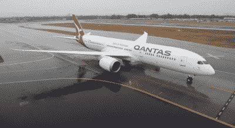
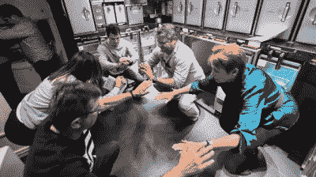
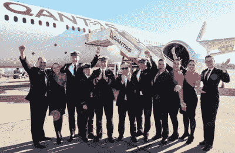

# 澳航的研究飞行航程的 115%,机舱不够宽敞

> 原文：<https://hackaday.com/2019/11/06/qantas-research-flight-travels-115-of-range-with-undercrowded-cabin/>

当你试图环游世界时，长途飞行会是一种真正的痛苦。一般来说，它们是通过沿途停车来实现的，中途停车迫使乘客下飞机，在继续飞行前消磨时间。随着多年来飞机的改进，航空公司已经开始在可能的情况下引入更多的直飞航班，消除这种挫折感。

澳大利亚旗舰航空公司澳航处于这一努力的最前沿，最近尝试了从纽约到悉尼的直航。这需要仔细的计划和准备，研究飞行是未来商业运行前的一次试运行。他们是如何在如此漫长的航程中让飞机和乘客保持在空中的？简短的回答是，他们欺骗了没有货物和纵容他们的 85%空客舱。然而，他们计划利用他们学到的知识，从现在起四年内开始运营 10，000 多英里的直飞客运航班，比目前的记录高出 10%。

## 打破记录

Qantas chose a Boeing 787-9 for the special ultra-long-range mission.

这次飞行选择的飞机是波音 787-9，刚从西雅图的飞机制造厂出来。这次试飞既是对澳航未来远程运营的研究，也是为了将飞机交付给新主人。正常情况下，787-9 的航程为 8800 英里，在典型的三级布局中可搭载 280 名乘客。

随着从纽约到悉尼的距离接近 10，100 英里，为了达到更长的距离，人们做出了牺牲。被称为“日出计划”的研究飞行将只载 40 名乘客，以及 10 名机组人员，包括 4 名值班飞行员。这些限制是为了减轻飞机的起飞重量，从而减少燃油消耗和提高航程。飞机也没有装载货物，在飞行前油箱加满了 101，000 公斤的燃油。飞机预计会带着大约 6000 公斤的剩余重量着陆，为紧急情况留出 90 分钟的飞行时间。

人为因素也是超长距离作业的关键。由于预计飞行时间超过 19 个小时，机组人员需要轮班工作，远远超过通常的要求。对轮调进行了特别考虑，以确保疲劳不会对机组人员的表现产生负面影响。所有飞行员都负责起飞和降落，在整个飞行过程中共用一系列 5 个 ¹ / [2] 和 2 个 ¹ / [2] 小时的轮班。机组人员配备了脑电图仪来测量大脑活动，以及光线监视器和身体活动监视器来确定长时间操作对身体的影响。

Exercise was used in conjunction with lighting and a special menu to help passengers adjust as quickly as possible to the Sydney time zone.

此外，几名乘客被纳入实验，以评估当直飞几乎半个地球时时差的影响。机舱照明被仔细控制，以帮助尽快调整昼夜节律。甚至连餐食都是特别准备的，第一道菜是辛辣刺激的菜肴，旨在帮助乘客保持清醒，而第二道菜是富含碳水化合物的舒适食物，旨在帮助乘客入睡。还包括一项特殊的锻炼制度，以凌晨 2 点令人振奋的马卡雷纳为特色。这可能会吓退一些飞行员，包括这位作者，但时差仍然是一个非常现实的问题。科学和胡闹的区别在于把它写下来，这次飞行的研究人员收集了大量的数据。机组人员甚至[每四个小时](https://www.cnbc.com/2019/10/18/qantas-studies-jet-lag-on-new-york-sydney-nonstop-worlds-longest-flight.html)收集一次尿液样本，以测量褪黑激素水平，同时参与者的反应能力在旅程中每隔一段时间就用一个 iPad 应用程序进行测试。此外，许多人被要求在飞行前后记录睡眠和活动日记，以供进一步分析。

## 一帆风顺…如果你有平躺式座椅和锻炼区

由于对每个细节都给予了最大的关注，这次飞行成功也就不足为奇了。晚上 9 点 30 分从纽约出发，编号为 QF7879 的航班在 19 小时 16 分钟后的早上 7 点 43 分降落在悉尼的金斯福德史密斯机场。[【David slot nick】报告称，与更典型的长途飞行相比，感觉休息得非常好](https://www.businessinsider.com.au/qantas-longest-flight-new-york-sydney-project-sunrise-review-pictures-2019-10?r=US&IR=T)，并指出旅程节省了 3 个小时，这归功于严格的反时差制度。与此同时，《时代》杂志的安格斯·惠特利指出[立即切换到悉尼时区需要承诺和坚强的意志](https://time.com/5706162/worlds-longest-flight-qantas-new-york-sydney/)，但是如果可能的话，他会选择直飞而不是中途停留。

The crew of QF7879 celebrates landing the first Project Sunrise research flight.

虽然作为一个研究项目，这次飞行是成功的，但这条路线投入商业运营可能还需要一段时间。日出项目只有 40 名乘客，他们都乘坐商务舱，配有平躺式座椅以方便休息。此外，在整个飞行过程中，厨房都有一名专职厨师提供服务，还有一组研究人员试图尽可能让旅程不那么痛苦。这些奢侈品需要花钱，而且飞机上绝大多数座位都是空的，这样的飞行距离商业可行性还有很长的路要走。同样重要的是，要考虑在经济舱飞行 19 个小时的不同体验，腿部空间和便利设施都大大减少，而且没有躺下睡觉的规定。

展望未来，[澳航的目标是到 2023 年](https://www.flightglobal.com/news/articles/project-sunrise-flights-likely-to-commence-in-2023-461610/)与真正的客户一起运营这些航线。这将通过新飞机来实现，空客 A350 或波音 777X 被吹捧为潜在的候选飞机。为了缓解长途飞行中经济舱座位的压力，该航空公司正在探索建立一个“公共区域”供乘客锻炼。这将与从“日出计划”中吸取的经验教训相结合，这将指导有关餐饮、照明和船员未来的决策。虽然这项技术可能还没有完全实现，但它是商业航空中即将出现的令人兴奋的一幕。