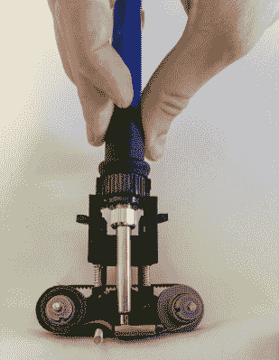

# 快速原型系统让可穿戴设备有了轮子

> 原文：<https://hackaday.com/2020/04/21/rapid-prototyping-system-gives-wheels-to-wearables/>

可穿戴设备是电子领域一个令人困惑的前沿。一方面，无论你去哪里，这都是展示赛道的最佳平台。另一方面，整个努力是复杂的，因为人类的身体没有直线，而且经常移动。电路需要灵活舒适。换句话说，可穿戴设备必须耐用。

 【康斯坦丁】【雷蒙】和【于尔根】开发了[一个有趣的电子纺织品原型系统](https://imld.de/en/research/research-projects/rapid-iron-on-user-interfaces-hands-on-fabrication-of-interactive-textile-prototypes/)，为那些不缝纫的人打开了可穿戴设备的世界，并使原型制作过程对每个人来说都更容易。

这是一种小型便携式滚烫设备，可以将不同种类的定制“胶带”贴在纺织品上。导电织物带可用作可触摸迹线，并可支撑柔性电子墨水屏幕和太阳能电池板等组件。一些胶带提供单点或多点连接，而另一些则是辅助基板，如聚酰亚胺胶带，增加了复杂电路的可能性。

该设备使用一种经过改进的烙铁来传送胶带，这些胶带被装载到 3D 打印的卷轴上，卷轴兼作轮子。休息之后来看看吧——有一个 30 秒的游览和 5 分钟的探索整个过程。

每个人都需要原型，即使是经验丰富的缝纫工。下一次你在思考线程的时候，[在这个过程中投入一些磁铁](https://hackaday.com/2020/02/26/magnets-make-prototyping-e-textiles-a-snap/)。

 [https://www.youtube.com/embed/FyPcMLBXIm0?version=3&rel=1&showsearch=0&showinfo=1&iv_load_policy=1&fs=1&hl=en-US&autohide=2&wmode=transparent](https://www.youtube.com/embed/FyPcMLBXIm0?version=3&rel=1&showsearch=0&showinfo=1&iv_load_policy=1&fs=1&hl=en-US&autohide=2&wmode=transparent)

 [https://www.youtube.com/embed/BKy2NxQ4dd4?version=3&rel=1&showsearch=0&showinfo=1&iv_load_policy=1&fs=1&hl=en-US&autohide=2&wmode=transparent](https://www.youtube.com/embed/BKy2NxQ4dd4?version=3&rel=1&showsearch=0&showinfo=1&iv_load_policy=1&fs=1&hl=en-US&autohide=2&wmode=transparent)

