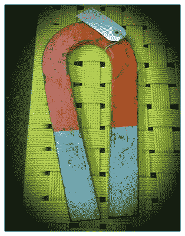
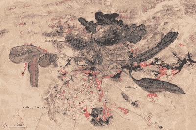

# 陷入贸易战的稀土金属

> 原文：<https://hackaday.com/2019/06/04/rare-earth-metals-caught-in-trade-war/>

这些天似乎从来没有好消息。从经验来说，那真的没什么新鲜的；总有一些事情需要担心，世界领导人总是擅长玩游戏，这不可避免地会导致令人不安的消息。当然，战争总是导致最糟糕的消息，在这个词前面加上任何修饰词，比如“冷”或“代理”，都无助于改善这种影响。

因此，最近几个月的头条新闻充斥着贸易战的故事，主要交战方是美国和中国。我们已经谈到了关税，这是任何贸易战中的主要武器，如何影响电子元件和其他对黑客重要的材料的供应。

但现在，随着贸易战的继续，一个更严重的阵线正在形成，这不仅会对有关各方，而且会对整个世界产生严重后果。贸易战已经升级到包括稀土金属，如果目前流传的威胁和谣言成为现实，构成现代社会核心的技术和产业将有陷入停顿的危险，至少是暂时的。

## 底线:并不罕见

那么什么是稀土金属，它们有什么稀有之处呢？首先，稀土元素在元素周期表中占据镧系元素——经常从主表中分离出来的两种元素中的第一行，很像阿拉斯加和夏威夷在美国地图上被运送到墨西哥湾。十五种镧系元素由第三周期系列中的两种金属钪和钇结合而成，主要是因为它们经常一起出现在矿床中，并且因为它们具有相似的性质。

除了放射性稀土元素钷之外，其他 16 种稀土金属甚至一点也不稀有，钷在整个地壳中自然存在的总量不到半公斤。铈是一种柔软的银灰色金属，在地壳中的含量实际上比铜更丰富，自 19 世纪以来，铈在工业中一直被广泛使用，主要用作催化剂、陶瓷、打火机打火石以及煤气灯灯罩的涂层。即使是最稀有的稀土金属也比黄金丰富 200 倍。

[“Big magnet on a yellow seat”](https://www.flickr.com/photos/82027065@N00/6821974592)by [daveypea](https://www.flickr.com/photos/82027065@N00) is licensed under [CC BY-NC-SA 2.0](https://creativecommons.org/licenses/by-nc-sa/2.0/?ref=ccsearch&atype=html)

稀土元素——同样，除了由铀的放射性衰变形成的钷——都是来自我们银河系邻居的礼物。它们在附近恒星的熔炉中被锻造，并被超新星吹到太空中，收集起来成为尘埃，最终凝结成我们的岩石世界。从钪得名的斯堪的纳维亚半岛，到南非、巴西、俄罗斯、加利福尼亚和中国南部，它们在散布在世界各地的各种矿物矿床中收集了钪。甚至在太平洋底部的淤泥中也发现了丰富的稀土元素，显然是由深海热液喷口从地球内部喷出的。

稀土元素都是金属，具有许多有用的特性，如高导电性、可锻性和延展性。这意味着它们可以与其他更常见的金属形成合金，赋予合金某些特性。许多稀土元素还具有催化特性，这导致它们在工业化学过程中的应用。由于稀土元素的电子结构，它们也容易形成颜色鲜艳的氧化物，这使它们成为颜料和染料的常见成分。

但是，也许今天稀土元素最重要的用途是在功能强大、重量轻的磁性合金中。钕和钐等稀土元素具有铁磁性，这意味着它们可以变成永磁体。纯稀土金属在相当低的温度下会失去其铁磁性，但当与钴和铁等其他铁磁性元素形成合金时，它们会形成极其强大的永磁体，部分原因是它们最外层轨道层中存在未配对电子。

## 问题是

虽然稀土金属并不特别稀有，但它们也往往不太集中。即使是最丰富的稀土矿也只含有少量的每种金属，而且通常在同一种矿石中可以发现多种性质非常相似的金属。因此，尽管找到稀土矿很容易，但从大量的覆盖层中提炼出商业上可行的稀土却绝非易事。

更糟糕的是，并不是每个矿床都有最有用的稀土元素，它们往往是较重的元素。最丰富的矿藏是在中国的矿山中发现的，中国目前提供了世界上 100%的重稀土，如镝，这是硬盘驱动器中的稀土磁体等所需要的。中国还为其稀土建立了一个庞大的增值链，从提炼原矿到成品金属和氧化物，再到将其转化为成品。当你购买任何含有稀土元素的东西时，它很有可能来自中国。

Baiyunbo Mine, from satellite. NASA

有了稀土元素，条条大路通中国，这就是当前贸易争端的症结所在。稀土元素已经成为如此多技术中不可或缺的一部分，如果中国限制出口或对其征收关税，整个行业都可能被摧毁。结果，中国似乎在这件事上占了上风——至少目前如此。

中国是世界稀土超级市场，不仅因为其丰富的矿藏，还因为其宽松的环境法规。提炼和分离稀土是一个肮脏的过程，涉及到许多苛刻的化学物质，并产生大量的废物。其他稀土矿，比如曾经为世界提供大部分成品金属和氧化物的加州帕斯山(Mountain Pass)矿，也因为环境限制而被关闭，这些限制开始让它们在经济上变得不可行。

## 减少、再利用、回收

然而，帕斯山正在复兴。Mountain Pass 于 2017 年收购破产，并于 2018 年恢复开采和浓缩稀土矿石。他们目前将精矿运送到中国进行提炼，但正在为现场提炼做准备，并声称到 2020 年他们将完全自给自足。这是否会在中国之外形成一个完整的增值链还有待观察，但至少这意味着世界将有一个中国以外的精炼稀土金属及其氧化物的替代品。

其他矿业也有希望。如上所述，稀土并不特别稀有，几乎任何地方开采的任何东西都会产生含有大量稀土矿石的尾矿。然而，从商业上来说，回收它们是不可行的，所以大部分这些有价值的矿物会直接回到地下，或者在处理来自矿山的原生矿石时被冲走。阿巴拉契亚的煤矿就是这种情况，人们发现煤炭加工产生的酸性废水中含有可回收的稀土元素。一个试点项目目前正在进行中，如果成功，来自煤矿、铁矿和几乎任何其他地下洞穴的尾矿和废物可能有一天会产生一种有价值的副产品，可以缓解当前的稀土短缺。

 [https://www.youtube.com/embed/RZAbBL-yQic?version=3&rel=1&showsearch=0&showinfo=1&iv_load_policy=1&fs=1&hl=en-US&autohide=2&wmode=transparent](https://www.youtube.com/embed/RZAbBL-yQic?version=3&rel=1&showsearch=0&showinfo=1&iv_load_policy=1&fs=1&hl=en-US&autohide=2&wmode=transparent)

稀土金属已经变得不可或缺，任何现代经济都需要稳定的供应来运转。造成当前供应紧张的经济力量，肯定也会是最终决定供应紧张的力量