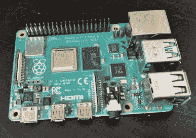
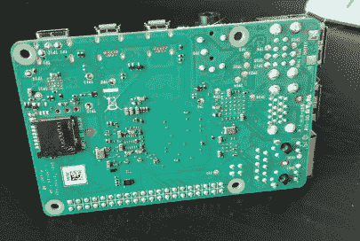
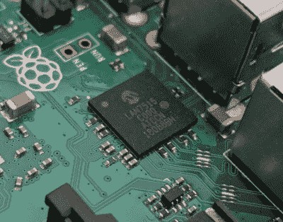
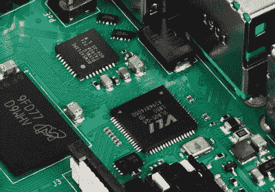

# 刚刚发布的树莓 Pi 4:更快的 CPU，更大的内存，双 HDMI 端口

> 原文：<https://hackaday.com/2019/06/23/raspberry-pi-4-just-released-faster-cpu-more-memory-dual-hdmi-ports/>

树莓 Pi 4 刚刚发布。这是树莓 Pi 的最新版本，比树莓 Pi 3 提供了更好的 CPU 和更多的内存，双 HDMI 输出，更好的 USB 和以太网性能，并将一直生产到 2026 年 1 月。

树莓 Pi 4 有三种型号——一种有 1GB 内存，一种有 2GB 内存，一种有 4GB 内存——分别售价 35 美元、45 美元和 55 美元。[有一段树莓派发布会的视频](https://www.youtube.com/watch?v=sajBySPeYH0)，所有细节都在[树莓派 4 网站](https://www.raspberrypi.org/products/raspberry-pi-4-model-b/)上。

### 更好的 CPU、更好的显卡和更大的内存

新改进的 Raspberry Pi 4 上的 CPU 是一次重大升级。虽然 Raspberry Pi 3 采用了 Broadcom BCM 2837 SoC(4×ARM Cortex-A53，运行速度为 1.2GHz)，但新主板采用了 Broadcom BCM2711 SoC(运行速度为 1.5GHz 的四核 Cortex-A72)。新闻资料称，这提供了可与入门级 x86 系统相媲美的台式机性能。

值得注意的是，新的 Raspberry Pi 4 的特点不是一个而是两个 HDMI 端口，尽管是微型 HDMI 格式。这允许高达 4k60p 的双显示器支持。图形能力包括 H.265 4k60 解码，H.264 1080p60 解码，1080p30 编码，支持 OpenGL ES，3.0 图形。和所有的 Raspberry Pis 一样，音频端口内也有一个~~组件~~复合视频端口。2 通道 MIPI DSI 显示端口和 2 通道 MIPI CSI 相机端口仍然来自树莓 Pi 3。

### 旧的变化

    

对于任何期待替代 Raspberry Pi 3 的人来说，有一个非常重要的变化:电源端口现在是 USB Type-C。

以前，尤其是随着树莓 Pi 3 的发布，树莓 Pi 基金会有传言说[任何旧的 USB 电源根本就不行](https://www.raspberrypi.org/blog/pi-power-supply-chip/)。标准 USB 电源保证在 5V 或 2.5 瓦时提供 500 毫安的电流。虽然这对于第一个 Raspberry Pi 来说已经足够了，但在过去的五年中，电力预算已经上升了。现在，一个树莓 Pi 3 在启动期间将消耗超过 3 瓦的功率。对于未来的任何一代树莓派来说，这都是站不住脚的，必须有一个电源插座来提供更多的电力。

USB-C 就是干这个的。有了 USB-C 电源输入，Pi 不再局限于任何旧电源适配器的 500mA 限制。这是一个很好的设计选择；如果你问为什么最初的 Raspberry Pi 使用微型 USB 端口供电，你可以简单地说，因为每个手机都使用一个充电端口，因此微型 USB 电源适配器随处可见。现在，大多数旗舰手机使用 USB-C 充电器，提供更多的电力，并为任何单板计算机提供了一个很好的电源适配器。当然，也可以通过 40 针 GPIO 连接器上的 5V 供电轨供电，或者通过带有相关 PoE 帽的 PoE 供电。

### **双 HDMI**

多年来，问题一直是如何给树莓派增加第二块高分辨率显示屏。是的，你也许可以使用 HDMI 或 [a 666 适配器板](https://uk.pi-supply.com/products/gert-vga-666-hardware-vga-raspberry-pi)的复合输出来给你 VGA。这比插第二根电缆需要更多的努力，所以这种情况根本不会发生。Raspberry Pi 4 放弃了大 HDMI 端口，改用两个微型 HDMI 端口，支持双显示器。现在，Pi 终于成为真正的台式机替代品，开箱即可支持多台显示器。

### 更快的 USB 和以太网

A Lan7515 USB/Ethernet controller, as found on the Raspberry Pi 3.

到目前为止，所有 Raspberry Pis 的最大缺点之一是通过以太网和 USB 端口的带宽。Raspberry Pi 上 USB 端口的真实带宽约为每秒 250 兆位，约为 USB 2.0 端口最大理论带宽的一半。以太网端口的最大带宽大约是 50 兆比特每秒；优于 10 兆比特，但也是理论上最大 100 兆比特/秒的一半。

USB 和以太网端口性能不佳的原因是组合控制器。除了 Zero 和现在的 Pi 4，所有 Pi 都使用了以太网和 USB 控制器的组合，在 Pi 3 的情况下，使用了 Microchip 的 LAN7515 芯片。这是在 SoC 上挂几个 USB 端口和以太网的一个很好的解决方案，但是实际性能总是低于理论性能。

The Raspberry Pi 4 Ethernet and USB chips

Raspberry Pi 4 取消了这种以太网和 USB 控制器的组合。现在，树莓派终于有了真正的以太网和 USB 端口。它拥有千兆以太网，这得益于 [BCM54213 以太网收发器](https://www.broadcom.com/products/ethernet-connectivity/copper-phy/gigabitphy/bcm54213pe)和 USB 3.0，这得益于 VIA Lab VL805 芯片，该芯片直接连接到 Broadcom SoC 上的 PCI Express 接口。虽然 Pi 4 只有两个 USB 3.0 端口，但对于大多数使用情况来说，这应该足够好了。

单板计算机社区对任何板的最大要求之一是添加 SATA 端口。从理论上讲，这是有意义的:如果你想把 Pi 变成 NAS，只需把硬盘插入 SATA 端口。虽然不是 SATA 端口，但是 USB 3.0 的加入*巨大；* USB 3.0 提供几乎与 SATA 端口一样多的带宽，USB 到 SATA 转换器便宜且容易获得。

### 这是你要买的覆盆子酱吗？

很明显，现在这个板出来了，几乎没有人会去买树莓 Pi 3 Model B。你选择哪个版本的树莓 Pi 4 取决于你的需求；1GB RAM 型号为 35 美元，2GB RAM 型号为 45 美元，4GB 型号为 55 美元。

第二个 HDMI 输出的添加非常出色，将 Raspberry Pi 从一台功能强大的商店或工作台计算机变成了一台桌面替代品。USB 3 和改进的 USB 和以太网带宽的增加是非常出色的，一如既往，WiFi 和蓝牙 5.0 形式的无线是一个受欢迎的规范。然而，总会有一些小变化——尤其是从单 HDMI 端口变为双微型 HDMI 端口——会稍微干扰现有的机箱解决方案。

这是你从现在开始，或者至少在接下来的几年里将要购买的覆盆子酱。这很好，但你可能要考虑多花 20 美元，从一开始就升级到 4GB 的型号。