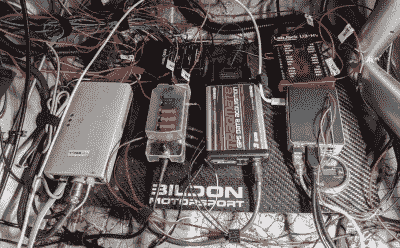

# 树莓 Pi 帮助赛车手掌握赛道

> 原文：<https://hackaday.com/2020/10/01/raspberry-pi-helps-racer-master-the-track/>

为了给自己一个竞争优势，racer [Douglas Hedges]希望开发一个系统，可以实时反馈他当前的表现与他之前的最快圈速相比如何。带着一个树莓派和一些 Python 库，他开始在他的车上安装一个简单的遥测系统。但正如这类项目的常见情况一样，事情从那里开始滚雪球。

The Raspberry Pi based data acquisition system.

在最基本的层面上，他的系统使用 GPS 位置和速度信息来点亮仪表盘上的一条 RGB LEDs:绿色表示他比之前的最佳单圈速度快，红色表示他没有。当他专注于赛道时，任何比这更复杂的界面都会分散他的注意力。但这并不意味着树莓 Pi 不能在比赛结束后收集数据供未来审查。

基本功能就绪后，[Douglas]将注意力转向收集发动机性能数据。原来汽车已经有一些预先存在的设备来收集指标，如空燃比和转速，他能够连接到 Raspberry Pi，这要归功于它使用了一个记录良好的协议。除此之外，他还增加了一个 Labjack U3 数据采集系统，让他能够获取节气门位置和冷却液温度等附加信息。Grafana 用于在赛后可视化所有这些数据，尽管听起来他也在考虑增加一个蜂窝数据连接，车辆数据可以实时流出。

在过去，我们已经看到车载数据收集系统使[真实世界的比赛看起来更像他们的虚拟对手](https://hackaday.com/2018/09/04/gps-overlays-give-real-life-racing-a-video-game-feel/)，但似乎[道格拉斯]在最激烈的时刻提出的解决方案更实用。

 [https://www.youtube.com/embed/bjZeXXChDv4?version=3&rel=1&showsearch=0&showinfo=1&iv_load_policy=1&fs=1&hl=en-US&autohide=2&wmode=transparent](https://www.youtube.com/embed/bjZeXXChDv4?version=3&rel=1&showsearch=0&showinfo=1&iv_load_policy=1&fs=1&hl=en-US&autohide=2&wmode=transparent)

 [https://www.youtube.com/embed/sWjJ_7Hw02U?version=3&rel=1&showsearch=0&showinfo=1&iv_load_policy=1&fs=1&hl=en-US&autohide=2&wmode=transparent](https://www.youtube.com/embed/sWjJ_7Hw02U?version=3&rel=1&showsearch=0&showinfo=1&iv_load_policy=1&fs=1&hl=en-US&autohide=2&wmode=transparent)

