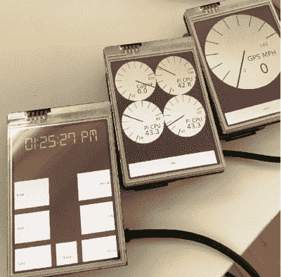

# 树莓派搭上了一辆 1989 年的宝马仪表盘

> 原文：<https://hackaday.com/2021/03/11/raspberry-pi-hitches-a-ride-in-a-1989-bmw-dashboard/>

你可能不会惊讶地发现，一辆 1989 年的宝马 325i 没有太多的电子设备。事实上，这辆老爷车中的仪表板“电脑”只是一个带有基本日历功能的数字钟。不满足于再浪费他宝贵的仪表板空间， [[Ryan Henderson]利用他在隔离期间的时间用树莓皮](https://www.linkedin.com/pulse/weekend-projects-digital-dash-ryan-henderson)替换了时钟模块。

坐落在一个定制的激光切割外壳中的是一个触摸屏 LCD 模块，直接连接到 Pi Zero 的 GPIO 头。结合一些 Python 代码，这为几乎任何[Ryan]想要的东西提供了一个非常灵活的多用途接口。现在他已经将它连接到一个 GPS 接收器上，这样他就可以计算出速度和加速度之类的东西，但是这个小小的嵌入式升级所能做的唯一真正的限制是你想要坐下来写多少代码。

 谢天谢地，听起来[瑞安]为你做了很多艰苦的工作。他开发了一个 Python 库，允许用户在屏幕上轻松绘制模拟仪表。这些面的大小是参数化的，甚至有自定义的最小/最大标记。当然[如果你宁愿只是在屏幕上扔一些文本和图像](https://hackaday.com/2018/03/21/making-pictures-worth-1000-words-in-python/)，那是[用现有的库如 PyGame](https://hackaday.com/2020/10/28/pygame-celebrates-20-years-by-releasing-pygame-2-0/) 很容易完成的。

[Ryan]说他还在研究一些代码，以便通过蓝牙 OBD2 适配器更好地将 Pi 集成到车辆系统中。在最基本的应用程序中，你可以在屏幕上显示各种引擎数据，但在更现代的汽车上，你可能会[接入 CAN 总线，并按照你的意愿弯曲它](https://hackaday.com/2019/05/09/sniffing-can-to-add-new-features-to-a-modern-car/)。

虽然这种特殊修改的物理大小和形状显然集中在这种型号和年份的宝马上，但一般概念可以应用于道路上的任何汽车。[【Ryan】最近为项目](https://github.com/ryanredbaron/E30_Upgraded_OBC)建立了一个 GitHub 知识库，并希望与那些有兴趣为他们的经典游乐设施增加一点现代~~复杂性~~便利性的人建立联系。

事实是，汽车越来越依赖车载电脑。我们已经看到特斯拉车主在与煮熟的闪存芯片作斗争，事情在好转之前可能会变得更糟。虽然毫无疑问，有些人宁愿让他们的日常司机尽可能简单，但我们对这样的项目感到鼓舞，[至少让车主按照自己的方式用电脑控制他们的汽车](https://hackaday.com/2021/01/30/nissan-gives-up-root-shell-thanks-to-hacked-usb-drive/)。