# 需要小键盘？打造自己的！

> 原文：<https://hackaday.com/2019/04/23/reaction-video-build-your-own-custom-fortnite-controller-for-a-raspberry-pi/>

如果你想要键盘，我们可以给你键盘。如果你想要一个小键盘，你可能就没那么幸运了。除非你正在[黑黑莓键盘](https://hackaday.com/2018/03/08/regrowing-a-blackberry-from-the-keyboard-out/)或者摆弄微型轻触开关，否则没有好的办法来解决小而薄的定制键盘。不过有一个选择:硅胶键盘。还没有人做过，所以我想我也可以。

不幸的是，没有现成的关于定制硅树脂键盘的设计、构造或制造的信息。有一些文档，但是每个这样做的工厂似乎都互相复制和粘贴信息。问中国的一家公司怎么做，是中国人的悄悄话游戏。尽管如此，我还是设法制作了一个定制的硅胶键盘，现在我正在与你分享如何制作的信息。

这个项目的目标是为可穿戴电子设备、电子会议徽章构建一个非常小的计算机键盘，在便携式游戏装备上玩堡垒之夜，以及作为一个非常小的 USB 键盘。这是以前做过的。2018 年贝尔格莱德黑客日会议徽章使用了 55 个以键盘布局排列的标准轻触开关。Hackaday.io 上的另一个项目是 [mini (Pi)QWERTY USB 键盘](https://hackaday.io/project/158454-mini-piqwerty-usb-keyboard)，也使用了几十个标准轻触开关，以键盘布局排列，供用户输入。然而，这些设备也有缺点。

[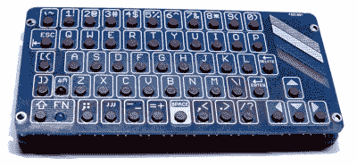](https://hackaday.com/wp-content/uploads/2019/03/piminiqwerty.jpg)

[The PiMiniQWERTY keyboard](https://hackaday.io/project/158454-mini-piqwerty-usb-keyboard) is the current state of the art in homemade, miniature keyboards.

首先，标准的 4 毫米轻触开关相当昂贵。当你在一个项目中只使用少数几个开关时，这不是问题，但如果你在每台设备上使用六七十个开关，这些成本就会增加。我发现的最便宜的轻触开关大约是 4000 个一卷 70 美元，或者每个开关 2 美分。乘以 70，这是每台设备 1.25 美元，仅在交换机上。可以想象，在一个项目中，开关的成本可能会高于微控制器。

其次，轻触开关需要组装。拾取和放置机器的故障率可能非常低，但是如果你在每块板上拾取和放置几十个开关，那么故障率将比只有一个单片器件的情况高。与 SMD 电阻和电容相比，轻触开关又大又软，增加了布局失败率。此外，由于挑选和放置开关需要时间，与使用一个独立的组件相比，您最终将为组装开关支付更多的费用。这推高了标准轻触开关的价格。

最后，这纯粹是虚荣，轻触开关没有标签。如果你要用 4 毫米轻触开关制作一个键盘，你还需要在你的印刷电路板上贴上标签。hack aday Belgrade Conference Badge 很好地做到了这一点，mini (Pi)QWERTY 通过使用两个 PCB(一个用于电子设备，另一个用于标签)出色地做到了这一点。很有可能通过丝网印刷或移印来标记轻触开关键盘，但是表面积已经非常小；反正贴标签的空间也不大。

这些问题的解决方案是使用注塑成型的硅胶键盘。你以前见过并使用过这些键盘。它们几乎出现在我见过的所有遥控器上，它们被用在你的旧诺基亚砖手机上。硅胶键盘无处不在，有些工厂会为你定制硅胶键盘:

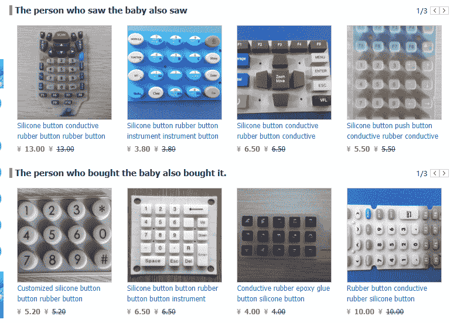

A variety of silicone keypads are available on TaoBao and AliExpress. The companies selling these keypads will also make custom keypads.

使用硅胶键盘有很多好处。首先，几乎所有的产品都在按钮上贴了标签。第二，你不像轻触开关那样局限于直径 4 毫米的小按钮。这些按钮可以是你能想象的任何大小和任何形状。组装容易；要将硅胶键盘与印刷电路板一起使用，您只需将键盘放置在 PCB 上；其他的都搞定了。最后，硅胶键盘看起来比任何轻触开关都要酷。那么为什么人们不使用它们呢？原因主要是成本，但也有相当一部分工程进入硅胶键盘。

### 不同类型的硅胶和薄膜开关

[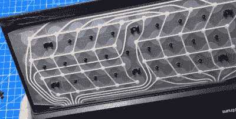](https://hackaday.com/wp-content/uploads/2019/03/zxspectrum.png)

The membrane assembly of a ZX Spectrum Image credit [https://www.youtube.com/watch?v=gzAP5PcI9jg](https://www.youtube.com/watch?v=gzAP5PcI9jg)

在深入探讨硅胶小键盘的设计之前，我应该先讨论一下小键盘和小键盘的各种不同设计。第一种是金属圆顶键盘，或薄膜键盘。至于 20 世纪 80 年代流行的家用电脑，ZX 频谱或雅达利 400(蹩脚键盘的版本)是触觉薄膜开关的最好例子。在你家里的其他地方，你的微波炉可能有这样一个键盘。

这些键盘以矩阵形式排列按钮。描绘这个矩阵的电路由画在两片聚酯上的导电墨水组成。键盘矩阵中的每个节点上方(每个按键下方)都放置了一个不锈钢圆顶。按下按钮会使圆顶塌陷，在两层聚酯纤维之间形成一个电路。

你能找到的最好的触觉薄膜键盘的图片是我的一个项目中的[。触觉薄膜开关不关心金属圆顶是如何被按下的。将按钮和字母放在薄膜顶部的最简单的解决方案是简单的图形覆盖。一块丝网印刷的塑料可以粘到触觉薄膜开关阵列上。这就是 Speak N 咒语中的键盘和](https://hackaday.io/project/3162/gallery)[大轨迹](https://en.wikipedia.org/wiki/Big_Trak#Programmable_keypad)是如何完成的。这就是你如何制作一个三岁小孩用的防花生酱键盘。

但是纯薄膜开关感觉很便宜，而且触觉薄膜键盘几乎没有触觉反馈。制造商的一个选择是在薄膜开关上方放置塑料键帽。再来看看金属圆顶键盘。这是你能找到的关于触觉薄膜键盘是如何构建的最好的视觉文档。他们使用硬塑料按键按下夹在两片印有导电墨水的聚酯中间的小金属圆顶:

 [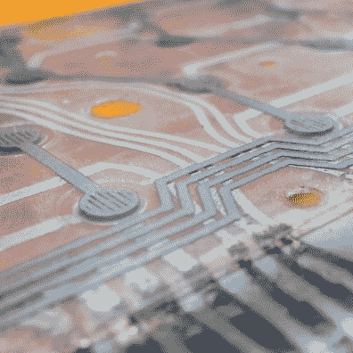](https://i0.wp.com/hackaday.com/wp-content/uploads/2019/03/6185861413207189643.jpg?ssl=1)  [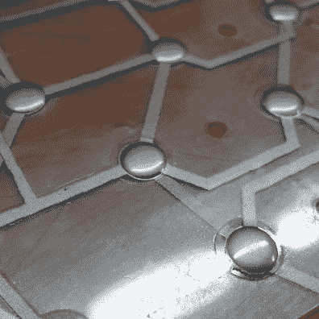](https://i0.wp.com/hackaday.com/wp-content/uploads/2019/03/2083971413207224955.jpg?ssl=1)  [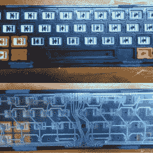](https://i0.wp.com/hackaday.com/wp-content/uploads/2019/03/3938041413207400938.jpg?ssl=1)  [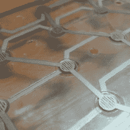](https://i0.wp.com/hackaday.com/wp-content/uploads/2019/03/2565061413207210629.jpg?ssl=1)  [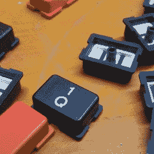](https://i0.wp.com/hackaday.com/wp-content/uploads/2019/03/8331741413207591959.jpg?ssl=1) 

或者，触觉薄膜键盘不需要*硬*塑料按钮。你可以在触觉薄膜键盘上使用柔软的硅胶按钮，比如 ZX 频谱。Speccy 没有像我的金属圆顶键盘那样使用坚硬的塑料方块，而是使用了单片硅胶按钮。ZX 频谱在其键盘中使用硅胶按钮，但它仍然是一个薄膜键盘。金属圆顶被一张丝网印刷塑料或硅胶方块压下没有区别。

另一种类型的小键盘——也是我为本文构建的类型——是硅胶键盘，或“chicklet”键盘，或对机械键盘爱好者来说，是橡胶圆顶键盘。

[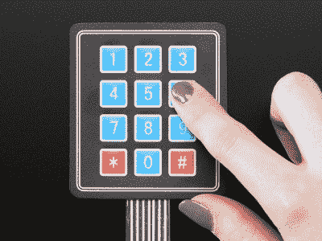](https://hackaday.com/wp-content/uploads/2019/03/adafruit-keypad.jpg)

The ubiquitous Arduino membrane keypad. Image credit [Adafruit](https://www.adafruit.com/product/419)

硅胶键盘使用注射成型的硅胶按钮按压触点。在硅胶键盘中，碳触点(一个“药丸”)被模制到硅胶按钮中，键盘矩阵的触点由印刷电路板上的迹线构成。触点可以集成到 PCB 中(建议使用 ENIG 镀金),也可以用导电油墨印刷。在这两种情况下，键盘都由电路板、每个按钮下方带有导电触点的硅胶键盘、每个按钮中的小导电碳触点以及将硅胶夹在电路板上的挡板组成。

在决定使用薄膜键盘还是硅胶键盘时，需要考虑几个因素，其中许多因素都有利于薄膜键盘。虽然硅树脂键盘可以制成多种颜色的按钮，但是薄膜键盘上的图形可以有效地印刷；薄膜键盘可以有任何颜色的任何图形。薄膜键盘本来就更便宜，因为它们不需要注射模具。硅胶键盘需要一个挡板或面板来容纳硅胶按钮的整体块，这意味着增加了第二个模具的成本。在这两者之间，硅胶键盘唯一的优势就是手感。如果你曾经尝试过使用雅达利 400，你会同意:硅胶键盘更适合打字。它们也比薄膜开关更引人注目。

### 当前研究和开放项目

[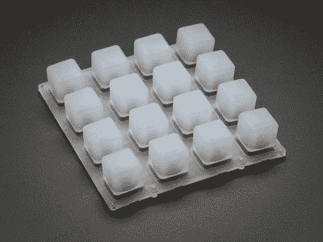](https://hackaday.com/wp-content/uploads/2019/03/1611-00.jpg)

The uncustomized silicone keypad that you can use in your project right now. Image credit: Adafruit

到目前为止，我还没有发现定制硅胶键盘的任何少量使用。这并不是说他们不存在于 DIY 社区中，他们非常存在: [Adafruit 出售 4×4 网格的硅胶按钮](https://www.adafruit.com/product/1611) (Sparkfun [也有同样的东西](https://www.sparkfun.com/products/7835)，在全球速卖通和易贝上也可以买到类似的硅胶按钮。是的，Sparkfun 和 Adafruit 在 PCB 的设计上投入了一些工程时间，但原始按钮很可能是在遥远的某个工厂制造的。这不是定制的硅胶键盘；这是用于定制项目的标准现成键盘。

这些特殊的硅胶按钮已经得到了很好的应用，比如一个单体克隆、[一个步进音序器](https://www.youtube.com/watch?v=0r35rKVCLrM)和[一个 MIDI 设备](https://www.adafruit.com/product/1929)。毕竟，这就是 underlit 硅胶按钮网格的设计目的:它们是很好的 MIDI 控制器。但是因为这些按钮没有标签，它们对其他东西没什么用。

据我所知，这些使用 4×4 硅胶键盘的项目是所有制造商/ DIY /业余工程中唯一使用硅胶按钮的项目。这并不是说人们没有努力。在适当的工程论坛上，有几个人正在研究硅胶键盘，还有几个人正在试验他们自己的铝模具，但是到目前为止还没有人扣动扳机。【达夫·琼斯】[已经拒绝了 uSupply](https://www.eevblog.com/forum/projects/usupply-custom-lcd/msg2208804/#msg2208804) 项目的硅胶键盘，取而代之的是一个定制的*薄膜*开关。

### 硅胶键盘、凸台和放屁孔的设计

那么，制作硅胶键盘需要什么呢？最终，你是在设计一个钢或铝模具。这个模具进入一个注模机，里面装满了碳丸，热硅胶被送进去，硅胶被硫化，零件被取出。可以对键帽进行进一步的处理，例如激光蚀刻标签、丝网印刷标签以及在键帽上涂上硬环氧树脂涂层。硅胶键盘的设计是注塑模具的设计，但基本组件实际上非常简单。下面的例子是一个单键硅胶键盘，它是用 Fusion360 在几分钟内完成的。

 [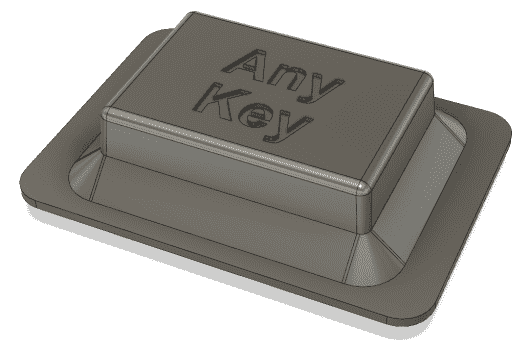](https://i0.wp.com/hackaday.com/wp-content/uploads/2019/03/anykey.png?ssl=1) The Any Key [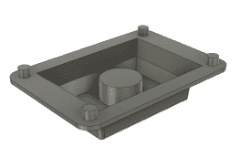](https://i0.wp.com/hackaday.com/wp-content/uploads/2019/03/anykeybottom.png?ssl=1) The interior structure of the Any Key. The carbon pill is in the middle of the key. On the corners, four bosses (placed into holes on the PCB) keep the key stable [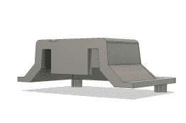](https://i0.wp.com/hackaday.com/wp-content/uploads/2019/03/cutaway.png?ssl=1) A cutaway view of the Any Key. The carbon pill (the cylinder in the center) does not extend to the bottom of the key

这种小键盘的外部结构由按键本身和作为基底的硅树脂层来限定。这个底座的四个角上有四个凸台，用来安装在 PCB 上。这些凸起是为了对齐，所以硅胶键盘不会四处滑动。

小键盘的内部结构由一个大的碳丸或实际触点定义，该触点将压在 PCB 上的电触点上。这是我设计的键盘的内部，除了更多的键和更多的复杂性，它仍然是和上面的例子一样的基本形状。请注意，在键盘的下侧有间隙，以允许空气通过每个按键。这些是屁洞。如果你不把这些放进去，你的键盘会放屁。

[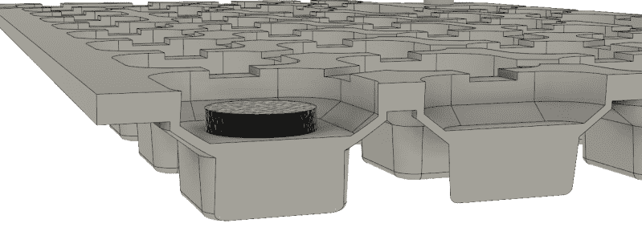](https://hackaday.com/wp-content/uploads/2019/03/cutaway-view.png)

A cutaway view of a silicone button. The black textured part is the carbon ‘pill’, which serves as a bridge between two contacts on a PCB.

The profile dimensions of the keyboard I designed. Measurements are in millimeters.

[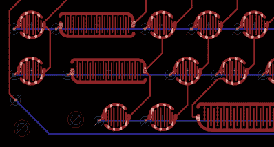](https://hackaday.com/wp-content/uploads/2019/03/7686761550680821520.png) 键盘的设计完成后，文件被送到一家硅胶键盘工厂制作模具和一些样品，是时候制作 PCB 了。在我的研究中，硅胶键盘的 PCB 触点设计并不重要。唯一重要的是有两条迹线连接到键盘矩阵的相对两侧，并且这些迹线应该靠得很近。建议采用 ENIG 或镀金表面。制造限制也开始起作用；走线和间距的“标准”最小宽度为 6 或 8 密耳，我设计的 PCB 每个触点的走线和间距为 10 密耳。

随着键盘和 PCB 的完成，我可以把我的注意力转向面板或筋膜。这是一片穿孔的塑料，用螺丝固定在印刷电路板上。硅胶键盘夹在边框和 PCB 之间。我做了这个原型，仅仅是为了测试这个键盘是不是 USB 键盘。电子设备只是一个[小 LC](https://www.pjrc.com/teensy/teensyLC.html) (因为那是我坐在周围的东西)，有一个切口允许访问开发板:

[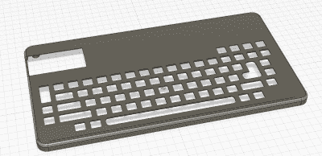](https://hackaday.com/wp-content/uploads/2019/03/5377091551594154851.png)[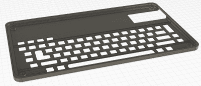](https://hackaday.com/wp-content/uploads/2019/03/4763681551594160743.png)

这个模型被送到 Shapeways，整个东西组装起来。Teensy 上运行的固件只使用标准的键盘库，并作为 USB HID 设备呈现给计算机。这是一个定制的硅胶键盘，完全是我想要的形状。这不是最终版本，因为 USB 键盘只是测试硅胶键盘的概念验证，但它确实可以工作。

 [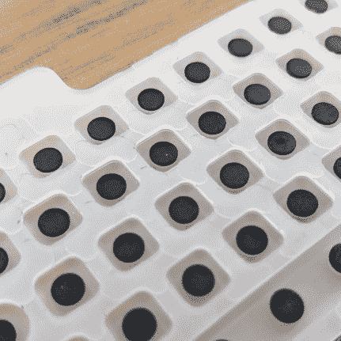](https://i0.wp.com/hackaday.com/wp-content/uploads/2019/03/carbonpills.jpg?ssl=1)  [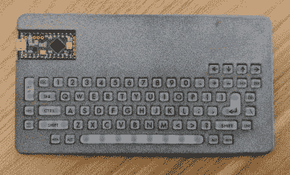](https://i0.wp.com/hackaday.com/wp-content/uploads/2019/03/kbhero.jpg?ssl=1)  [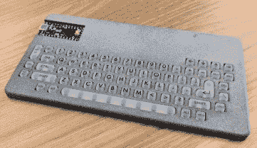](https://i0.wp.com/hackaday.com/wp-content/uploads/2019/03/kbside.jpg?ssl=1)  [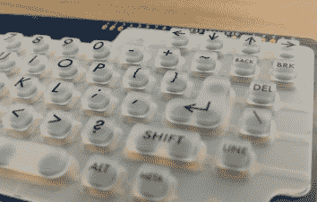](https://i0.wp.com/hackaday.com/wp-content/uploads/2019/03/kbsideosh.jpg?ssl=1)  [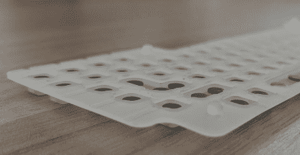](https://i0.wp.com/hackaday.com/wp-content/uploads/2019/03/nubsalignment.jpg?ssl=1) Note the alignment ‘nubs’. These align the silicone with the pads on the PCB [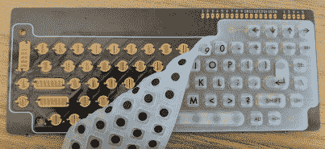](https://i0.wp.com/hackaday.com/wp-content/uploads/2019/03/peel.jpg?ssl=1)  [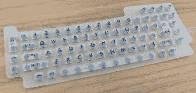](https://i0.wp.com/hackaday.com/wp-content/uploads/2019/03/singleside.jpg?ssl=1) 

### 从经济上来说，这是没有意义的，除非你正在建造 10，000 个。

我将完全公开这项工程的费用。这些价格的样本容量为 1；我只和一家硅胶键盘制造商谈过，我只得到一个设计的报价。然而，正因为市场竞争激烈，我希望这些价格能够代表定制硅胶键盘的平均成本。

这款硅胶键盘的设计成本如下:

| 工具作业 | $2,219 |
| 设计成本 | $600 |
| 银行费用 | $58 |
| **总计:** | **$ 2877** |

少量样品的总成本为**2877 美元**。这只是模具的价格和让工程师检查我的 CAD 文件。3000 美元给了我 10 个键盘。

但是一旦设计和加工完成，负责这项工作的工厂就可以生产键盘了。此后的每件报价从 1000 件的**1.30 美元**到 5000 件的**0.79 美元**不等。总之，一千个键盘将花费我 4177 美元，或者说刚刚超过**每台 4.18 美元**。5000 个键盘将花费我 6827 美元，或**1.36 美元/台**。这个最后的价格——每台不到 1.50 美元——使得这项技术对任何从事小规模制造的人来说都是可行的。

我们知道硅胶键盘适用于大型制造商；三星销售了数百万台电视，所有电视都配有相同的遥控器。为有效的 DIY 项目制作定制硅胶键盘的问题一直没有解决。没有小规模的项目使用这项技术，因此没有人问定制硅胶开关是否有意义。我在这里告诉你，如果你做了一千个左右的单位，它就可以。在 5000 左右，你的硅胶键盘和相关的塑料挡板的成本可能低于你的微控制器的成本。

这个项目的所有源代码都可以在 GitHub 上找到[。](https://github.com/bbenchoff/Dumb-Badge/tree/master/Test%20Keyboard)