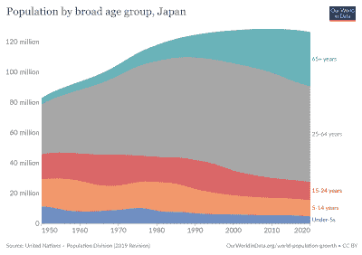
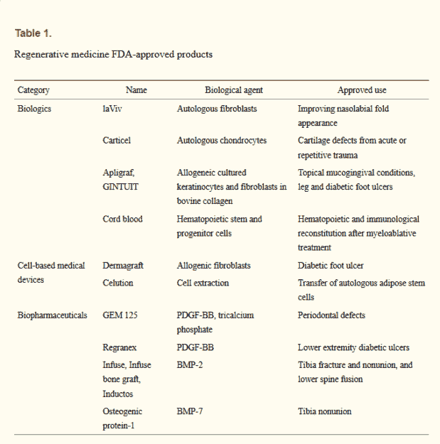

# 再生医学:消除时间摧残的承诺

> 原文：<https://hackaday.com/2022/01/12/regenerative-medicine-the-promise-of-undoing-the-ravages-of-time/>

在许多方面，人体就像任何其他机器一样，需要不断补充燃料和维护才能保持运转。除了我们选择那天吃什么之外，大部分事情的发生都没有我们的干预。然而，有时由于事故、身体疾病或衰老，我们身体的自动修复机制变得不堪重负，无法正确完成任务，或完全无法修复损伤。

我们大多数人都知道蜥蜴可以再生尾巴，一些海星可以再生出和它们被切成的碎片一样多的新海星，而 T2 美西螈可以再生四肢甚至大脑的一部分。然而，人类也拥有惊人的[再生能力](https://en.wikipedia.org/wiki/Regeneration_in_humans)，尽管对我们来说，这种能力主要存在于肝脏中，即使切除四分之三的肝脏，肝脏也能再生。

在[再生医学](https://en.wikipedia.org/wiki/Regenerative_medicine)领域，目标是利用患者自身的遗传物质，诱导受损组织再生，或者用外部生长的器官和组织替换受损器官和组织。这将为我们提供一个未来，在这个未来里，随时都可以根据需要获得替代器官，许多类型的损伤不再是永久性的，包括瘫痪。

## 一切从知识开始

自 20 世纪初以来，我们对人类生理学和动物生理学的理解水平已经大幅提高，当时的技术让我们能够比以往任何时候都更详细地研究微观世界。虽然经验医学早在公元前 3000 年的苏美尔文明就已经看到了它的开端，但是我们对身体功能的过程和组成部分的普遍理解却是最近才出现的。

1869 年弗里德里希·米舍尔首次分离出 DNA，但直到 1953 年才描述出它的结构。这一发现为[分子生物学](https://en.wikipedia.org/wiki/Molecular_biology)领域奠定了基础，该领域旨在了解生物活动的分子基础。从某种意义上来说，这一时刻可以被视为具有变革性，例如从经典力学到量子力学的转变，因为它将焦点从宏观观察转变为对这些观察的更基本的理解。

Japanese population by age group. (Credit: OurWorldInData.org)

这让我们大大增加了对身体如何对损伤做出反应的理解，以及再生过程的分子基础，以及为什么人类通常不能再生受损的肢体。最终在 1999 年，威廉·a·哈塞尔廷创造了“再生医学”这个术语，他在 2001 年写了一篇文章，阐述了他对这个术语的设想。这将不仅解决事故和疾病造成的伤害和创伤，而且解决与老龄化相关的问题，这将解决随着世界人口的平均年龄不断增加而出现的人口危机。

Angelo S. Mao 等人(2015 年)报道了 2015 年再生医学的最新进展。这包括再生方法，包括外部生长的组织和器官，或刺激先天再生能力。由于与再生医学领域的广泛重叠，他们的论文包括了[组织工程](https://en.wikipedia.org/wiki/Tissue_engineering)的生物医学学科。尽管将再生医学产品推向市场需要大量的时间和金钱，毛等人还是列出了当时 FDA 批准的产品:

FDA-approved regenerative products in 2015\. (Credit: Angelo S. Mao et al., 2015)

虽然无论如何，这些都不是奇迹产品，但它们确实证明了这些方法的有效性，显示出与现有产品相似或更好的有效性。虽然将细胞带到受影响的区域并诱导修复是策略的一部分，但另一个重要部分涉及细胞外基质( [ECM](https://en.wikipedia.org/wiki/Extracellular_matrix) )。这些是体内许多组织和器官的基本结构，不仅提供支持，而且在生长和再生中起作用。

然而，ECM 是非细胞的，因此被视为“医疗设备”。例如，它们在皮肤愈合以防止疤痕组织形成方面发挥作用，但也在再生医学的另一个诱人方面发挥作用:利用自身细胞在患者体内或体外培养整个替代器官和身体部分。例如，[小麦思等人(2010)](https://journals.healio.com/doi/abs/10.3928/01477447-20100526-24) 报道了一名 19 岁的美国海军陆战队员，他的部分右大腿肌肉被爆炸摧毁。从猪(猪)肠粘膜下提取的 ECM 植入该区域四个月后，检测到肌肉组织逐渐再生。

这里的一个重要研究领域是合成 ECM 样支架的开发，因为这将使该过程更快、更容易和更通用。合成支架也使体外培养更大结构的过程变得更加容易，这是肾脏、心脏等器官生长所必需的。理想情况下，这些器官将从诱导的多能干细胞( [iPS](https://en.wikipedia.org/wiki/Induced_pluripotent_stem_cell) )中生长出来，这些干细胞是患者自己的细胞，可以恢复到早期的特化状态。

## 交换零件

毫不奇怪，作为一个以某种方式集合了几乎所有涉及(人类)生物学领域的领域，再生医学并不容易。虽然研究一个工作系统是一回事，但是让一个系统从零开始成长是完全不同的一个层次。这就是为什么尽管通过从诱导多能干细胞中简单地生长出新的替代器官来获得基本上无限的替代器官供应是非常好的，但功能器官的复杂性使其目前超出了我们的能力范围。

基本规则是器官或组织越不复杂，就越容易在体外培养。理想情况下，它将只由单一类型的细胞组成，并在一些生长介质中生长，而不需要 ECM。这里有吸引力的目标是例如角膜，在等待角膜移植的名单上的人数大大超过了供体角膜。

在 [Mobaraki 等人(2019)](https://www.ncbi.nlm.nih.gov/pmc/articles/PMC6579817/) 的一篇综述中，考虑了目前批准的众多角膜替代物以及正在研究的新方法。尽管人造角膜已经使用多年，但它们存在各种问题，包括生物相容性问题和其他妨碍长期功能的问题。供体角膜的使用面临短缺，这是首要问题。目前的再生研究集中在角膜缘区发现的干细胞(角膜缘干细胞，LSC)。自 1977 年以来，这种技术在修复眼表缺陷方面似乎很有前景。

The evolution pathway of ocular surface reconstruction investigations which started with autologous conjunctival transplantation in a patient with bilateral alkali burn in 1977 and have been continued with other methods specially limbus regeneration over the past four decades. (Credit: Nakamura et al., 2016).

LSC 在角膜的正常再生能力中起作用，并提供了生长替代角膜或修复受损角膜的起点，以及必要时添加 ECM。这可以结合抑制局部免疫反应来实现，从而促进伤口的自然愈合。即便如此，在可行的原位修复角膜*或体外培育替代物*的治疗方法获得美国食品和药物管理局或国家同等机构的批准之前，仍有大量的研究需要进行。**

 **类似的情况可以在人造皮肤的发展中看到，幸运的是，由于患者身体上有大量的皮肤移植(自体移植)通常是可能的。即便如此，工程皮肤替代物(ESS)的应用似乎更优越。这种方法不需要去除其他地方的皮肤(表皮),并且限制了疤痕的形成。它包括在伤口上放置一种基于胶原蛋白的 ECM，它可以选择接种角质细胞(皮肤前体细胞)，从而加速伤口愈合。

正如 [Tzeranis 等人(2015)](https://www.ncbi.nlm.nih.gov/pmc/articles/PMC4791220/) 所报道的，支架在皮肤再生中被证明是必不可少的。这支持了来自其他研究的证据，表明细胞粘附到 ECM 上在细胞调节和发育中是必不可少的。随着最近的变化，似乎毛囊的形成和神经支配都是可以解决的问题。

## 还有很长的路要走

Longitudinal spinal cord section treated with the most bioactive therapeutic scaffold. Regenerated axons (red) regrew within the lesion. (Credit: Samuel I. Stupp Laboratory/Northwestern University)

我们可能还需要很长时间才能从患者自身的诱导多能干细胞中培育出类似替换心脏的东西。最近的研究主要集中在现有心脏的去细胞化(仅留下 ECM)，并用天然细胞重新填充(例如 [【加尔维斯-蒙顿等人 ，2012](https://www.sciencedirect.com/science/article/abs/pii/S1885585713000248?via%3Dihub) )。例如，通过创建一个合成支架，并在其中植入来自患者 iPS 细胞的细胞，可以设计出一种可行的治疗方法。

可能更容易转化为标准治疗的是创伤后脊髓神经的再生，最近由[Á·阿尔瓦雷斯等人(2021)](https://www.science.org/doi/10.1126/science.abh3602) ( [新闻稿](https://news.northwestern.edu/stories/2021/11/dancing-molecules-successfully-repair-severe-spinal-cord-injuries/&fj=1))发表的一篇文章涵盖了使用人工支架促进神经再生、减少疤痕和促进血管形成的最新进展。这为有朝一日脊髓损伤可以完全修复带来了希望。

如果我们回到“作为机器的身体”的比较，那么人体就不像是一辆汽车或一件重型机械，而更像是一个内部有着复杂电路和部件的胶合配件。随着复杂性的激增，需要更深层次的理解，以及越来越先进的工具，以便能够高效地进行修复，并获得良好的结果。

即便如此，再生医学已经拯救了许多人的生命，例如今天的烧伤患者，并改善了无数其他人的生活。随着研究的进一步进展继续转化为治疗，我们应该会看到从“你必须学会适应这一点”到更乐观的“给它一些时间来恢复”的逐渐变化，就像受伤的退伍军人或事故的受害者一样。**