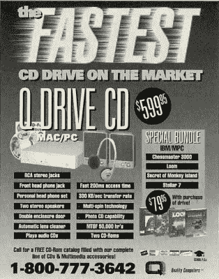
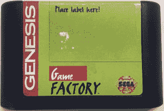

# 还记得 Blockbuster Video 尝试按需刻录游戏卡带的时候吗？

> 原文：<https://hackaday.com/2018/10/01/remember-when-blockbuster-video-tried-burning-game-cartridges-on-demand/>

到 20 世纪 90 年代初，有一件事是清楚的，未来是数字化的。音乐的模拟格式销售下降，CD 销售上升；很明显，至少在美国，人们把更多的计算设备带进了家里。根据这个 [*早安美国*栏目](https://www.youtube.com/watch?v=n_E2lh1lgmk&feature=youtu.be&t=52)，在本世纪初，大约三分之一的美国家庭拥有任天堂娱乐系统。

有了这些游戏机，每个购物季都变成了“谁排队时间最长”的竞赛，以挑选最新的游戏。这使得购物者在最后一刻不得不选择延期付款或者空手而归。事情本不必如此。数字世界已经出现，实体媒体只需要跟上。要让其他人敞开心扉，需要两家完全不同的公司结成不太可能的联盟。

## 20 世纪 90 年代早期的数字点播

进入新叶娱乐。IBM 和 Blockbuster 的合资企业，最初旨在通过在现场按需创建物理媒体来改变人们购买音乐和家庭视频的方式。

> “一个信息网络，它以数字方式向世界上任何地方的零售店按需提供几乎任何类型的娱乐产品。”

通过向零售商提供他们能处理的所有空白 CD、VHS 磁带和首饰盒，每种新发行的唱片都有存货，旧的唱片永远不会绝版。配有交互式客户演示站，配有 30 秒的歌曲剪辑和触摸屏，任何人都可以预览标题，而无需引人注目的端盖显示或零售员工的干预。所需要的只是顾客下订单和一点耐心。

CD-Rom Ad, Computer Gaming World: Nov. 1993

这个想法当然是合理的。消费者已经习惯了在许多百货商店提供的一小时照片冲洗服务，所以将这种模式应用于 CD 和电影销售并不是一件难事。顾客会走到电子产品区，下订单，完成剩下的购物，然后在结账前拿起他们选择的专辑/电影。

制作他们自己的盗版所需的技术对普通消费者来说简直遥不可及。P2P 文件共享几乎不存在，互联网连接仍然以波特来衡量。即使有人能够获得未经授权的拷贝，一个像样的 CD-ROM 驱动器，没有刻录功能，仍然要花费 600 美元左右。

## 复制技术的现状

[据 NewLeaf 的一名前员工](https://retailgeek.com/future-of-retail-as-seen-in-1992/)称，“我们建造了一个奢华的演示中心……其中包括高速 VHS 复制、最先进的 4X CD-Rom 刻录机、第一代数字彩色打印机，以及自动制造和组装完整媒体及其所有包装的机器人技术。”典型的专辑可以在几分钟内刻录完毕，而电影的复制时间则因转移到 VHS 磁带的限制而更加多变。演示中心的内容管理系统通过光纤电话线连接到主机上，以便跟踪销售情况，[的新版本可以从同一个网络连接上下载。](http://articles.sun-sentinel.com/1993-05-12/business/9302110400_1_newleaf-entertainment-joint-venture-ibm)

理论上，技术方面的一切似乎都在排队；问题在于让版权所有者同意这种新的发行方式。事实上，NewLeaf 的商业模式将从本质上为无论规模大小的零售商提供公平的竞争环境，这在当时对“六大”唱片公司来说是一个直接的失败。

## 一个弹夹，多种可能性

Game Factory 16 Mb Sega Genesis Cartridge

没有主要唱片公司或电影公司的支持，是时候从零售领域转移了。Blockbuster Video 的主要业务是租赁业务，该业务的一个新兴部分是视频游戏租赁。视频游戏行业的发布日期变得越来越严格；像真人快打的《致命星期一》这样基于事件的发行日期，Blockbuster 通常会在发行的第一周就缺货。按需生成库存的概念非常适合租赁业务模式。此外，这是在 16 位游戏机时代，最初的游戏机战争，游戏机制造商寻求任何和所有的机会来区分自己的竞争。新叶会在美国的[世嘉找到一个盟友，他们非常渴望扩大他们的支持](https://books.google.com/books?id=sgsEAAAAMBAJ&q=%22new+leaf%22#v=snippet&q=%22new%20leaf%22&f=false)。

这个被称为游戏工厂的支点很快成为现实，南卡罗来纳州哥伦比亚地区的 10 家大型音像店被选为测试市场。这些商店的机器能够刷新包含世嘉创世纪游戏的 16 Mb 和 32 Mb EEPROM 盒式存储器。刷新过程平均只需要 45 秒，创世纪游戏的大部分都能够适应两个可用的内存容量；尽管像 Virtua Racing 这样在盒式 PCB 上包含附加处理器的游戏永远不会兼容。

## 游戏机发展速度的受害者

游戏工厂测试证明是积极的，然而，这是 1994 年和革命性的索尼 PlayStation 在日本。视频游戏的不断发展和专有性质只会证明太多的时间下沉，在同年晚些时候百视达和维亚康姆的合并中，整个项目将被取消。

NewLeaf Entertainment 采取了一种大胆的方法来重新定义 iTunes 之前的音乐购物体验和 Steam 之前的视频游戏购买体验，但最终未能说服内容持有者适应更以消费者为中心的分发模式。一小时的实体媒体照片对当时来说实在是太激进了，尽管新叶娱乐公司的故事可能最好由他们的代言人丹尼斯·米勒来讲述。