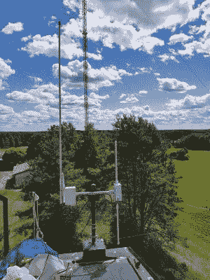

# 远程 ADS-B 安装用 RTL-SDR Trio 监听所有的飞机传输，用蜂窝电话呼叫总部

> 原文：<https://hackaday.com/2019/08/14/remote-ads-b-install-listens-in-on-all-the-aircraft-transmissions-with-rtl-sdr-trio-phones-home-on-cellular/>

在安装几乎任何一种无线电设备时，最重要的三个因素与房地产一样:位置、位置、位置。尽可能高的无障碍位置使天线具有最远的无线电视野以及最大的安装成本。但是远程安装也带来了问题，特别是维护，这可能是一件苦差事。

 因此，当[tsimota]有机会将他的一个自动相关监视广播(ADS-B)接收器重新安置到一个远程站点时，他确保远程设备尽可能防弹。在[一篇用大量图片](https://www.reddit.com/r/RTLSDR/comments/cme0wq/my_remote_adsb_setup/)详细描述的文章中，【tsimota】展示了他在构建中付出的巨大努力。

该系统有一个运行 ADS-B 软件的固态硬盘 Raspberry Pi 3，一个用于三个独立的 [RTL-SDR 加密狗](https://hackaday.com/2019/07/31/rtl-sdr-seven-years-later/)的供电 USB 集线器，用于各种飞机监控通道，一个远程 [FlightAware 加密狗](https://hackaday.com/2015/07/18/tracking-nearly-every-aircraft-with-a-raspberry-pi/)用于监控 ADS-B，以及内部和外部温度传感器。所有东西都被装进一个防风雨的盒子里，这个盒子有过滤通风风扇来保持凉爽，甚至还有一个磁簧防篡改开关，让他知道盒子是否被打开。一个 LTE 调制解调器将数据传输回互联网，一个 GSM 控制的插座允许远程重启，一个 UPS 保持整个系统的运行，如果这个系统现在存在于 15 米高的大楼顶上的电源信号。

没有人比我们更喜欢高质量的远程安装，这是一个很好的例子。我们唯一的吹毛求疵是使用传感器的试验板，但在低振动的位置，它应该工作良好。如果你渴望建立一个 ADS-B 地面站，但还不想马上投入，那么几年前的这本初学者指南是一个很好的起点。