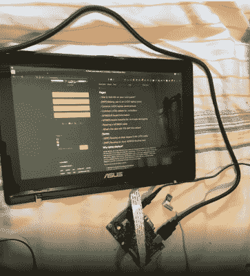
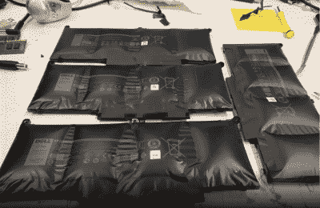

# Remoticon 2021 // Arsenijs 撕裂你的笔记本电脑

> 原文：<https://hackaday.com/2022/03/17/remoticon-2021-arsenijs-tears-apart-your-laptop/>

Hackaday 自己的[Arsenijs Picugins]一直在忙着拆开旧笔记本电脑，了解哪些可以轻松重复使用，哪些不可以，并为 2021 Hackaday Remoticon 提供了一个充满迷因的演示，提供了一些非常实用的建议。

Full HD, IPS LCD display with touch support, reused with the help of a dedicated driver board

一台报废的笔记本电脑内部有哪些部件值得保留？除了 RAM stick 和硬盘等可移动设备之外，最明显的第一个目标是液晶屏。这些令人惊讶地易于使用，驱动板在通常的市场上可以买到，只要你确保检查你的面板支持的确切型号。

笔记本电脑内部的许多组件实际上是 USB 设备，像触摸屏控制器、网络摄像头之类的东西通常是单独的模块，它们只是简单地使用电源和 USB。这是有道理的，因为笔记本电脑已经有相当数量的外部 USB 连接，为什么不在内部使用呢？其他项目有点棘手:触控板似乎是 PS/2 或 I ² C，需要更多的硬件支持。数字麦克风大多说话 I ² S，这意味着一些微控制器编码。

然而，有些物品需要多一点小心，所以可能要避免使用旧的戴尔电池，因为它们有“辣枕头”的倾向。正如[Arsenijs]所说，当它们成熟时采摘，但不要太成熟。电池需要一点照顾和喂养，确保你有一些细胞保护，如果你拉原始细胞！充电电子设备总是在主板上，所以如果你带电池模块，这需要你自己安排，但这并不困难，只要你能找到绕过 [SMBus 协议](https://en.wikipedia.org/wiki/System_Management_Bus)的方法。

These batteries are too ripe. Leave them alone.

旧的笔记本电脑更加模块化，有些甚至是为升级或修改而设计的，这种小型化趋势推动一切都在缩小——笔记本电脑现在需要薄到足以刮胡子——导致一些制造商在硬件设计方面转向更专有的方向。

这种发展与我们对隐私、可修复性和消除浪费的关注相冲突，导致封闭的盒子里装满了不可修复、不可重复使用的黑盒。我们认为是时候收回一些硬件了，所以为那些承担逆向工程和发布可重用性信息任务的人欢呼三声，并祝愿他们能够继续下去。

 [https://www.youtube.com/embed/137S2sQJuhc?version=3&rel=1&showsearch=0&showinfo=1&iv_load_policy=1&fs=1&hl=en-US&autohide=2&wmode=transparent](https://www.youtube.com/embed/137S2sQJuhc?version=3&rel=1&showsearch=0&showinfo=1&iv_load_policy=1&fs=1&hl=en-US&autohide=2&wmode=transparent)

