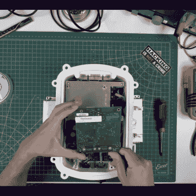

# Remoticon 2021 // Hash Salehi 智胜智能电表

> 原文：<https://hackaday.com/2022/01/13/remoticon-2021-hash-salehi-outsmarts-his-smart-meter/>

智能电表在它们之间形成网状网络，向四周传输你的使用数据。其中一些甚至允许电力公司通过网络远程关闭你的电源。你可能想知道这些信息是否是敏感的，或者断电系统是否有明显的安全漏洞，随机的人可能会关掉你的房子。Hash Salehi 已经开始进入这些仪表，对我们其他人来说幸运的是，[他在 Remoticon 2021](https://youtu.be/T4rKaqjUXXs) 期间分享了他的发现。这是一次充满 GNU 无线电、嵌入式设备和在法拉第笼中经营自己的电力公司的精彩花絮的旅程。

这个智能电表是由德克萨斯州达拉斯的一家名为 Oncor 的电力公司安装的。这些特定的仪表使用 ZigBee 模块形成一个广泛的网状网络，允许它们在它们之间传递消息，最终到达收集器或聚合器，以上传到更中心的位置。哈希通过大家最喜欢的在线拍卖行获得了他的零件，并惊讶地看到有这么多零件可用。然后，有了零件在手，他开始所有通常的逆向工程技巧:特别提款权，法拉第笼，闪存芯片阅读器，并重新创建原理图。

为了继续深入兔子洞，Hash 采取了一种双管齐下的方法，开始在固件上倾注(超过 300 kB ),并试图捕获他所在区域的流量。从只收听一个频道开始，他扩展到收听所有 240-260 个频道，但发现单独收听每个频道正在消耗他投入的所有计算能力。GNU Radio con 的一次谈话给了他灵感，让他采用跳频的方法来解码所有的数据包。一次在高速公路上开车，他的车里有一个天线，这让他能够捕捉到迷人的图表，显示该地区的仪表以及它们已经运行了多长时间。

 然而，理解协议的真正考验不仅仅是接收。他还想寄一些包裹。但是，当然，电力公司不会对他们网络上的流氓演员感到太兴奋，不管他们的意图是什么。所以 Hash 需要他自己的网络，有效地启动了一个不提供任何电力的电力公司。

他之前买了一个收集器，发现里面有一整块运行 Windows 7 Embedded 的英特尔处理器。主程序是。Net，所以这使得调整变得微不足道。现在他有了接收器，是时候做一个他能控制的发射器了。他仍在努力，但这一切都在 GitHub 和其他地方的[公开。这里最酷的技巧是他在接收机期望的跳频时间表上的变通办法:他简单地一次广播所有 240 个频道！喜欢特别提款权。](https://github.com/BitBangingBytes)

这显然不是一个周末项目，如果你感兴趣，我们之前已经与 Hash 就智能电表进行了一次黑客聊天。我们期待着他还会有什么发现。

 [https://www.youtube.com/embed/T4rKaqjUXXs?version=3&rel=1&showsearch=0&showinfo=1&iv_load_policy=1&fs=1&hl=en-US&autohide=2&wmode=transparent](https://www.youtube.com/embed/T4rKaqjUXXs?version=3&rel=1&showsearch=0&showinfo=1&iv_load_policy=1&fs=1&hl=en-US&autohide=2&wmode=transparent)

