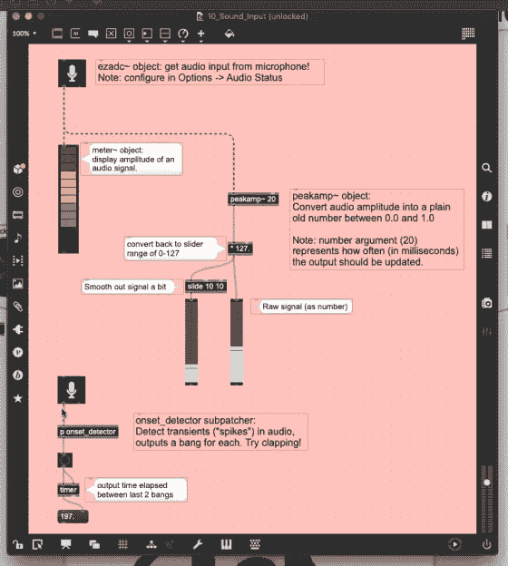

# Remoticon 视频:如何在您的交互式项目中使用 Max

> 原文：<https://hackaday.com/2020/12/17/remoticon-video-how-to-use-max-in-your-interactive-projects/>

当你想快速地将媒体和用户交互结合在一起时，寻找一些重要的构建模块可能是一个救命稻草。这就是 Max 背后的想法，这是一种图形编程语言，它在任何构建艺术装置、技术演示(比如儿童博物馆)和用户信息亭的人中间都获得了忠实的追随者。

Guy Dupont 在 2020 Hackaday Remoticon 期间举办了一场[如何开始使用 Max workshop](https://www.youtube.com/watch?v=6aWVh3VSuHU) 的讲座，让我们了解最新进展。他的速成课程介绍了该程序的基础知识，并提供了一套 16 个演示，您可以通过玩这些演示来熟悉该程序。正如他所说，如果你需要声音、视频、图像、按钮、旋钮、传感器和互联网数据进行输入和输出，那么 Max 值得一看。研讨会的视频可以在下面找到。

 [https://www.youtube.com/embed/6aWVh3VSuHU?version=3&rel=1&showsearch=0&showinfo=1&iv_load_policy=1&fs=1&hl=en-US&autohide=2&wmode=transparent](https://www.youtube.com/embed/6aWVh3VSuHU?version=3&rel=1&showsearch=0&showinfo=1&iv_load_policy=1&fs=1&hl=en-US&autohide=2&wmode=transparent)

[前往研讨会页面](https://hackaday.io/project/175075-remoticon-prototyping-to-the-max)，您可以从文件部分下载示例。 [Max](https://cycling74.com/products/max-features) 是一个有免费试用期的商业程序。盖伊指出，它的兄弟程序 [Pure Data](https://puredata.info/) 是免费和开源的，它几乎可以在任何东西上运行，但与 Max 相比就像是驾驶手动挡和驾驶自动档。如果你有使用这两个程序的第一手经验，我们希望在下面的评论中听到你的想法。

 任何熟悉图形化编程语言的人都会觉得使用 Max 如鱼得水。块被拖动到工作空间中，并通过输入和输出之间的连线连接。有大量的块可用于你可能想象的一切。在一些演示中包括高级交互功能，如从 Twitch 上的聊天消息中接受命令，从 IFTTT 中触发，以及在同一无线网络上的不同 Max 实例之间添加交互性。

[本文顶部图片中显示的示例](https://twitter.com/gvy_dvpont/status/1320175095764160515)是网络摄像头输入。当盖伊举起粉红色的标志时，它会解除麦克风的静音，当他放下时，它又会静音。这在数字上相当于在你的变焦通话中有[一个说话棒](https://en.wikipedia.org/wiki/Talking_stick)。盖伊对那些寻求硬件交互性的人的建议是利用串行，或利用 MIDI 控制。

这种快速启动会让任何人都开始工作，不管你以前有什么经验。作为一个你最终会陷入其中的恶作剧的例子，Guy 展示了他在 Max 中建模的一个移位寄存器，一直到与非门。如果你想看看盖伊的其他作品，我们喜欢他的 [Bonnaroo 点唱机](https://hackaday.com/2020/08/09/tune-into-the-bonnaroo-that-no-one-gets-to-go-to/)和他重新制作的 [Wurlitzer 笔记可视化工具](https://hackaday.com/2020/06/20/wurlitzer-note-visualizer-gets-a-2020-spec-replica/)。