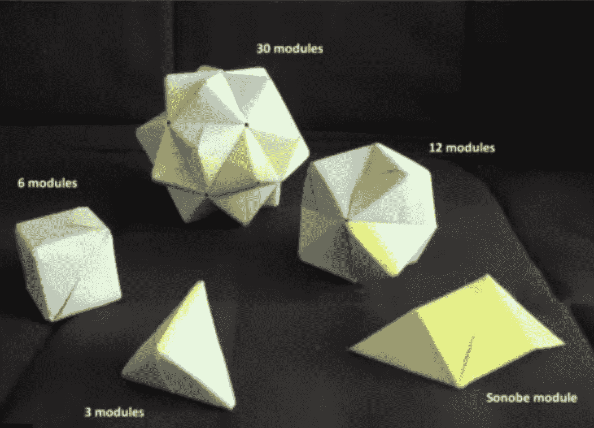

# Remoticon 视频:用 Charlyn Gonda 制作发光的折纸

> 原文：<https://hackaday.com/2020/12/21/remoticon-video-making-glowy-origami-with-charlyn-gonda/>

黑客是推动信封，发现新的和聪明的方法来使用他们的原始设计者从未设想过的东西。[Charlyn Gonda]的 Hackaday Remoticon 工作室“制作华丽的折纸”正是如此；折纸艺术与发光二极管艺术的结合。查看下面嵌入的完整课程，并继续阅读您将发现的内容摘要。

 [https://www.youtube.com/embed/ZcQ8KpowN6k?version=3&rel=1&showsearch=0&showinfo=1&iv_load_policy=1&fs=1&hl=en-US&autohide=2&wmode=transparent](https://www.youtube.com/embed/ZcQ8KpowN6k?version=3&rel=1&showsearch=0&showinfo=1&iv_load_policy=1&fs=1&hl=en-US&autohide=2&wmode=transparent)

研讨会的主题是，你不需要精心制作的千个 LED 条和复杂的印刷电路板来制作一个有吸引力的立体灯光秀，即使是相对简单的折叠纸结构也可以产生迷人的效果。为了说明这一点，[Charlyn]带领参与者通过一系列三种日益复杂的折纸技术，这些技术可以组成各种有趣的形状和结构。

Sonobe Modules at Play

第一个是 [Sonobe 模块](https://en.wikipedia.org/wiki/Sonobe)，一个简单的折叠组合，它本身看起来不太像。但是 Sonobe 并不是独立的，它们被设计成可以组合在一起制造各种形状和大小的多面体。看看右边的图片，看看它们可以组合在一起创造出什么。第二个设计是用一系列简单的类似阿尔科迪亚的[山脉和山谷褶皱](https://britishorigami.info/valley-mountain-folds/)修改的长矩形。但是再稍微调整一下，这张折叠的纸可以用于更多的技术目的。最终的折叠是一个更加复杂的平行四边形，它可以折叠成一个扭曲的、灵活的独立圆柱体。[Charlyn]展示了最后两次折叠如何创造出一张足够灵活的纸，可以增长和收缩，保持重量，并制作其他有趣的动态结构，与建筑和充气空间栖息地类似。

如果你想在家跟进，请查看 Hackaday.io 页面中的折叠模板和更多讨论！