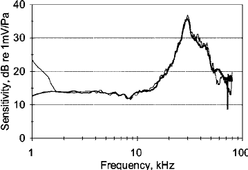

# 使用超声波从录音中去除说话者的声音

> 原文：<https://hackaday.com/2022/08/12/remove-a-speakers-voice-from-a-recording-using-ultrasound/>

如果你能有效地阻止别人录下你的声音会怎么样？这是密歇根州立大学郭等人(2022)研究的重点，他们使用动态计算的音频信号[有效地抵消了录音设备](https://arxiv.org/abs/2207.05848v1)中一个人的声音。这依赖于某些微机电系统(MEMS)麦克风的一个有趣方面，这种麦克风通常用于智能手机和其他录音设备。

Pressure sensitivity of a MEMS microphone. (credit: Brian R. Elbing)

一个特制的超声波信号被发送到正在记录一个人声音的同一个麦克风，可能会导致声音音频信号在最后的记录中消失。作者采用的方法包括使用一个神经网络，该网络根据必须消除其声音的人(“Bob”)的声音样本进行训练。在对话期间记录 Bob 的声音后，创造性地命名的神经增强消除(NEC)系统确定要发送到目标记录设备的超声波信号。同时，持有录音设备的人(“Alice”)仍将正常地感知 Bob 的声音。

由于超声波具有高度方向性，该系统只能干扰特定的麦克风，不会影响房间中隐藏的麦克风。正如作者所指出的，使用其他系统进行一般的麦克风干扰是可能的，但这在法律上是有问题的，这在他们的 NEC 系统中应该不是问题。

感谢[JohnU]的提示！