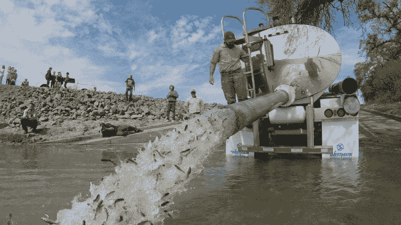
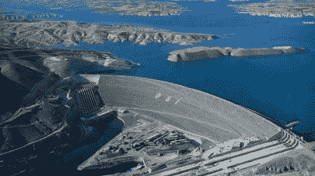
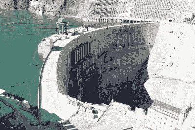

# 修复灾难性故障:奥罗维尔大坝更新

> 原文：<https://hackaday.com/2019/05/17/repairing-a-catastrophic-failure-the-oroville-dam-update/>

两年多前，美国最大的大坝的主溢洪道发生了灾难性的故障，主溢洪道是大坝运营商防止湖水上涨的主要手段。溢洪道的故障造成了如此严重的侵蚀，以至于水电站无法运行，进一步恶化了局势。几天后，大坝终于达到了设计极限，水开始从一个从未使用过的紧急泄洪道流下，促使下游社区的 18.8 万人撤离。

自从危机爆发以来，工作人员一直在夜以继日地修复主要的和紧急的泄洪道，以确保这个世界上最富裕的国家最大的基础设施之一不会完全瘫痪。大坝的泄洪道最近于 4 月 2 日重新开放，正好赶上今年的积雪融化，到目前为止一切看起来都很好。

修复工作是一个真正的工程壮举，也许也是一个物流奇迹。下面的视频回顾了许多所需的原材料输入，但最引人注目的是，在整个修复过程中，每五分钟就有一辆装满碾压混凝土的自卸卡车被清空——足以建造一条从奥罗维尔大坝到德克萨斯州的人行道。使用如此大量混凝土的部分原因是它不仅仅用于修复主溢洪道。还为紧急溢洪道建造了一个巨大的“防溅垫”,以在必须再次使用时限制侵蚀。但是全面的变化不仅仅局限于混凝土和钢筋。休息之后，请加入我，让我试着思考一下奥罗维尔大坝修复的全部内容。

## 有人会想到鱼吗？(事实上，他们做到了)

 

奥罗维尔危机期间，卡车卸下从河里救起的鱼。[图片来源: [NOAA 渔业](https://www.westcoast.fisheries.noaa.gov/stories/2017/21_0321201_oroville_dam_fish_save.html)

修复大坝本身并不是唯一需要完成的任务。大坝下面的盆地中聚集的沉积物如此之多，以至于河里的鱼无法从一边游到另一边。这意味着数以百万计的小鱼必须用卡车在该地区运输，从各种渔场和池塘，往返于河流，以防止种群崩溃。

另一个可能更明显的问题是，下游盆地的沉积物根本阻止了发电站的运行。由于发电机位于大坝底部，由极端侵蚀造成的堵塞阻止了大坝这一部分的任何流出。在恢复发电机的运转能力之前(这也降低了湖水的水位，这是一个副作用)，在修复主泄洪道的真正工作完成之前，所有的碎片都必须被清除。

修复工作完成后，大坝运营商测试了主溢洪道的小流量，并计划将流量增加到高于两年前溢洪道首次出现问题时的泄流量。到目前为止，修复后的泄洪道没有出现任何问题，大坝运行正常。

## 在最大的工程项目名单上

 

土耳其的阿塔图尔克大坝【图片来源:[Temblor](http://temblor.net/earthquake-insights/m5-2-earthquake-in-turkey-strikes-site-of-induced-seismicity-6870/)

虽然奥罗维尔大坝于 1968 年竣工，但它是世界上最大的大坝之一，但按结构体积计算，仍仅是美国第三大大坝(尽管它仍是最高的大坝)。自那以后，只有另外两座大坝超过了它，土耳其的阿塔图尔克大坝和巴基斯坦的塔尔贝拉大坝。这些都是用泥土、岩石或两者的组合建造的，用来阻挡水库；其它类型的坝需要较少的建筑材料，但能达到相似(或更高)的高度，如混凝土拱坝和重力坝。

混凝土拱坝需要一个由坚固岩石构成的狭窄山谷来建造一个有效的结构，而重力坝需要一个坚固的岩石地基来防止结构下沉。像奥罗维尔这样的堤坝没有这些相同的要求，可以建在要求不太严格的地区，尽管缺点是建造它们需要大量的材料。这是位于路堤后侧的奥罗维尔大坝紧急溢洪道的部分失效模式。由于它是用泥土而不是混凝土建造的，它能够被迅速侵蚀，威胁到大坝的结构完整性。

当然，拱坝和重力坝也不能幸免。胡佛大坝的溢洪道在这两种情况下都遭受了气蚀的破坏。在 Grand Coulee 大坝，泄洪道的损坏发生在降雨量大的一年，当时泄洪道的使用能力超过了过去。不过，通常情况下，这些问题不会导致奥罗维尔出现的那种损害，甚至可以通过在季节早期将水库进一步排水来防止(尽管这取决于准确的天气预报)。

## 大坝复兴

 

金平一级水电站【图片来源:[中国日报](http://www.chinadaily.com.cn/m/gezhouba/2014-12/05/content_21203524.htm)

现在发展中国家正在修建更多的大坝，因为仍然有大量质量良好的河流可供修建大坝。发达国家大多数可利用的地点已经用于发电和防洪。但是在像中国这样的地方有大量的机会。然而，由于中国似乎更喜欢像三峡大坝这样的重力坝，或像锦屏一级大坝这样的拱坝，因此几乎没有筑坝。

虽然有更高的大坝，蓄水更多的大坝，更大的大坝，或产生更多电力的大坝，只要维护得当，这些大坝都有望在未来避免任何类似奥罗维尔的问题。

## 责备游戏

不幸的是，修复奥罗维尔的问题不太可能是故事的结尾。目前的问题是决定哪一级政府将支付 10 亿美元的修复费用。联邦政府声称，这次修复没有资格获得联邦资金，因为大坝的失败是管理和维护不善的结果。这意味着加州很可能要为此买单，而且不会轻易拿出这笔钱。

不管金融和政治局势如何发展，奥罗维尔大坝的危机可以被视为一个例子，说明随着维护预算的持续紧张，其余大多数桥梁、大坝、运河和其他关键基础设施可能会发生什么。不幸的是，尽管仅仅因为这一事件就有近 20 万人的生命处于危险之中，但击败这匹死马并没有带来任何可衡量的政策变化。

即使基础设施很小，也不能避免缺乏维护。就连佛罗里达州美国 1 号高速公路上的一座[小桥也在 2017 年末经历了严重的结构性故障](https://hackaday.com/2018/01/11/local-infrastructure-the-devil-is-in-the-details/),至今仍未修复，可能是由于政府争吵、缺乏资金，或者两者兼而有之。

也许下一次我们过桥、坐飞机、喝水、甚至开灯的时候，我们应该考虑一下我们基础设施的状况，从大到小。它可能不会像奥罗维尔大坝那样完美。

 [https://www.youtube.com/embed/VVWv5RqFQ5I?version=3&rel=1&showsearch=0&showinfo=1&iv_load_policy=1&fs=1&hl=en-US&autohide=2&wmode=transparent](https://www.youtube.com/embed/VVWv5RqFQ5I?version=3&rel=1&showsearch=0&showinfo=1&iv_load_policy=1&fs=1&hl=en-US&autohide=2&wmode=transparent)

