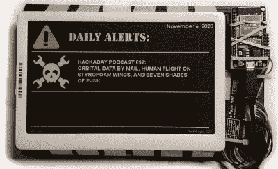

# 重新利用大型电子价格标签

> 原文：<https://hackaday.com/2020/11/27/repurposing-large-electronic-price-tags/>

如果你最近在疫情勇敢地走了足够长的时间，去了一趟大型零售商店，你可能会发现一些贴在电器等大件商品上的巨大的电子纸价格标签。这些 7 英寸的显示器很可能是为 Kindle 等电子阅读器而设计的，但通过一些剩余交易，现在正在大声喊着去年洗衣机的清仓节省。在当地家得宝(Home Depot)买到一款价格特别优惠的三星冰箱后， [[YodaLogic]开始怀疑他们是否会屈从于黑客的意志。](https://hackaday.io/project/175947-74-e-ink-shelf-label-used-as-a-weather-station)

现在要澄清的是，[YodaLogic]没有窃取这些标签中的任何一个。事实证明，你可以在易贝以不到 15 美元的价格买到它们，或者至少这是这篇文章发表前的价格。当你意识到这些显示器实际上具有彩色功能时，这是一个非常好的价格…尽管只有两种。显然，当零售商订购所谓的“色度 74”标签时，他们可以选择黄色或红色作为第二颜色。虽然不像全彩色显示器那么令人兴奋，但它肯定将它们与我们迄今为止在 DIY 项目中看到的大多数电子纸面板区分开来。

The panel gets mighty close to the HaD color scheme

我们想告诉你，[YodaLogic]破解了其中的一个东西，并能够将其连接到一个 Pi 或微控制器上，但事实要复杂一些。将 Chroma 74 的面板连接到用于类似 Waveshare 7.5 英寸显示器的控制板似乎没有任何作用。经过一番探索和刺激，很明显，Chroma 中使用的 WFD0750BF19 电子纸面板需要一个定制的软件配置文件来实现它。不幸的是，似乎没有这种特定面板的数据手册。

通过将从类似显示器的数据表中收集到的信息与一些实验相结合，[YodaLogic]提出了一种配置配置文件，这种配置文件在大多数情况下是有效的。黄色似乎没有应有的活力，刷新可能需要 20 秒，但这无疑是一个开始。也许代码可以通过社区的一些输入来收紧，或者更好的是，也许有人知道我们可以从哪里获得该面板的数据手册。

虽然我们已经开始看到更多的项目使用电子纸显示器，但它们高昂的价格仍然让许多黑客望而却步。能够重新利用像这样的廉价硬件[真的可以刺激一些有趣的开发](https://hackaday.com/2020/09/18/radon-monitor-recreates-steam-gauge-with-e-ink/)，所以我们很高兴看到【YodaLogic】对这个项目进行最后的润色，并向更广泛的受众开放。