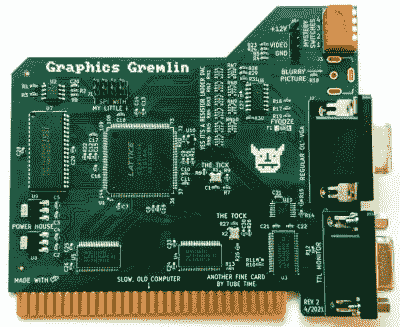

# 复古 ISA 卡意味着老旧、缓慢的计算机不再需要老旧、笨重的显示器

> 原文：<https://hackaday.com/2021/05/18/retro-isa-card-means-old-slow-computers-no-longer-need-old-heavy-monitors/>

老式电脑的一个特点是，它们在很大程度上取决于人们能否在其中插入兼容的显示器。这就是[Tube Time]的 [Graphics Gremlin 背后的东西，这是一款现代设计的复古 ISA 视频卡](https://github.com/schlae/graphics-gremlin)，它使用 FPGA 在输入端就像老式的 [MDA](https://en.wikipedia.org/wiki/IBM_Monochrome_Display_Adapter) 或 [CGA](https://en.wikipedia.org/wiki/Color_Graphics_Adapter) 视频卡一样，但提供了一个 VGA 端口，用于更现代的显示输出选项。(事实上，还有一个 RGBI 连接器和一个复合视频输出，但 VGA 可能是最广泛使用的。)

Handy silkscreen labels make everything crystal clear. Click to enlarge.

当*真正的*老式视频卡仍然大量存在时，为什么还要制造一个新设备来模仿旧的 ISA 视频卡呢？因为旧卡的可用性不是瓶颈。问题是 MDA 或 CGA *显示器*不像以前那么容易被发现，而[仍然存在的不可替代的老式显示器有在运输过程中被打碎的风险](https://hackaday.com/2021/04/29/shipping-a-crt-lessons-learned/)。幸运的是，VGA 显示器(或者至少是接受 VGA 输入的转换器)要丰富得多。

开发板的设计文件和组装笔记都在项目的 GitHub 库上，还有大量关于组装和故障排除的详细信息，Verilog 代码也有自己的文档。图形精灵仍在开发中，但你也可以在[【Tube Time】的 Twitter feed](https://twitter.com/TubeTimeUS) 上观看最新动态。

感谢[NoxiousPluK]的提示！