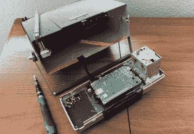

# 复古电视用树莓派展现家庭记忆

> 原文：<https://hackaday.com/2021/09/21/retro-tv-shows-off-family-memories-with-raspberry-pi/>

被老式电子产品的外观和感觉所吸引，【Democracity】决定[将一台旧的索尼微型电视变成一个数码相框](https://www.instructables.com/Retro-TV-With-Raspberry-Pi/)，它可以在旧的家庭照片中时尚地循环播放。你可能会认为现代 IPS 宽屏显示器会很显眼，但由于 1/16 英寸黑色丙烯酸挡板的巧妙应用以及仍安装在前面板的原始玻璃，新硬件融入得非常好。

驱动新显示器的是 Raspberry Pi 4，这听起来可能有些夸张，但考虑到前端是由 DAKboard 通过 Chromium 提供的，我们可以理解对一些额外马力和 RAM 的渴望。如果是我们，我们可能会用一个不太强大的板和一些 Python 脚本，当然[还有一些交钥匙开源解决方案](https://hackaday.com/2018/03/05/shoot-and-forget-digital-photo-frame/)，尽管我们承认这可能更快更容易设置。

 【民主】提供了一些关于他如何拆开电视并接上新设备的一般信息，但当然具体步骤会有所不同，这取决于你最终将哪台旧电视送到天上的大部件箱。我们确实喜欢他确保按钮和旋钮的所有机制完好无损，所以即使它们什么也不做，你仍然可以摆弄它们。

否则，他设置无头 Chromium 实例的步骤可能适用范围更广。关于设置这个特殊的 LCD 模块和将显示器旋转到正确方向的提示也是如此。如果您只是按照指南的这一部分进行操作，那么您可以构建自己的独立 Raspberry Pi DAKboard 端点来试用该服务。

听到这不是[民主之城]第一次升级老式硬件，可能不会感到太惊讶。早在 2017 年，我们就报道过这款[华丽的装饰艺术风格扬声器，他配备了 RGB LEDs 和亚马逊 Echo Dot](https://hackaday.com/2017/10/16/echo-dot-finds-swanky-new-home-in-art-deco-speaker/) 。与前一篇帖子一样，一些评论者可能会对这个项目中的一个老式设备感到不安。但我们会反驳说，他的家人现在将从这个美丽的硬件中获得更多的乐趣，而不是如果它仍然在壁橱里收集灰尘。