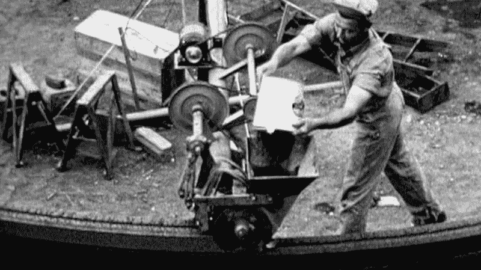
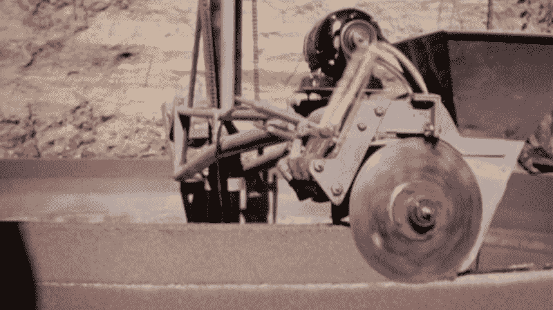

# 复古建筑:3D 打印建筑，20 世纪 30 年代风格

> 原文：<https://hackaday.com/2021/10/06/retrotechtacular-3d-printed-buildings-1930s-style/>

我们身处未来，自以为拥有超大规模的 3D 打印机，可以挤出完整的、随时可以入住的建筑，却发现一些聪明的发明家早在 20 世纪 30 年代就提出了基本相同的想法。

这位来自印第安纳州瓦尔帕莱索的发明家(William E. Urschel)似乎真的发现了他的“砌墙机器”，正如他 1941 年的专利所描述的那样。下面的第一个视频很好地概述了这个装置，它由一个安装在配重臂末端的“挤出机”组成，配重臂的长度决定了所产生的圆形结构的半径。吊杆在中心桅杆上旋转，每挤压一层就手动转动。商业端有一个小漏斗，用于装看起来异常干燥的混凝土或砂浆混合物。料斗有一组凸轮驱动的铲，向下驱动材料，将材料推出料斗；混合物被限制在两个旋转圆盘之间，圆盘抹平侧面并驱动挤出机向前。

这种设备对材料有着贪婪的胃口，工人们为保持机器运转而忙碌的样子就是明证。窗户和门的开口用一点手工操作，开口顶部用过梁支撑混凝土。巧妙的工具被用来切割屋顶椽子的口袋，完成的结构，配有人造雉堞和一层灰泥，看起来相当体面。

但是[乌舍尔先生]不是一个固步自封的人，因为正如第二个视频所显示的，到 20 世纪 40 年代末，他已经对这台机器做了一些改进。挤出机的设计已经简化，具有潜在危险的滑轮和皮带的数量已经减少。他还增加了相对于桅杆倾斜吊杆的能力，让新球场的牛腿架在较低的球场上。由此产生的蜂巢状结构非常迷人，即使它的顶部需要手工修整。同样迷人的是助手[拉里]、[卷毛]和[莫伊]的滑稽动作。同样令人高兴的是，十年或更久之后，原来的建筑仍然矗立在那里，尽管这些建筑似乎不再矗立，至少从谷歌地图上快速浏览印第安纳州瓦尔帕莱索的情况来看是这样。

诚然，[乌尔舍尔先生]的设计相当有限，我们已经通过 3D 打印各种结构远远超越了他的视野，从[完整的城堡](https://hackaday.com/2014/09/01/update-3d-printed-concrete-castle-completed/)到[风力涡轮机塔](https://hackaday.com/2020/07/06/3d-printing-bigger-wind-turbines/)。但不可否认的是，他在我们之前到达了那里，这需要一些非常聪明的黑客技术。

感谢 tipline 坚定的[基思奥尔森]在这一点上的提醒。