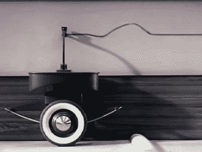

# 反技术:汽车悬架是关于波浪的

> 原文：<https://hackaday.com/2020/03/11/retrotechtacular-automotive-suspension-is-all-about-waves/>

除了让人们了解摄影机稳定器或光学图像稳定的必要性之外，这个八十年前的视频还展示了汽车行业在其悬挂系统中开发的一些优雅的解决方案。具体来说，这个 1938 年的雪佛兰视频是针对重视科学的观众的，因此卷轴使用模型将手头的问题归结为物理课。

Model of a wheel with a leaf spring records the effect of a bump on a piece of paper above

问题是不平坦的地面——即“地球表面的波浪”——无论是开阔的田野、土路，甚至是铺砌的公园道路。任何行驶在这些路面上的车辆都将面临挑战，不仅要为崎岖的地形提供缓冲，还要考虑悬挂系统本身的反应方式，以避免振动和其他负面影响。在视频中，这被归结为一个由一个模型绘制的二维波形，该模型从一个轮胎开始，发展到包括一个前后悬挂系统不同的四轮车辆。

也许视频中最具启发性的部分是对汽车前悬架实际工作原理的解释。车轮需要能够驾驶车辆，同时悬架还必须允许轮胎保持垂直于路面。这显示在本文顶部的图像中。每个车轮都有一个摇臂，允许车轮转向和垂直运动。螺旋弹簧用于代替初始模型中所示的板簧。

你可能知道接下来会发生什么。弹簧能够储存和释放能量，如果让它们自己去做，它们会通过振荡来消耗撞击的能量。这正是我们不想要的。解决办法是增加减震器，限制弹簧的性能。遇到颠簸的模型绘制的波形现在被紧紧地约束在平坦地面的基线上。

这是我们可以全心全意支持的广告类型。世界各地的产品工程师们，请尝试说服你们的营销同事向我们展示内部，告诉我们为什么做出这些选择，并分享帮助用户理解该产品如何工作以及为什么以这种方式构建的测试。过去的八十年给我们周围的大多数产品带来了无数层的复杂性，但是人性并没有改变；人们仍然很好奇，想看看我们周围的科学原理在起作用。

确保你没有在视频结束前退出。这是一次真正的表演，一辆汽车的桌面模型在一辆全尺寸的雪佛兰上重现，并以“写天空的烟”作为分界线。我不认为这是一个真正的模拟，但它肯定是我总是在一个伟大的复古主题中寻找的那种媚俗。

 [https://www.youtube.com/embed/ej7CRAIGXow?version=3&rel=1&showsearch=0&showinfo=1&iv_load_policy=1&fs=1&hl=en-US&autohide=2&wmode=transparent](https://www.youtube.com/embed/ej7CRAIGXow?version=3&rel=1&showsearch=0&showinfo=1&iv_load_policy=1&fs=1&hl=en-US&autohide=2&wmode=transparent)

