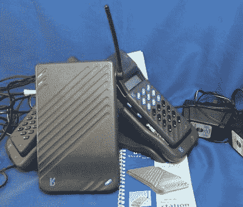
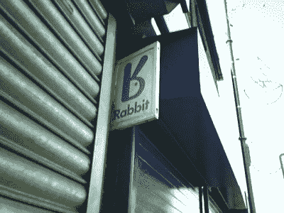

# Retrotechtacular: CT2，当接听手机电话不是首要任务时

> 原文：<https://hackaday.com/2021/03/19/retrotechtacular-ct2-when-receiving-mobile-phone-calls-wasnt-a-priority/>

多年来，我们在本系列中为您带来了许多示例，向您展示了曾经强大的技术。最有趣的是技术上的死胡同，这些想法曾经看起来好像是下一个大事件，但事后看来是如此不切实际或完全无用，以至于引起了人们的惊讶，以至于他们曾经见过天日。

今天的主题就是这样一项技术，它是一项严肃的产品，得到了从 20 世纪 80 年代末到 90 年代初多个国家的一些最大的技术公司的支持。 [CT2](https://en.wikipedia.org/wiki/CT2) 是第一个向公众开放的全数字移动电话网络之一，那么为什么它已经消失得无影无踪了呢？

## 未来是无线的，不是移动的！

A Rabbit handset and its home base station. Jmb, [CC BY 2.5](https://commons.wikimedia.org/wiki/File:Rabbit_CT2_home_base_station_PICT7369a.jpg).

这个想法很简单:通过提供一种不仅能与家里的基站一起工作，而且能在外出时从商业基站打电话的手机，来弥合家用无绳电话和移动电话之间的差距。你将拥有一部轻薄时尚的手机，而不是一部笨重的模拟手机，当你大步穿过火车站大厅去参加高性能商务会议时，你可以拨打重要的电话。它旨在取代当时相当糟糕的模拟无绳电话，在英国，这是一个由多家公司尝试过的想法，并且 *IEE 审查*预见了它的光明前景。

该技术在当时的消费产品中具有革命性，ADPCM 数字化的 32 kbit 数字数据流在 864 至 868 MHz 的载波上多路复用。这些手机的输出功率只有 10 兆瓦，这可能是它们声称距离基站 100 米的主要原因。因为它们是对无绳家庭电话而不是完全成熟的移动电话的幻想，所以它们的用户必须通过键入 PIN 来与每个新基站进行认证，这一缺点意味着他们只能通过所有者家庭基站上的座机接收呼叫。相邻基站之间没有自动切换，因此它不是蜂窝系统。

## 这是一个关于废弃标牌能存在多久的练习

A surviving Rabbit base station sign at Ashton-under-Lyne, England. Jonathandavis, CC BY-SA 3.0.

既然它受到了全国的关注，为什么每家公司都在市场上碰运气，结果却失败了呢？首先，手机本身非常昂贵，大约 200 英镑(按 1990 年的价格计算超过 300 美元)，这使得那些没有手机的消费者无法承受，他们可能会被更便宜的替代品所吸引。除此之外，还有每月订阅和通话费用，进一步增加了成本。

然而真正的杀手是，依赖基站的网络面临着一项不可能完成的任务，即提供足够的覆盖范围，以确保其用户有机会在他们可以使用它的地方。它们可以在公共场所找到，如火车站和汽车站、高速公路服务站和购物中心，但即使在小型便利店铺开也不能提供所需的渗透。最著名的网络是 Rabbit，当我还是学生的时候，它正处于鼎盛时期，虽然那时已经有几个学生拥有移动电话，但在与朋友的交谈中，我们没有一个人记得认识任何有 Rabbit 手机的人。对于打算成为移动电话廉价替代品的网络来说，这并不令人鼓舞。

也许如果手机更便宜的话，这个系统会带来更多的客户，基站网络会扩展到更有吸引力的程度。因为 GSM 手机的到来带来了一个价格相似但更好的数字系统，它提供了全面的覆盖和来电，到 1993 年底，这个网络就死了。在 20 世纪 90 年代的剩余时间里，兔子基站和手机可以从过剩的供应商那里找到，作为稍微不寻常的无绳家用电话，但除此之外，它只存在于少数几个腐烂的标志中，当你在英国旅行时，仍然可以不时地看到这些标志。[曼彻斯特环城路]在休息时间下面的视频中展示了其中的一些。

在欧洲 [DECT](https://hackaday.com/2017/08/18/retrotechtacular-olivetti-net3/) 数字电话系统中有一个关于 CT2 故事的脚注。其目的是取代 CT2，并具有包括数据层的全功能 3G 蜂窝电话系统的规范，以及作为家用无绳电话的一般用途，但从未实现这种潜力。网络和制造商已经被无绳手机弄得焦头烂额，在接下来的十年里，除了 GSM，他们不会再关注其他地方。今天，在我们的社区里，你会发现为数不多的几个可以使用 DECT 公共移动网络的地方之一，以 Eventphone 提供的[欧洲黑客训练营](https://hackaday.com/2018/08/30/gsm-phone-network-at-emf-camp-built-on-raspberry-pi-and-limesdr/)网络的形式存在。

你们谁有 CT2 手机吗？比我们的评估更好还是更差？请在评论中告诉我们。

 [https://www.youtube.com/embed/1tL8P5Gr40o?version=3&rel=1&showsearch=0&showinfo=1&iv_load_policy=1&fs=1&hl=en-US&autohide=2&wmode=transparent](https://www.youtube.com/embed/1tL8P5Gr40o?version=3&rel=1&showsearch=0&showinfo=1&iv_load_policy=1&fs=1&hl=en-US&autohide=2&wmode=transparent)

头图:Jmb， [CC 乘 2.5](https://commons.wikimedia.org/wiki/File:Rabbit_CT2_Phone_PICT7368a.jpg) 。