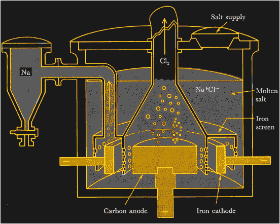

# 1947 年风格的钠处理

> 原文：<https://hackaday.com/2018/10/03/retrotechtacular-disposing-of-sodium-1947-style/>

一位高中朋友曾经讲述过他的父亲是一家环境废物处理公司的化学家，他将大量有问题的金属钠倾倒在新英格兰南部一条污染更严重的河流中。尽管当地居民已经习惯于在河里看到各种有毒的 hijinx，但由此产生的爆炸应该足以让他们报警并迅速撤退到实验室。这是一个好故事，但在当时并不特别可信。

看了这个 1947 年陆军部如何处理多余钠的视频后，我不太确定。自从化学课上的演示开始，我就知道钠的活性有多强。在那次演示中，一片柔软的灰色金属会在装满水的培养皿中跳舞，并最终点亮几秒钟。美国政府决定处理 20 吨钠的方式完全是另一回事。这种金属是剩余的战争产品，可能被用于燃烧弹和飞机用铝的生产。政府不再愿意囤积这种金属，试图引起工业界对这种金属的兴趣，但由于运输这种材料的风险和费用，这一切都无济于事。可悲的是(那时候经常是这样)，他们只是决定扔掉它。

## 环境化学

最后的安息地是勒诺湖，这是华盛顿州东部大峡谷附近的一个生物死碱湖。3500 磅(1600 公斤)的钢锭被毫不客气地滚进了湖里，随后的爆炸非常壮观。下面的视频是该事件的新闻短片；它的质量很低，所以你可能想看看一磅的钠遇水后会做什么。

看着钠与水发生如此剧烈的反应可能会让你有心情亲自参与这一行动。这可以理解，但可能不是一个好主意。如果勒诺湖在 1947 年还没有完全没有水生生物的话，那很可能是在政府完成这项工作之后。钠与水结合产生氢氧化钠水溶液和大量的氢气，剧烈放热。所有这些对动物都没有好处，执法部门和野生动物保护机构也很可能不会接受。

## 金属钠是如何制成的

Down’s cell for electrolytic production of sodium. Source: [Lumen Learning](https://courses.lumenlearning.com/introchem/chapter/electrolysis-of-sodium-chloride/)

如果你坚持尝试自己制造金属钠，你会面临一些挑战。在商业规模上，金属钠是通过电解熔融氯化钠制得的。温度高达 800 摄氏度，电流在千安培范围内，这不太适合 DIY。

不过，也有非电解方法，NurdRage 有一个有用的指南，用溶剂提取钠(T1)要容易得多，并且能产生相当数量的纯金属。不过，它也不是没有缺点；最好的溶剂是二恶烷，它本身就是一种致癌的有毒物质。

如果你选择制造钠，或者只是在网上订购一些，请有一个处理它的计划。我们知道在 40 年代时代不同了，勒诺湖已经死了，但很难看到那个视频而不退缩。

 [https://www.youtube.com/embed/HY7mTCMvpEM?version=3&rel=1&showsearch=0&showinfo=1&iv_load_policy=1&fs=1&hl=en-US&autohide=2&wmode=transparent](https://www.youtube.com/embed/HY7mTCMvpEM?version=3&rel=1&showsearch=0&showinfo=1&iv_load_policy=1&fs=1&hl=en-US&autohide=2&wmode=transparent)

[via [r/whoadude](https://www.reddit.com/r/woahdude/comments/9gu86d/throwing_sodium_in_the_river/e66tz5x/)