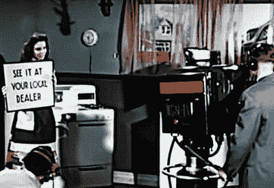

# 回顾技术:20 世纪 50 年代电视是如何工作的

> 原文：<https://hackaday.com/2022/05/06/retrotechtacular-how-television-worked-in-the-1950s/>

今天看电视的体验与我们的父母在我们这个年龄时有很大不同，我们有高清数字点播流媒体服务，他们有少量模拟频道提供线性预定广播。一部即将在电视上播出的电影可能是大多数人都曾经历过的重大事件，而像咖啡广告这样简单的事情也可能成为我们共同文化经历的一部分。这一切的背后是同步模拟技术将信号从演播室带到起居室的小小奇迹，这也是 1952 年梁佑彬电影《电视:它是如何工作的》的主题。 坐下来，在休息时间下面的视频中享受一次简单得多的世界之旅。

Production values for adverts had yet to reach their zenith in the 1950s.

在介绍了电视在 50 年代早期美国的文化影响后，有一个阴极射线管的基本介绍，接下来是许多读者可能不太熟悉的东西，图像或图像摄像管，它构成了那个时代大多数电视信号的基础。

它是为普通大众编写的，所以电视图像的扫描光栅是通过来回阅读一本书来介绍的，然后翻译成光栅是如何用偏转线圈和电子枪画在屏幕上的。不过，它并没有过于简化，因为它讲述了图像是如何交错的，并显示了如何引入同步脉冲来保持系统的所有部分一起工作。

特别引人入胜的一瞥是简要提到了用于在全国范围内传输电视信号的实心铜同轴电缆和陆上微波链路，这些混凝土塔今天仍然可以看到，但它们不再有我们在电影中看到的巨大的喇叭天线。

这部电影中一个相当明显的遗漏是没有提到彩色电视，因为 NTSC 标准正式采用之前是在 1953 年底，第一批彩色电视机上市之前是在 1954 年初。彩色电视在 1952 年将会是下一个大事件，但是由于没有可供观看的传输，并且场序 CBS 系统和 RCA 兼容的点序系统之间激烈的标准战争仍在进行，最终演变成 NTSC 标准，彩色电视超出了当时的消费者观众也就不足为奇了。

因此，我们正在介绍 525 行标准，许多人认为这是 NTSC 视频，但没有我们大多数人熟悉的 NTSC 兼容彩色系统。525 线模拟标准可能已经从我们的客厅消失了一段时间，但[由于最后几个电台去年才停播](https://hackaday.com/2021/07/14/end-of-an-era-ntsc-finally-goes-dark-in-america/)我们可以说它运行得相当好。

我们在 Hackaday 非常喜欢模拟电视，而且[这肯定不是我们第一次使用所有 525 行](https://hackaday.com/2016/10/06/never-twice-the-same-color-why-ntsc-is-so-weird/)。同时，为了真正深入了解电视信号时序的内部工作原理，准备好[了解你的视频波形](https://hackaday.com/2016/10/06/never-twice-the-same-color-why-ntsc-is-so-weird/)。

 [https://www.youtube.com/embed/MlsBl6rw5SU?version=3&rel=1&showsearch=0&showinfo=1&iv_load_policy=1&fs=1&hl=en-US&autohide=2&wmode=transparent](https://www.youtube.com/embed/MlsBl6rw5SU?version=3&rel=1&showsearch=0&showinfo=1&iv_load_policy=1&fs=1&hl=en-US&autohide=2&wmode=transparent)

