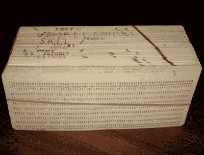
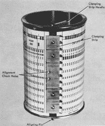
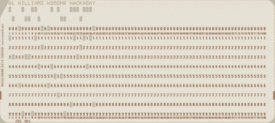

# 逆向技术:用卡编程

> 原文：<https://hackaday.com/2022/11/09/retrotechtacular-programming-by-card/>

如果你还没见过，最近的 Supercon 6 徽章是一台老式的电脑，前面板上有一个闪闪发光的灯。这让人想起了 Altair 8800、PDP-11 或 DG Nova。然而，即使回到过去，也只有少数人真正用开关给计算机编程。通常，您可以使用开关来切换第一级引导加载程序，然后从某种存储设备(如磁带或纸带)加载更好的引导加载程序。大多数人并没有真正使用开关。

然而，大多数人做的是打孔卡。从技术上讲，霍尔瑞斯卡，尽管我们通常称之为卡、穿孔卡或 IBM 卡。有许多不同的机器可以用来打孔，但我猜没有一台像 IBM 029 那样受欢迎。当然，这个系列中的模型绝大多数都是人们用来打孔的。

对于门外汉来说，一张卡的大小相当于一张老式的美钞——这是赫尔曼·何乐礼发明它们时的流行款式。这张卡片由不像标准文件夹那么厚的材料制成，分为 80 列和 12 行。后来的卡片有了更多的列，但这些列从未真正达到经典的 80 列卡片的规模。

为了在卡片上打孔，一台机器在底部 10 列中的一列上打孔。所以“1”行上的洞是 1,“4”行上的洞是 4。最初的卡片使用圆孔和 45 列，但 IBM 的一位名叫莱克的发明家在 1928 年就意识到窄方孔可以容纳额外的数据。第 11 和第 12 行，有时是“0”行，用来表示特殊字符，有时是数字符号。

A deck with a “sorting stripe” by ArnoldReinhold, CC-BY-SA-3.0

老实说，你可以随心所欲地解释一张卡片，但在实践中，有一些常见的方案。然而，以二进制穿孔的卡片并不罕见，每一个孔是 1 或 0，每一列组成一个二进制数。在字符编码之上，还有其他格式约定，比如在卡片的某些列中有校验和或行号。行号尤其有用，因为它允许你在一副牌被丢弃和顺序被打乱后对它进行排序。另一个常见的技巧是在一副牌的边缘画一条对角线标记线，这样你就可以很快发现是否有一张或多张牌出了问题。

空白卡片通常被用作“哨兵”或者我们今天称之为“文件结束”的标记。然而，一些程序会寻找一个不可能的值，例如-9999999。

## 阅读

读卡器相对简单。大多数读卡器使用一系列钢丝刷，卡片在钢丝刷下移动。在有孔的地方，刷子可以接触到卡片下面的金属板，形成一个回路。如果这听起来不是超级可靠，那是因为它不是。

旧的警告“不要折叠、旋转或毁坏”是要求用户不要让卡片堵塞机器或在机器上打新的洞。如果你不记得的话，纺锤可能是你桌子上不符合 OSHA 标准的钉子，你可以把文件放在上面固定它们。对于穿孔卡片来说，这可不是什么好策略。

事实上，一个常见的恶作剧是在卡片的每一栏打孔，这样卡片就会变得很薄，而且会卡住阅读器，当然，操作员肯定不喜欢这样。这些卡片有时被称为“花边”卡片，因为它们像花边一样精致。

## 写作

那么怎么打卡呢？尽管有一些手工打孔预切卡的方案，但这些方案主要用于特殊应用，如投票、没有设备的小型学校或库存控制。对于严肃的应用，你使用了一个键穿孔。你可以在下面看到密歇根大学 1967 年关于 029 操作的教学视频。

 [https://www.youtube.com/embed/kaQmAybWn-w?version=3&rel=1&showsearch=0&showinfo=1&iv_load_policy=1&fs=1&hl=en-US&autohide=2&wmode=transparent](https://www.youtube.com/embed/kaQmAybWn-w?version=3&rel=1&showsearch=0&showinfo=1&iv_load_policy=1&fs=1&hl=en-US&autohide=2&wmode=transparent)

An 029 program drum

029 里有三个站:最右边的站拿着一张卡等着打孔。中间的槽是你正在打孔的卡片。最左边的是你刚刚打的卡(通常)。因为机器左边的卡可以被读取，所以您可以将其中的列复制到您正在处理的卡上。这对于纠正错误是很重要的。你可以复制前一张卡片到错误点，改正它，然后复制剩余的穿孔。

029 可以做很多花样，包括打孔卡，为机器本身设置特殊选项。你拿着卡片，把它绕在一个能控制机器运转的鼓上。例如，您可以定义字段或将机器设置为自动跳过或复制列。另一个常见的操作是为某些字段自动设置字母或数字移位。

如果你在第一个视频中没有得到足够的，第二部分显示高级用法。对于 20 世纪 60 年代制造的机电设备来说，这是一个复杂的硬件。

 [https://www.youtube.com/embed/SWD1PwNxpoU?version=3&rel=1&showsearch=0&showinfo=1&iv_load_policy=1&fs=1&hl=en-US&autohide=2&wmode=transparent](https://www.youtube.com/embed/SWD1PwNxpoU?version=3&rel=1&showsearch=0&showinfo=1&iv_load_policy=1&fs=1&hl=en-US&autohide=2&wmode=transparent)

## 解释

现代的打孔机会沿着顶部边缘打印文本，这样你就可以看到和阅读它。如果你有没有被翻译的卡片，你可以把它放进一台机器去打印。例如，大多数程序输出的卡片上没有解释打印。

为了帮助你阅读卡片，许多卡片上都印有指南。一张基本的卡片只是打印了行和列。但是特殊的卡片会显示行号或其他程序专用数据的专用字段。看到带有公司或学校标志的卡片也很常见。

## 你自己的卡片

Custom card image from the virtual keypunch

想自己做卡片吗？好吧，最好的方法是建立你自己的硬件。第二个最好的办法是挑选一些旧的剩余齿轮并修复它——手册是可用的。但是我们大多数人会满足于在网上尝试。试着用[虚拟穿孔](https://www.masswerk.at/keypunch/)制作一张卡片。想读回来吗？[你也可以做那个](https://www.masswerk.at/cardreader/)。

我们确实怀念一些老技术，但我们不怀念卡片，真的。有许多变化。96 列卡用于 IBM System 3。还有 40 列的手工穿孔卡片，90 列的 UNIVAC 卡片，甚至 130 列的鲍尔斯-萨马斯卡片。孔径格式的卡片是普通的卡片，上面有一个孔，可以放一小块缩微胶片，用来保存图形之类的东西。

甚至认为自己在用卡的 IBM 电脑也没有走到最后。在卡片最终消亡之前，典型的 IBM 计算机从磁带或软盘中取出“虚拟卡片组”。一只 [Arduino 会读卡吗](https://hackaday.com/2015/01/17/arduino-reads-punch-cards/)？是的，是的，它可以。众所周知，穿孔卡片不是为计算机开发的，而是为织布机开发的。很久以后，它们也被用于[试管测试器](https://hackaday.com/2021/06/15/your-1958-punch-card-machine-tested-tubes/)。

标题图来自[哥伦比亚大学](http://www.columbia.edu/cu/computinghistory/029.html)。