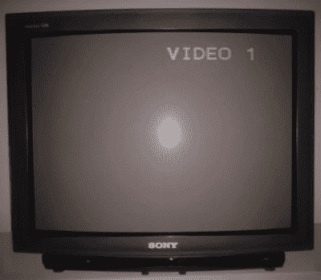

# Retrotechtacular:工厂车间的一些最后的 CRT

> 原文：<https://hackaday.com/2018/11/30/retrotechtacular-some-of-the-last-crts-from-the-factory-floor/>

向一个仅仅比你小 15 岁的人解释一项技术是什么样子似乎有点疯狂，但是当谈到 CRT 时，我们已经达到了那个程度。可能仍然有 CRT 电视和显示器的残余物被遗弃在野外，但是，一个准备进入高中的孩子遇到它们的可能性很小。虽然没有什么可以替代真实的东西，但有一个来自[Glenn]的原始视频，他分享了他在 21 世纪初参观索尼特丽珑装配线的经历。

索尼电子的阴极射线管制造工厂位于加利福尼亚州兰乔贝尔纳多的总部旁边。2006 年,当索尼完全转向数字显示器，如 Bravia 电视机的平板液晶显示器生产线时，该工厂被关闭。[Glenn]的视频显示，制造过程从头到尾几乎完全自动化。这一点在视频中明显缺少人的情况下变得更加明显。

Trinitron 系列电视机于 1968 年首次出现。在大多数制造商提供黑白显像管的时候，索尼的 Trinitron 系列是彩色的。这个名字一直延续到最后，直到它和显像管电视一起退役。索尼对技术创新(和专有媒体格式)的关注使他们成为美国消费电子领域的巨头长达四十多年，但在向数字世界过渡的过程中，他们将市场份额拱手让给了竞争对手。

一个快速的警告，因为下面的视频是直接在索尼的工厂车间拍摄的，所以机器声音很大。观众可能希望在按下播放键之前降低音量。

 [https://www.youtube.com/embed/yNkIgVwr_nQ?version=3&rel=1&showsearch=0&showinfo=1&iv_load_policy=1&fs=1&hl=en-US&autohide=2&wmode=transparent](https://www.youtube.com/embed/yNkIgVwr_nQ?version=3&rel=1&showsearch=0&showinfo=1&iv_load_policy=1&fs=1&hl=en-US&autohide=2&wmode=transparent)

因为他们不再像过去那样制造电视机，所以在 20 世纪 50 年代 CRT 电视机的制造中也有这种复古的特征。