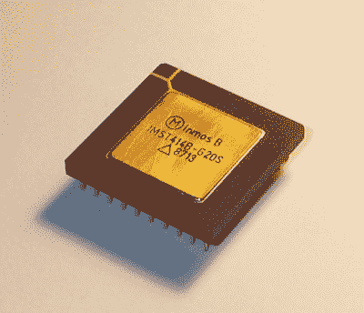

# 晶片机

> 原文：<https://hackaday.com/2019/04/19/retrotechtacular-transputer/>

早在 2016 年，Hackaday 发表了一篇对位于 Bletchley Park 的国家计算博物馆的评论。它提到，在展出的一系列令人着迷的计算机文物中，有一个盒子可以在他们的 Cray-1 超级计算机旁边的一个房间的角落里找到。这是一个晶片机开发系统，虽然它的体系结构今天几乎被遗忘了，但曾经有一段时间，这个英国开发的微处理器家族代表了计算的未来。那么*到底什么是*晶片机，为什么它很特别，为什么 2019 年我们没有在每张桌子上都有一台晶片机？

[![An Inmos RAMDAC (the 28-pin DIP) on the motherboard of a 1989 IBM PS/55\. Darklanlan [CC BY 4.0]](img/8482224a7dceb38b625fa38b69229aba.png)](https://hackaday.com/wp-content/uploads/2019/03/ibm_vga_90x8941_on_ps55.jpg)

1989 年 IBM PS/55 主板上的 Inmos RAMDAC(28 针 DIP)。总部设在布里斯托尔的英莫斯是一家——不，让那家*成为*——英国半导体公司，在那个政府认为本土半导体制造能力具有战略重要性的时代。他们制造微型计算机外围芯片、RAM 芯片和视频芯片(20 世纪 80 年代计算的普通硅)，但他们令人兴奋的项目是晶片机。

该微处理器家族通过从基础上构建成大规模多处理器，解决了当时传统处理器固有的速度瓶颈。晶片机处理器的网络将共享一个以交叉点形式排列的串行互连网络，允许多个处理器相互独立连接而不会发生冲突。它是第一个采用这种架构的，在当时被视为下一个大事件。到 20 世纪 90 年代末，所有的计算机都将使用晶片机，所以电子工程专业的学生都将学习晶片机，并在他们的小组项目中遇到晶片机。我记得我的三年级 EE 班会分成几个小组，每个小组负责一个更大项目的一部分，该项目将通过晶片机系统核心的交叉点开关进行通信，尽管我记得没有一个小组能让任何东西工作。尽管如此，在现代回顾这台机器的设计还是很有趣的。让我们开始吧！

## 不太 RISC

作为电子工程专业的本科生，我们被告知该架构是 RISC，但近 30 年后我仔细阅读了该架构，我了解到，虽然它有一个相对简单的指令集，但它不是通过 RISC 技术而是通过巧妙使用 ROM 微码来实现每个周期一条指令。这是儿童谎言的教导还是 Inmos 公司对处理器的营销的影响还不清楚，但他们对晶片机能做什么大吵大闹肯定是真的。我记得看到了下面的视频，其中有两个屏幕的蝴蝶演示，光线跟踪和 Mandelbrot 设置，我被一些花了我的准将 Amiga 几个小时的东西所倾倒，这些东西几乎是由晶片机实时执行的。是的，相对低清晰度的银球光线追踪在 20 世纪 90 年代初是一件大事。

An Inmos T414 Transputer chip. Lefdorf ([CC-BY-2.5](https://commons.wikimedia.org/wiki/File:IMST414B-G20S.JPG))

晶片机系列从 20 世纪 80 年代初最初的 16 位产品发展到 32 位版本，然后是 SOC 版本，包括与 Sinclair Research 的不幸合作，以及内置浮点功能的版本。晶片机架构的优势最终被传统处理器性能的进步削弱，到 20 世纪 90 年代初 SGS-Thomson 拥有该公司时，晶片机的开发停止了。它已经进入了一系列利基产品，但不知何故未能打入由英特尔和摩托罗拉等竞争对手的更传统的微处理器主导的大众市场。

今天，Inmos 和晶片机都是计算机历史的注脚。奇怪的是，我们现在被具有源自英国的多处理器架构的大众市场计算机所包围，但它们的特点是真正的 RISC ARM 内核，其祖先在剑桥的 Acorn 开发，而晶片机则吸引了人们的注意力。南威尔士的 Inmos 半导体工厂如今归国际整流器公司所有，仍在生产，尽管其生产晶片机的日子已经一去不复返了。

布莱奇利的晶片机开发系统将成为博物馆 Inmos 历史展览修复项目的一部分。与此同时，晶片机本身可能已经死亡，但它确实有一个后代仍在生产。 [Xmos](https://www.xmos.com/) 是另一家总部位于布里斯托尔的半导体公司，专门生产用于高要求音频应用的 CPU，由于他们的创始人包括前 Inmos 关键员工，他们的核心受到晶片机的严重影响。离开大学后，我可能从未遇到过晶片机，但四分之一世纪后，作为一项高端音频产品合同的一部分，我尽可能地接近了一台晶片机，因为它有一个 Xmos CPU。

晶片机，一个对半导体未来的大胆设想，最终实现了，但不是以它的创造者希望的方式。如果你找到了一个，就好好保存它，这是一段真实的历史！

 [https://www.youtube.com/embed/cdK3PXKvYgs?version=3&rel=1&showsearch=0&showinfo=1&iv_load_policy=1&fs=1&hl=en-US&autohide=2&wmode=transparent](https://www.youtube.com/embed/cdK3PXKvYgs?version=3&rel=1&showsearch=0&showinfo=1&iv_load_policy=1&fs=1&hl=en-US&autohide=2&wmode=transparent)

[主要图片来源: [Inmos IMST425](https://commons.wikimedia.org/wiki/File:KL_inmos_IMST425.jpg) 作者:Konstantin Lanzet CC-BY 3.0]