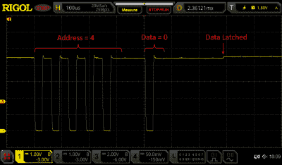

# 对双线 LED 灯条协议进行逆向工程

> 原文：<https://hackaday.com/2022/01/31/reverse-engineering-a-two-wire-led-strip-protocol/>

尽管圣诞节可能还要过几个星期，但如今在一年中的任何时候，我们都可以在家里找到各种各样的彩色 LED 装置。[Tim]得到了一个 LED 窗帘，它带有一个遥控器，用户不仅可以设置 LED 的整体颜色，还可以运行简单的动画。但这些不是你的标准 WS2812B 带数据线:所有的 led 只是简单地用两根线并联起来，这怎么可能呢？

The LED string protocol is very simple, with one address field and one data field.

[Tim]将他的示波器连接到 LED 灯串上，找出它们是如何工作的，[在一篇全面的博客文章中详细描述了结果](https://cpldcpu.wordpress.com/2022/01/23/controlling-rgb-leds-with-only-the-powerlines-anatomy-of-a-christmas-light-string/)。事实证明，控制器短暂地短路 LED 灯条的电源电压来产生数据位，类似于老式脉冲拨号电话的工作方式。集成到每个 LED 中的一个微小芯片接收这些脉冲，但由于一个电容器在电源线变低时保持芯片供电，因此保持其内部状态。

在对协议进行逆向工程后，[Tim] [继续实施类似的设计](https://hackaday.io/project/183709)，使用 ATMega328P 作为控制器，ATtiny10 作为 LED 驱动器。只需几行代码和 ATtiny 电源引脚上的 100 nF 缓冲电容，[Tim]就能通过电源线发送脉冲来打开和关闭 LED。要完全实现 LED 灯串中使用的协议，还需要做一些工作，但作为概念验证，它表明这种电力线通信可以通过标准元件实现。

我们以前见过通过双线 LED 链发送信号的项目[，尽管是作为一个更普通的 LED 灯条的附件。[Tim]不是第一个对](https://hackaday.com/2021/12/04/two-wire-sensors-on-led-strips/)[记录不良的 LED 灯条协议](https://hackaday.com/2015/04/12/documenting-poorly-documented-led-strips/)进行逆向工程的人，但可能也不会是最后一个。