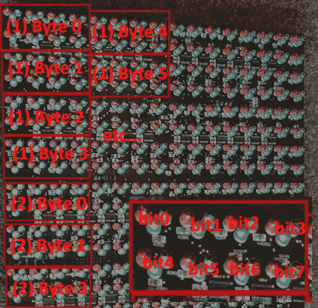

# 逆向工程拯救废弃的 LED 面板

> 原文：<https://hackaday.com/2020/05/09/reverse-engineering-saves-trashed-led-panels/>

在骑自行车的时候，[哈蒙德·皮尔斯]遇到了一个堆满了大型 LED 面板的垃圾箱。尽管在网上搜索后，这些型号并没有显示出任何有用的信息，但他还是决定尽可能安全地携带更多。新冠肺炎的封锁只给他留下了有限的一套工具，但他仍然设法破解了用于控制他的电子垃圾分数的协议，并记录下来供我们阅读。

 根据 PCB 丝网印刷上的有用标签和一位曾经从事数字路标工作的朋友的建议，【Hammond】很快就大致了解了这些面板在电源和控制方面的需求。尤其是当他注意到电路板上布满了 MBI5024 移位寄存器时。

下一步是拿一个基于 ATmega328PB 的开发板，开始在面板的输入线上输入数据，看看他是否能得到响应。通过仔细的观察和一些自定义代码，他最终发现，发送到线路上的每一个字节的数据将控制一个 4 x 2 的 led 区域。

一旦他有了基本的东西，下一步就是开始扩展他的代码来处理像形状、文本和菊花链面板这样的东西。在将他的一些工作发布到 Reddit 后，网络侦探确定该协议似乎是 hub 75 的某种变体，这给了[Hammond]一些关于连接器中其他一些引脚可能用途的提示。他在网上发布了他的所有代码，供任何可能会觉得有用的人使用，但由于他仍然不知道是谁制造了这些面板，也不知道为什么会有多少面板实际上还在外面。

弄清楚如何与一个未知或未记录的硬件交谈可能是令人生畏的，[但像这些](https://hackaday.com/2020/04/16/reverse-engineering-a-saabs-in-dash-display/)这样的成功故事提醒我们为什么值得付出努力。正如我们所见，[垃圾和宝藏](https://hackaday.com/2019/12/11/reverse-engineering-an-old-bus-display/)的区别往往在于敏锐的眼光和几行代码。