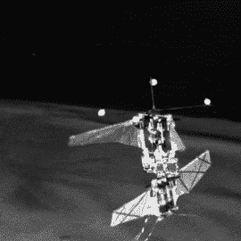

# 机器蜂鸟模仿自然

> 原文：<https://hackaday.com/2019/05/12/robot-hummingbird-imitates-nature/>

普渡大学的生物机器人实验室一直在研究机器人蜂鸟，正如你在下面的视频中看到的，已经取得了很大的成功。更重要的是，他们已经在 GitHub 上分享了成功。如果你想制造一个扑翼机器人，这绝对是你开始的地方。

 如果你曾经观察过蜂鸟，你就会知道它们的飞行能力是惊人的。Purdue 机器人以类似的方式飞行(尽管通过系绳获得动力和控制信息)，并依赖于每个翅膀都有自己的马达。马达不仅推动翅膀，还充当传感器。例如，它们可以检测机翼是否损坏，是否与某物接触，或者是否由于大气条件而改变了性能。

除了系留控制系统，蜂鸟还需要一个外部运动捕捉传感器和一些机器学习。研究人员指出，有足够的有效载荷能力将电池放在船上，他们还需要额外的传感器来完成完全自由的飞行。当你意识到一只真正的蜂鸟用小小的大脑处理这一切时，你会感到很惊奇。

发布的代码是 Python 语言，是本月晚些时候在一次技术会议(IEEE 机器人和自动化国际会议)上的三个演示的一部分。如果你不想等待论文，IEEE Spectrum 上有一个关于机器野兽的帖子，现在可以获得，那篇文章包含了论文的预印本。Python 代码确实需要一点运行，所以期待一个重要的飞行计算机。

我们看到的最后一个蜂鸟机器人是一个间谍。我们也见过类似于[蜜蜂](https://hackaday.com/2015/10/04/harvards-microrobotic-lab-sinks-robobees-and-claims-it-was-on-purpose/)的机器人——有点像。

 [https://www.youtube.com/embed/jhl892dHqfA?version=3&rel=1&showsearch=0&showinfo=1&iv_load_policy=1&fs=1&hl=en-US&autohide=2&wmode=transparent](https://www.youtube.com/embed/jhl892dHqfA?version=3&rel=1&showsearch=0&showinfo=1&iv_load_policy=1&fs=1&hl=en-US&autohide=2&wmode=transparent)

 [https://www.youtube.com/embed/SpIEWqIhLQo?version=3&rel=1&showsearch=0&showinfo=1&iv_load_policy=1&fs=1&hl=en-US&autohide=2&wmode=transparent](https://www.youtube.com/embed/SpIEWqIhLQo?version=3&rel=1&showsearch=0&showinfo=1&iv_load_policy=1&fs=1&hl=en-US&autohide=2&wmode=transparent)

