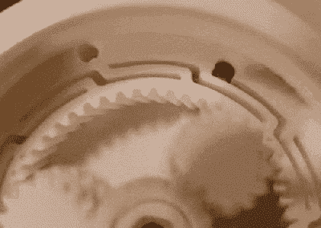

# 机器人关节与这个致动器项目一起模块化

> 原文：<https://hackaday.com/2019/10/22/robot-joints-go-modular-with-this-actuator-project/>

[约翰·劳尔]一直在努力重新思考机器人手臂。他的项目创造了[模块化的开源致动器，可以相互连接形成手臂](https://github.com/chilipeppr/robot-actuator-esp32-v8)令人鼓舞，并且拥有令人印象深刻的低零件成本。每个致动器都是独立的，具有 ESP32，其设计利用了 Aliexpress 等供应商提供的廉价模块和部件的外形。

Flex spline in action, for reducing backlash

每个模块都有 3D 打印齿轮(带消隙柔性花键)，用于反馈的 RGB LED，集成的归位，主动冷却，由铜带制成的滑环，以及背面用于慢跑和训练输入的触摸传感器转盘。其结果是一个低背隙，低成本的驱动器，保持外部接线绝对最少。

最初的灵感来自一个名为 [WE-R2.4](https://www.thingiverse.com/thing:3327968) 的设计，【John】以多种方式加入了自己的想法，下面的视频对此进行了最好的总结。该视频是[系列中的第三部](https://youtu.be/4o3d7_WZ_DQ)，涵盖了最有趣的发展和设计变化，同时对零件和操作进行了出色的概述(第一部分的视频是基本概述，第二部分的视频显示了原型制作过程，在此过程中【约翰】3D 打印了结构零件和齿轮，并磨出了定制的 PCB)。)

 [https://www.youtube.com/embed/4o3d7_WZ_DQ?version=3&rel=1&showsearch=0&showinfo=1&iv_load_policy=1&fs=1&hl=en-US&autohide=2&wmode=transparent](https://www.youtube.com/embed/4o3d7_WZ_DQ?version=3&rel=1&showsearch=0&showinfo=1&iv_load_policy=1&fs=1&hl=en-US&autohide=2&wmode=transparent)

你的兴趣被激起了吗？如果是这样，请前往 GitHub 库了解所有细节，包括 Fusion 360 模型、PCB 设计文件和在线来源的完整物料清单。虽然[并非所有的机器人执行器都需要电机或齿轮](https://hackaday.com/2019/06/14/pneumatics-for-the-masses/)，但不可否认的一点是，3D 打印、PCB 制造和获取电子元件的可用性对这样的项目来说是一个巨大的福音。