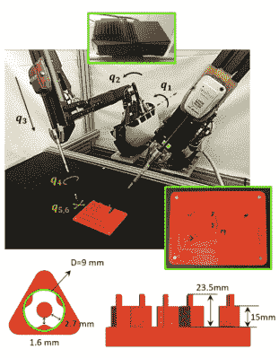

# 机器人外科医生显示出有朝一日胜过人类的迹象

> 原文：<https://hackaday.com/2022/09/12/robotic-surgeons-are-showing-hints-of-one-day-outperforming-humans/>

当谈到被认为是最复杂的人类活动领域时，最典型的例子是火箭科学和脑外科手术。事实上，成为一名外科医生意味着在一个复杂的、不断变化的、高绩效的领域取得资格，并获得与之匹配的薪酬和尊重。

随着时间的推移，手术工具发生了变化，近几十年来，机器人助手变得很常见。现在，最新的机器人开始在某些方面超越人类外科医生。让我们看看这是如何实现的，以及这对医学的未来意味着什么。

## 会移动的机器人

机器人手术自 20 世纪 80 年代以来一直在发展，当时基本的机器人被用来帮助完成简单的手术任务。机器人提供了许多优势，使它们成为外科手术的理想选择。它们可以以极佳的位置精度握住工具，不会疲劳，并且它们的机械手可以在比人手小得多的范围内工作。当进行锁孔手术时，这一点尤其有益，在这种手术中，微型机器人工具可以与摄像机一起插入患者体内。这使得外科医生可以在患者身上做最小切口的同时进行手术，从而提高恢复效果并降低任何感染的可能性。

Moving pegs on a board is a typical way human surgeons practice with robotic surgical manipulators. However, one recent study has shown that the robot can achieve the task faster under autonomous control than with a human making the moves. Credit: [Research paper](https://arxiv.org/ftp/arxiv/papers/2012/2012.12844.pdf), IEEE Transactions on Automation Science and Engineering

传统上，机器人手术器械，如著名的[达芬奇机器人](https://www.davincisurgery.com/)，在人类外科医生的直接控制下使用。它们具有过滤人体运动中常见的微小颤动的优点，并且还提供了比仅用人手可能实现的更大运动范围的手术器械控制。不过，从根本上说，机器人是完全远程控制的，由人类来指导对病人进行手术的工具的准确移动。

然而，最近的研究探索了给机器人手术系统增加自主控制。[一项研究](https://arxiv.org/ftp/arxiv/papers/2012/2012.12844.pdf)探索使用手术机器人来完成一项简单的任务，将三角形的钉子从钉板的一边转移到另一边。钉板是人类外科医生常用的训练工具，它教授精细的运动控制、精度和速度。这项研究探索了三种不同的钉移动任务，单手方法，双手方法，以及在将钉放回棋盘之前将钉从一只手转移到另一只手的方法。

控制达芬奇机器人系统的人类外科医生能够比研究团队创建的全自动系统更快地完成单手任务。然而，双手任务在完全自主控制系统下更快地完成。

当然，相对于人体外科手术来说，在木板上移动钉子是简单的。鉴于当今的机器视觉系统，跟踪已知大小和形状的刚性物体相对简单。尽管如此，它表明，处理能力和控制系统现在可以最好地帮助人类完成这样的任务，这是一个富有成效的实验和研究领域。

 [https://www.youtube.com/embed/KNHgeykDXFw?version=3&rel=1&showsearch=0&showinfo=1&iv_load_policy=1&fs=1&hl=en-US&autohide=2&wmode=transparent](https://www.youtube.com/embed/KNHgeykDXFw?version=3&rel=1&showsearch=0&showinfo=1&iv_load_policy=1&fs=1&hl=en-US&autohide=2&wmode=transparent)

如果你熟悉达芬奇机器人手术系统，它可能来自在网上疯传的经典葡萄手术视频。

然而，其他团队正在超越简单的标准化训练任务。约翰·霍普斯金大学的一个研究小组在活猪身上试验了自主机器人手术。这包括在所谓的肠吻合手术中重新连接切断的肠。这是一个非常具有挑战性的过程，需要外科医生小心翼翼地将两段肠道缝合在一起，而不损伤难以置信的软组织。

早期的测试包括在体外进行手术，机器人系统能够在人类医生的帮助下完成手术。进一步的升级使得手术可以通过猪体内的锁孔方法来实现。智能组织自主机器人(STAR)能够自己完成三分之二的必要缝合，其余部分在人类外科团队的指导下完成。对于机器人来说，这是一个令人印象深刻的壮举，它表明未来的发展可以让机器人在未来几十年里单独工作。

现在，是我们出众的眼睛和大脑让人类外科医生保持领先。事实是，许多手术已经用机器人器械实现了。一旦机器人获得了卓越的视觉系统和智能，它们可能会完全胜过人类外科医生。一如既往，时间会证明一切。