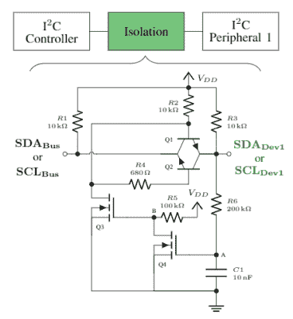

# 由于总线隔离，空间中具有强大的 I2C 和 SPI

> 原文：<https://hackaday.com/2021/09/29/robust-i2c-and-spi-in-space-thanks-to-bus-isolation/>

想象一下，你正在卫星上向太空发送一个硬件。除非你是美国国家航空航天局的好朋友，否则一旦发射失败，你就不太可能去那里修理。稳健的设计是关键，因此即使一个组件出现故障，其余的硬件也能继续工作。

这个 I2C 隔离电路的例子出自【马克斯】的论文。SPI 实现甚至更简单。

【Max Holliday】发现自己正处于这种情况，在一颗卫星上运行 69 个 I2C 和 SPI 设备。因此，他想出了在出现问题时自动将设备与这些总线隔离的电路。这项工作是 TechRxiv 预印本服务器上一篇研究论文的主题。

问题是，这些简单的总线并不总是最健壮的，容易受到单点故障的影响，一个坏的部分会影响总线的其他部分。[Max]指出，大量传感器和设备依赖于这些标准，如果没有这些标准，设计将会非常困难或者非常昂贵，因此需要一种解决方案。

为了解决这个问题，[Max]开发了一个简单的外部电路，可以放在 I2C 或 SPI 通信总线的每个节点上。在发生故障的情况下，该节点可以通过该电路与总线断开，从而允许系统的其余部分继续运行。

只需几个晶体管、金属氧化物半导体场效应晶体管和无源器件，你也可以使用这些技术保护你的总线免受故障影响。[Max]在 2021 年 1 月成功飞行的 NASA V-R3x 任务中就是这样做的，如果你需要进一步确认这项技术的价值。

这种东西不会困扰那些制造车库门开启器的家庭爱好者，但是对于那些设计系统的人来说，它可能有很大的价值，如果他们失败的话，必须优雅地失败。请务必在下面的评论中分享您关于鲁棒 SPI 和 I2C 总线的最佳技巧和诀窍！