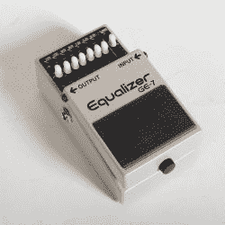

# 在 LTSpice 中摇滚:模拟经典吉他踏板

> 原文：<https://hackaday.com/2020/10/29/rockin-out-in-ltspice-simulating-classic-guitar-pedals/>

音乐家有一种奇妙的语言来描述信号。一个声音可以是肥胖的，黑暗的，脆脆的，有力的——这样的例子不胜枚举。这些不是很专业的术语，但是它们完成了工作。毕竟，向吉他手要求更清脆的声音比要求他们锐化波形的边缘，同时放大高频成分并衰减低频成分要容易得多。当然，以这种方式看待信号也很有趣，尤其是当您可以将音质的变化与波形的变化联系起来时，更理想的是，与产生波形的电路联系起来。

为了进行这样的调查， [[Nash Reilly]一直在 LTSpice](http://cushychicken.github.io/ltspice-boss-ge7-equalizer/) 中模拟吉他效果踏板。能够在网上找到[他需要的大部分原理图](https://www.hobby-hour.com/electronics/s/guitar-effect-schematics.php)，【纳什】分解电路各部分的功能，建立整个系统的模拟。他的文章清楚地解释并经常展示了盒子里发生的事情。从表面上看，这是你最喜欢的效果踏板的内部工作的有趣之旅。除此之外，这是一篇出色的模拟设计综述，非常值得任何对音频、电子或音频电子感兴趣的人阅读。

对于那些对物理路线而不是模拟路线感兴趣的人，我们已经在之前[看了一下踏板设计。任何想要尝试创建模拟的人都可以](https://hackaday.com/2017/12/20/taking-a-guitar-pedal-from-concept-into-production/)[拿到一份 LTSpice](https://www.analog.com/en/design-center/design-tools-and-calculators/ltspice-simulator.html#) ，或者查看一个名为 LiveSpice 的[包，它可以让你实时模拟电路并使用它们处理现场音频——这对原型吉他效果非常有用。](https://www.livespice.org/)