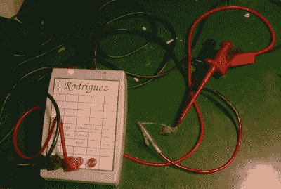

# 廉价的罗德里格斯-IV 型曲线描绘仪

> 原文：<https://hackaday.com/2021/05/16/rodriguez-iv-curve-tracer-on-the-cheap/>

作为对电气工程堆栈交换的在线讨论的回应，[Joseph Eoff]决定通过使用 Arduino Nano 和一些无源元件拼凑一个[裸机 IV 曲线跟踪器](https://hackaday.io/project/177785-rodriguez-the-worlds-slowest-iv-tracer)来证明他的观点。但他继续修补电路，看看这个简单的设置能带来多大的改进。他通过使用定时器 1 库获得 1024 步而不是 256 步，从 PWM DAC 电路中挤出了一点额外的分辨率。为了读取电压，他实施了过采样(在某些情况下再次过采样)，以从 Nano 的 10 位 ADC 中获取几个额外的分辨率位。整个过程由 Python / Qt 脚本控制，以生成所需的图形。

虽然它的工作，并给他静脉曲线，这种简单是有代价的。它很慢——[Joseph]报告说，在一个晶体管上追踪五个不同的基极电流值需要几分钟。正是这种速度的缺乏激发了他以卡通人物斯皮蒂·冈萨雷斯的堂兄 Slowpoke Rodriguez 的名字命名这个项目，slow poke Rodriguez 又名“全墨西哥最慢的老鼠”。除了极其缓慢之外，追踪器的电压限制在 5 伏特，电流低于 5 毫安。

[Joseph]在他的博客上记录了整个设计和构建过程[，并在 GitHub](https://josepheoff.github.io/posts/iv-1-toc)上提供了[源代码，如果你想亲自尝试的话。十年前，我们报道过另一个有趣的](https://github.com/JosephEoff/Rodriguez) [IV 型曲线跟踪仪，它建在硬纸板](https://hackaday.com/2011/10/20/analog-test-interface-for-your-computer/)上，但是它比 Rodriguez 型大得多。