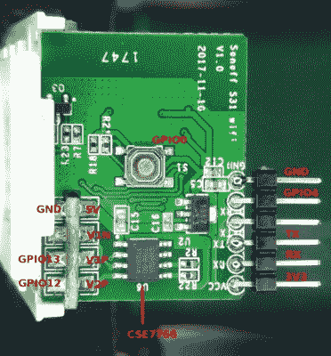

# 使用 ESPHome 实现您自己的自动化

> 原文：<https://hackaday.com/2020/04/20/roll-your-own-automation-with-esphome/>

智能家居有多种不同的途径，而[Marcus]最终决定使用基于 ESPHome 和 ESP8266/ESP32 的设备来创建一个完整的 DIY 智能家居解决方案，涵盖他的车库门、洒水器、led 灯、灯泡和插座。这里甚至有一个实验性的(非常经济的)基于 ESP32-CAM 的相机。

 事实上，【马库斯】的文章也可以作为一种参考设计。如果你对 [ESPHome](https://esphome.io/) 感到好奇，一定要读一读他所说的，因为他准确地解释了他是如何配置每个设备的，以及他在这个过程中遇到的任何挑战。

除了软件指导之外，这篇文章也是一个很好的资源，教你如何在几个不同的智能设备上刷新一个新的固件。[Marcus]提供了标记精美的电路板图像，显示您需要连接程序员的位置，这可能会为您省去一些麻烦。尽管他设法点燃了其中一个灯泡，所以请留意。

[Tasmota](https://tasmota.github.io/docs/#/) 是另一个用于控制基于 ESP8266 的设备的开源选项，如果你想探索这个方向，不要忘记最近使用 Tasmota 固件的[flash Sonoff 设备变得更加容易](https://hackaday.com/2020/02/25/flashing-sonoff-devices-with-tasmota-gets-easier/)。