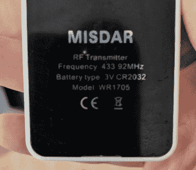

# RTL-SDR 为 Alexa 控制的百叶窗铺平了道路

> 原文：<https://hackaday.com/2018/09/27/rtl-sdr-paves-way-to-alexa-controlled-blinds/>

偶尔看看一个项目，尤其是一个涉及对未知通信协议进行逆向工程的项目，并认为它可能超出了您的能力范围，这是可以原谅的。我们都经历过。但是，随着我们使用的越来越多的设备正在成为无线黑匣子，我们都将不得不变得更加舒适，不时地跳入深水区。幸运的是，我们可以从许多成功的故事中寻找灵感。

 一个恰当的例子是无线百叶窗[【斯图亚特·辛森】认为如果他能用亚马逊 Alexa](https://stuarth.github.io/alexa-blinds/) 来控制它们的话，会有用得多。有很多关于如何让 Alexa 执行你的命令的文档，所以他并不担心这个。棘手的部分是控制无线百叶窗，因为他所要做的只是遥控器背面印着的频率。

幸运的是，在廉价 RTL-SDR 设备的时代，这通常是你所需要的。[Stuart]插上他的接收器，启动了难以置信的便捷的通用无线电黑客。因为他知道频率，所以只需调谐并按几次遥控器上的按钮就能捕捉到清晰的画面。然后软件把它分解成遥控器发出的二进制序列。

这就是斯图尔特的幸运之处。制造商采取了简单的方法，没有包括任何类型的安全功能，甚至懒得承认信号已经收到。他需要做的只是用一个连接到 ESP8266 的标准 433MHz 发射机鹦鹉学舌般地说出二进制序列，盲人就上钩了。这*是否意味着*足够近的任何人都可以控制这些特殊的盲注，但这是另一个故事了。

大约一年前，我们看了一下通用无线电黑客(Universal Radio Hacker)，很高兴看到它正在加速发展。我们还介绍了[创建你自己的 Alexa 技能的来龙去脉](https://hackaday.com/2018/01/17/an-alexa-skill-among-other-things-in-a-few-minutes/)，如果你想在项目的这一方面有所进展的话。