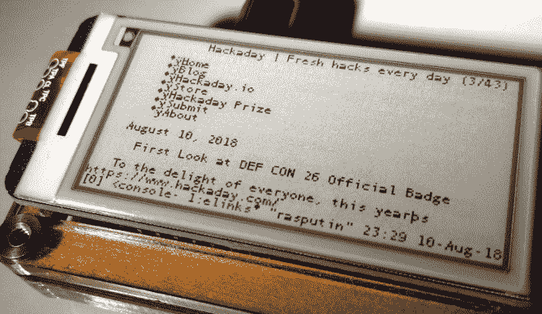

# 在廉价的 E-Ink 显示器上运行 Linux 终端

> 原文：<https://hackaday.com/2018/08/14/run-a-linux-terminal-on-cheap-e-ink-displays/>

如果你没有跟上电子墨水显示器的世界，这里有一些好消息:它们现在相当便宜。只需 15 美元，你就可以买到一个小型电子墨水显示器，它有足够好的性能和对比度，可以真正做一些有用的事情。只有一个问题:弄清楚如何在你的项目中驱动它们。

当实际使用这些电子墨水模块时，厌倦了只看到电路图和样本代码，[Jouko str mmer]决定尝试为这些华丽的小显示器创建一个交钥匙应用程序。结果是 PaperTTY，一个 Python 程序，它允许用户[在电子墨水显示器上打开一个全功能的 Linux 虚拟终端](https://github.com/joukos/PaperTTY)。

 当然，也有一些注意事项。首先，这一切都假设你正在使用 Waveshare 显示器(特别是他们的 2.13 英寸帽子)通过 SPI 连接到 Raspberry Pi。这并不是说这是唯一可以工作的*硬件组合，但这是唯一一个【Jouko】在这一点上做了任何测试的硬件组合。如果你想在硬件方面有所突破，你可能需要亲自动手。*

能够在这些电子墨水显示器上打开 Linux VT 的优势非常简单:你可以在上面运行任何你想运行的软件。您可以使用(或编写)标准的 Linux 控制台程序，而不必开发专门支持该显示器的软件。[Jouko]提到了许多流行的程序，如`vim`和`irssi`，但是您可以轻松地编写一个 Bash 脚本，将您喜欢的任何数据转储到屏幕上。

在休息之后的视频中，Jouko 向怀疑者展示了 PaperTTY 的实际应用，这些怀疑者认为这种显示器不适合交互使用。显示非常清晰易读，没有闪烁的迹象。总的来说，他说这种体验与使用慢速 SSH 连接没有什么不同。这可能不是我们想要的全职使用电脑的方式，但我们绝对可以看到它的潜力。

随着 Kindle 黑客攻击的最新进展，T2 对电子墨水的兴趣似乎一如既往的高涨。不管反对者怎么说，这是一项[有用的利基技术，仍然有很大的前景](https://hackaday.com/2017/04/12/can-you-build-an-e-ink-display-from-scratch/)。

 [https://www.youtube.com/embed/mXBS4l3OvyE?version=3&rel=1&showsearch=0&showinfo=1&iv_load_policy=1&fs=1&hl=en-US&autohide=2&wmode=transparent](https://www.youtube.com/embed/mXBS4l3OvyE?version=3&rel=1&showsearch=0&showinfo=1&iv_load_policy=1&fs=1&hl=en-US&autohide=2&wmode=transparent)

