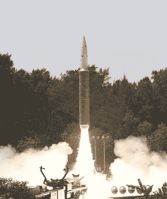
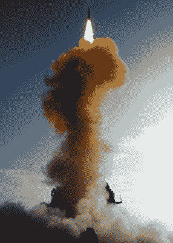

# 俄罗斯反卫星武器试验招致广泛谴责

> 原文：<https://hackaday.com/2021/11/17/russian-anti-satellite-weapon-test-draws-widespread-condemnation/>

11 月 15 日上午，一枚俄罗斯导弹摧毁了地球上空轨道上的一颗卫星。反卫星武器的成功试验激怒了航天业的许多人，将宇航员和宇航员都置于危险之中，并引起了地球上几乎所有公共和私人航天组织的注意。

这是备受争议的军事反卫星行动历史上的又一篇章，对未来的太空任务具有重要意义。让我们检查发生了什么，并探索更大的操作背景。

多个来源的分析表明，一个反卫星武器系统摧毁了一颗名为宇宙 1408 的俄罗斯卫星。该卫星为苏联提供电子和信号情报，于 1982 年发射，预计任务期限为 6 个月。这颗 2，200 公斤重的卫星已经报废了几十年，位于大约 480 公里高度的低地球轨道上。

美国太空司令部已经发布了一份声明，表明俄罗斯发射了一枚直接上升的反卫星导弹，击中了宇宙 1408 号。这些发现得到了许多私营太空组织的独立验证，包括 LeoLabs 和 T2 Seradata。

确切的细节很难获得，但怀疑集中在使用俄罗斯 PL-19 Nudol 导弹进行测试。PL-19 是一种地面发射导弹，最近一次测试[是在去年](https://www.popularmechanics.com/military/weapons/a34992366/russia-test-space-weapon-satellite-killing-missile/)进行的，除了反卫星作用之外，它还有反弹道导弹的应用。这两项任务有相似的要求——需要一种具有高 delta-V 和高机动性的导弹，以便在轨道高度打击快速移动的目标。这也不是俄罗斯最近唯一的反卫星项目，据报道，俄罗斯最近测试了一颗设计用于对轨道上的其他卫星进行动力攻击的卫星[。](https://www.bbc.com/news/world-europe-53518238)

 [https://www.youtube.com/embed/0ZGjT5nwqYk?version=3&rel=1&showsearch=0&showinfo=1&iv_load_policy=1&fs=1&hl=en-US&autohide=2&wmode=transparent](https://www.youtube.com/embed/0ZGjT5nwqYk?version=3&rel=1&showsearch=0&showinfo=1&iv_load_policy=1&fs=1&hl=en-US&autohide=2&wmode=transparent)

YouTube 视频:LeoLabs 捕捉到的数据显示，反卫星武器试验的碎片正接近国际空间站(ISS)的轨道。

这次试验很快招致了航天界的广泛谴责。也许最值得注意的是，根据美国国家航空航天局的一份声明。国际空间站上的宇航员被指示就地避难。船上的团队穿上宇航服，关闭一些径向国际空间站模块的舱口，并登上目前与空间站对接的 SpaceX Crew Dragon。在 NASA 认为情况安全之前，这些措施是在通过试验产生的碎片区时采取的。据多个消息来源报道，空间站美国和俄罗斯部分之间的舱门仍然打开。值得注意的是，空间站上的七个人中有两个是俄罗斯宇航员，他们也被俄罗斯的试验置于危险之中。

美国宇航局局长比尔·纳尔逊在一份声明中表达了愤怒，指出他“对这种不负责任和破坏稳定的行为感到愤怒”。鉴于俄罗斯在载人航天方面悠久的历史，很难想象俄罗斯不仅会危及国际空间站上的美国和国际合作伙伴的宇航员，还会危及他们自己的宇航员。他们的行为是鲁莽和危险的，也威胁到了中国的空间站。”

这种测试的问题是产生大量的碎片，这使其他航天器面临损坏或毁灭的风险。来自美国太空司令部的报告表明，测试产生了超过 1500 个可追踪的碎片，可能还有“数十万个”较小的碎片，这些碎片太小，以至于目前的技术无法监测。

目前的估计表明，这些碎片可能会在轨道上停留数年，如果不是数十年的话，威胁到现有航天器大量使用的广阔轨道区域中的航天器。国际空间站的轨道一般在 300-400 公里左右，并在碎片区周围采取了上述预防措施。SpaceX Starlink 卫星的轨道约为 550 公里，顺便说一句，这是一个选择的低轨道，以便它们在服务寿命结束后脱离轨道并烧掉以避免增加低地球轨道的太空垃圾问题。哈勃太空望远镜的轨道为 540 公里，中国的天宫空间站的轨道也在 340-450 公里之间。

India’s ASAT missile, launched in 2019\. Credit: Press Information Bureau, Indian Ministry of Defence

印度在 2019 年进行的类似试验[也引起了愤怒，尽管由于发生在较低的高度，政治背景较少，也许不像今天的俄罗斯试验那样受到不良影响。目前的模型显示，印度试验摧毁了高度为 270 公里的 Microsat-R 卫星，其大部分碎片将在未来几年内相对较快地脱离轨道。](https://hackaday.com/2019/04/09/humanity-creates-a-cloud-of-space-garbage-again/)

相反，中国在 2007 年的一次测试将 FY-1C 气象卫星定位在 865 公里的更高高度，将碎片留在更高的轨道上。测试产生的一半以上的碎片仍在 850 公里以上的轨道上运行，预计在未来几十年或几个世纪内仍将在轨道上运行。2011 年，一片被摧毁的卫星[在距离国际空间站](http://edition.cnn.com/2011/US/04/05/space.station.debris/index.html?hpt=T2)不到 6 公里的地方经过，凸显了此类活动的真实危险。

自太空时代开始以来，苏联(后来的俄罗斯)和美国都开展了重要的反卫星武器开发项目。每一方都试验了各种方法，从地面发射和飞机发射的导弹，到激光系统和其他更好的想法，如可以通过动力或其他方式摧毁其他卫星的卫星。

A Standard Missile-3 (SM-3) launched from the U.S. Navy AEGIS cruiser USS Lake Erie was used to destroy a non-functioning National Reconnaissance Office satellite in 2008\. At the time, the satellite was at just 247 kilometers altitude, meaning most of the debris quickly deorbited due to atmospheric drag. Credit: US Navy, public domain

与此同时，美国最近一次众所周知的测试是在 2008 年使用 RIM-161 标准导弹 3 导弹击落了一颗失败的美国国家侦察局卫星 USA-193。RIM-161 导弹被设计用于反弹道导弹的角色，使其非常适合反卫星任务。据称摧毁的原因是卫星被认为是一种危险，携带 1000 磅有毒的肼燃料，如果重返人口稠密地区，可能威胁到人类的生命。

然而，俄罗斯的声明声称，肼燃料仅仅是中国在 2007 年试验后测试反卫星武器的一个借口。当时的猜测是，这可能会导致新一轮的太空军备竞赛。

美国、俄国、印度和中国已经成功试验了 ASAT 武器，结果已经够糟了。无论如何，随着今天俄罗斯 ASAT 武器的积极试验，以及近年来其他反卫星试验的许多传言，似乎太空现在可能比以往任何时候都更加武器化。这种活动对所有航天活动构成了重大风险，许多人希望，一旦所有相关国家都证明了自己的观点并亮出军刀，试验就会迅速停止。一如既往，时间会证明一切。