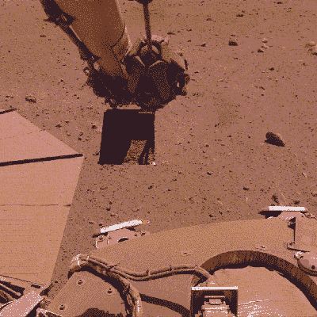

# Sand Hack 增强 InSight 火星着陆器的动力

> 原文：<https://hackaday.com/2021/06/10/sand-hack-boosts-power-on-insight-mars-lander/>

我们喜欢阿波罗 13 号中的那一部分，美国宇航局的工程师必须在一个圆孔中安装一个方形的二氧化碳过滤器。我们基本上喜欢《火星人 T2》中的每一个场景，马克·沃特尼将他能得到的任何硬件组装起来，以便在一个充满敌意的星球上生存。我们更喜欢看真正的美国宇航局工程师尝试破解并命令[洞察号着陆器自己铲沙子来增加太阳能电池板的能量](https://mars.nasa.gov/news/8959/nasas-insight-mars-lander-gets-a-power-boost/)。

InSight 最近延长了其研究火星内部地质的两年任务，一直受到其太阳能电池板上灰尘堆积的困扰。这些尘埃只是增加了预期的能量损耗，当这颗红色行星接近远日点时，能量损耗就会增加——远日点是其轨道上离太阳的最大距离。试图通过脉冲其展开马达来摇动面板，但没有成功。其他太阳能任务经历了火星风的清洁效应；然而，尽管看到了大量的阵风，洞察号并没有看到任何明显的改善。

与直觉相反的是，操作人员指示着陆器从靠近(而不是在顶部)一块太阳能电池板的铲子上慢慢滴下更多的灰尘和沙子。随着风的吹动，较大的颗粒被微风带着穿过面板，并从表面反弹，带走一些积累的灰尘。虽然这听起来可能是一个微小的影响，但该实验导致每溶胶约 30 额外瓦特小时。利润率仍然很低，科学仪器仍然需要关闭以节省能源。但仅这一次提升就足以将断电时间推迟几周。

现在有太多令人兴奋的任务正在火星上进行。不过，让[回顾一些最早的探测器](https://hackaday.com/2021/06/03/mariner-4-our-first-up-close-look-at-mars/)也很有趣。我们总是惊讶于[美国宇航局为我们提供的一些 DIY 乐趣的资源](https://hackaday.com/2021/05/28/3d-printed-mars-rover-smiles-for-the-camera/)。