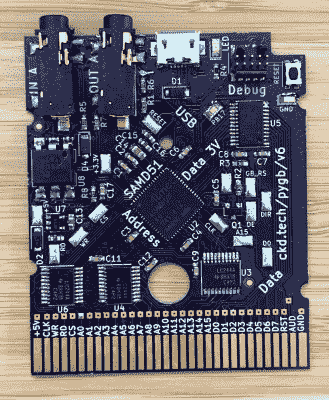

# Scott Shawcroft 正在用 CircuitPython 编写 Game Boys

> 原文：<https://hackaday.com/2020/03/02/scott-shawcroft-is-programming-game-boys-with-circuitpython/>

有些人喜欢用强硬的方式做事。也许他们驾驶手动变速器，或者他们使用绕线工具而不是烙铁，或者他们在汇编中编码以接近机器。以强硬的方式做事当然有其优点，我们在这里不是为了争论这一点。另一方面，CircuitPython 的项目负责人斯科特·肖克罗夫特(Scott Shawcroft)在 2019 年 Hackaday 超级大会的演讲中，将[变成了一个以简单方式做事的绝佳案例。](https://www.youtube.com/watch?v=ycTFYb-9nhI)

事实上，他马上证明了这是多么容易。他站在讲台上，在满屋子的人面前演讲，在一台不熟悉的笔记本电脑前泰然自若，只有普通的文本编辑器。然而，只需一次按键和一次文件保存操作，斯科特就能让他的 Adafruit Edge 徽章上的 led 灯从关闭变为明亮，这是 Supercon swag bag 中的另一个可黑客攻击的硬件。

## 代码+社区

正如 Scott 解释的那样， [CircuitPython](https://circuitpython.org/) 以自己是代码和社区的平等部分而自豪。换句话说，它是友好的，到处都是邀请。用 CircuitPython 开发很容易，因为整个环境——代码、工具链和设备——都是非常可移植的。与传感器和其他小玩意交互很容易，因为 Python 的导入和库机制是众所周知的，这两者在 CircuitPython 生态系统中一直在增长。

CircuitPython 非常友好，它甚至可以相对容易地与旧硬件对话，而不会陷入代际之争。为了证明这一点，斯科特拿出了一个原始的任天堂游戏机和一个定制的盒式磁带，他可以用它通过游戏机的 CPU 播放有趣的声音。

##  现在你在玩 Python

看到 Scott 在哪些平台上使用了 CircuitPython 的强大功能是很有趣的。Game Boy 带来了声音和像素生成的硬件以及一些逻辑，但他说是盒子上的代码做了有趣的事情。

CPU 以 1MHz 的速率与购物车通信。只要你能保持这个速度，并且 CPU 理解你的指令，你就能让它做任何你想做的事情。

斯科特的定制手推车有一个 120 兆赫的 SAMD51。他花了一秒钟解释他如何从 Python 库到连接到游戏男孩大脑的线路——基本上，CircuitPython 下面的 C 代码访问 SAMD 中定义的直接结构来进行直接内存访问(DMA)，从而实现 1MHz 的无抖动通信。

他正在使用芯片的查找表从 clock、read 和 A15 产生 1MHz 信号，以便向 Game Boy CPU 的声音寄存器发送音乐播放指令。这听起来工作量很大，但 CircuitPython 有助于消除这些肮脏的细节，留下一个更简单的界面。

如果您想方便地访问硬件，不管它是新的还是旧的，信息很清楚:使用 CircuitPython。

 [https://www.youtube.com/embed/ycTFYb-9nhI?version=3&rel=1&showsearch=0&showinfo=1&iv_load_policy=1&fs=1&hl=en-US&autohide=2&wmode=transparent](https://www.youtube.com/embed/ycTFYb-9nhI?version=3&rel=1&showsearch=0&showinfo=1&iv_load_policy=1&fs=1&hl=en-US&autohide=2&wmode=transparent)

