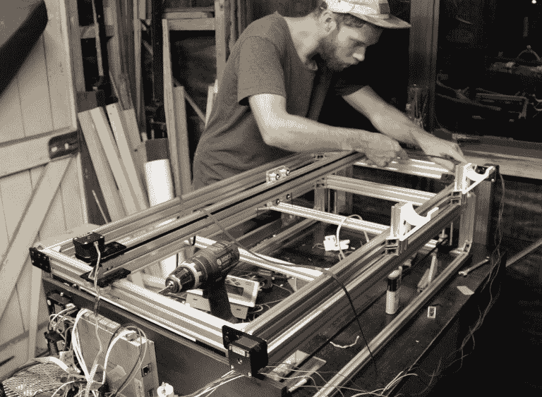

# 刮刮乐——打造超大型激光切割机

> 原文：<https://hackaday.com/2018/11/20/scratch-building-a-supersized-laser-cutter/>

既然 3D 打印机已经或多或少地打入了大众市场，黑客们需要一种新的“精英”工具来花时间设计和摆弄。从过去几年来看，看起来激光切割机将会成为当今的黑客工具；因为我们开始看到越来越多的入门级商业模型的定制构建和修改。通常这些仅限于相对较小和低功率的二极管激光器，但正如下面的项目所示，情况并不总是如此。

 【罗布·切斯尼】设计并制造的这台[大幅面激光切割机在他的博客上，以及在休息后的视频里都有细致的描述。它由铝型材和 ABS 3D 打印零件组成，位于一个丙烯酸外壳中，与激光器的内部机架隔离开来。总的来说，它的造价约为 2000 美元，但考虑到这款切割机的体积和功能，这仍然是一个非常合理的价格。](http://furtherfabrication.com/new-blog/2018/8/5/laser-cutter-build)

[Rob]仔细规划了该构建的每个方面，在实际购买任何硬件之前，用 CAD 对整个机器进行建模。有趣的是，他的主要设计限制是他的小屋的门:他想建造最大可能的激光切割机，仍然可以通过它。这导致了最终机器的长且相对较浅的最终尺寸。该设计还受到最大限度减少材料浪费的愿望的指导，因此在可能的情况下，零件被设计为最大限度地从一米长的铝型材上切割下来。

该激光器具有一个可移动的 Z 轴，其设计类似于您可能在 Prusa 风格的 3D 打印机中看到的设计，机架的每个角落都有一个 8 毫米的丝杠和光滑的杆，用于结合提升和导向。所有的导螺杆都通过滑轮和标准的 GT2 皮带相互连接，但在这个版本中，[Rob]指出 Z 轴必须手动操作。在未来，他将能够添加一个步进电机并轻松实现自动化，但这并不是让机器运行的关键。

他将 3D 打印零件用于几何形状相对复杂的物体，如激光管支架和 Z 轴组件，但更简单的支架是由切割丙烯酸制成的。在一些组件中，[Rob]使用焊接水泥粘合两片丙烯酸树脂，从而使厚度加倍。大型丙烯酸面板也被用于激光器的外壳，这是有意设计为一个独立于激光器本身的实体。他认为这将使组装更加容易和快速，因为外壳不必像集成到机器中一样保持相同的尺寸公差。

[Rob]提供了大量关于水冷却、激光控制电子设备、校准反射镜的细节，以及任何你可能想知道的关于建造自己的激光切割机的细节。如果你一直在考虑建造自己的激光器，并有任何你好奇或不确定的事情，这是一个很好的机会，他在这个版本中解决它。

除了非常幸运地在垃圾桶里找到一把可以翻新的[激光切割机](https://hackaday.com/2018/10/19/laser-cutter-resurrection-uncovers-a-magnificent-machine-beneath-the-ash/)之外，如果你的易贝 K40 已经不够用了，那么建造自己的机器可能仍然是最好的升级途径[。](https://hackaday.com/2018/09/27/laser-noob-getting-started-with-the-k40-laser/)

 [https://www.youtube.com/embed/-JBIMSJ--v8?version=3&rel=1&showsearch=0&showinfo=1&iv_load_policy=1&fs=1&hl=en-US&autohide=2&wmode=transparent](https://www.youtube.com/embed/-JBIMSJ--v8?version=3&rel=1&showsearch=0&showinfo=1&iv_load_policy=1&fs=1&hl=en-US&autohide=2&wmode=transparent)

