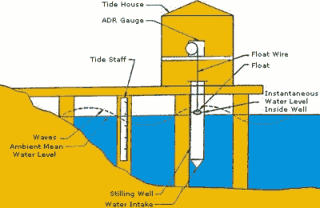
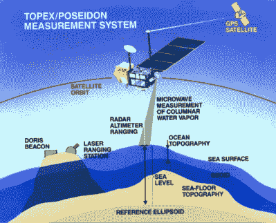

# 海平面:我们如何测量全球海平面，上升的海平面会改变这个基准吗？

> 原文：<https://hackaday.com/2021/03/08/sea-level-how-do-we-measure-global-ocean-levels-and-do-rising-oceans-change-that-benchmark/>

每年夏天你都去海边，但最近你开始注意到每次去海滩似乎都变窄了。是海平面上升了，还是沙子被卷走了？说到海平面，你会不断听到海平面每年都在上升——但是到底是如何测量的呢？毕竟，你不能准确地使用尺子。事实证明，有许多智能系统可以精确测量全球海平面，误差不超过一英寸半。

不仅海浪总是在海洋表面荡漾，而且潮汐周期性地起伏，使得任何单一的海平面瞬时测量都非常不准确。即使您计划在几周或几个月内进行数百或数千次测量，进行单独测量仍然很困难。在海浪中挑选一块漂亮、稳定的石头，在上面划一条线，两周内每小时回来一次，用卷尺测量一下。在最好的情况下，你每次读数都在 6 英寸之内，不管你会弄湿什么，在最坏的情况下，石头会移动，你会得到一个潮湿的笔记本，上面满是无用的数字。所以我们来看看专业人士是怎么做的。

## 昂贵的尺子

事实证明，用尺子测量海平面并不遥远——但是专业海洋学家有非常好的叫做[验潮仪](https://oceanservice.noaa.gov/facts/tide-gauge.html)的仪器，它们安装在名副其实的潮汐房里。最简单的验潮仪是一根固定在水中的长管。这个管子在水面下有小孔，可以让水流入和流出。也被称为静水井，这种设备平均出小的运动和波动，允许对管内的一系列刻度进行更加平静和准确的测量。

An old-fashioned tide house, courtesy of [NOAA](https://oceanservice.noaa.gov/facts/tide-gauge.html)

当然，手工进行所有这些测量是乏味的工作，今天有计算机化的方法来记录潮位。即便如此，一些潮汐房早在 1830 年就有了自动记录系统。这些系统由静水井中的浮子组成，浮子通过绳索和滑轮移动“笔”。每六分钟，这支笔就会在纸上标出潮位，很像老式地震计的工作方式。

多年来，静水井已经演变成了探测管——而不是绳子上的浮子，探测管沿着管道发送音频脉冲，并测量脉冲从水面反弹并返回到传感器所需的时间。最近，NOAA 开发了一个新系统，使用微波雷达来测量水位。微波传感器不需要一口静水井，它们可以安装在水面上的一个结构上。这是一个巨大的优势，因为如果你不需要穿潜水服和空气罐，维修传感器就容易得多。在未来几年，NOAA 计划将其声学测量站转换到这种新的微波技术。

那么，如果你能在不接触水的情况下测量海平面，你能准确测量多远的距离呢？

## 发送卫星

事实证明，你可以在很远的地方进行测量——准确地说，大约 830 英里远。

Courtesy of [NASA/JPL](http://sealevel.jpl.nasa.gov/files/archive/technology/P38232.jpg)

1992 年，一枚阿丽亚娜 4 号火箭从圭亚那航天中心升空，将 TOPEX/Poseidon 卫星送入轨道。这颗卫星携带了一系列令人印象深刻的仪器，包括两个雷达高度计、一个微波辐射计、GPS 接收器和一个激光反向反射器阵列。GPS 系统能够将卫星的位置精确到一英寸以内，并且是第一个证明 GPS 卫星可以用于定位其他航天器而不仅仅是地面目标的系统。

TOPEX/Poseidon 系统具有开创性，原因有很多。它不仅能够以令人难以置信的精度(1.5 英寸)测量海平面，而且是第一次绘制地球潮汐的任务。它绘制了海洋洋流图，收集了有价值的数据，提高了我们对气候变化、天气甚至地球重力场的理解。

虽然该卫星在 2006 年出现故障后被关闭，但它的任务由 Jason-1 接管，Jason-1 于 2001 年发射，以补充 TOPEX/Poseidon 的测量。Jason-2 紧随其后，2016 年，Jason-3 接过了衣钵。

我们知道这些卫星在测量海平面方面做得很好，但是他们到底是在测量什么呢？

## 那么海平面是零吗？

嗯，是……也不是。这取决于你的参照点。如果你看任何地形图，你会注意到海拔是以高于(或偶尔低于)海平面的高度来表示的。飞行员经常报告 AMSL 的海拔高度，或高于平均海平面的高度。平均海平面是通过对静水位(SWL)进行时间平均以消除每日潮汐的周期性影响而获得的。SWL 只是可以用验潮仪测量的东西，海平面随着海浪等海洋运动而变平。这对于测量不是海洋的东西的高度来说足够好了，但是如果我们试图从海洋本身来测量海洋，我们会遇到一个问题。这就是我们需要其他参考来衡量的地方。

基于卫星的仪器报告相对于 WGS-84 参考椭球体的海平面，该参考椭球体由 [TOPEX/Poseidon 数据用户手册](https://podaac-tools.jpl.nasa.gov/drive/files/allData/topex/L2/mgdrb/docs/uhmgdrb/html/uhsec01.htm#Heading8)定义为“地球作为椭球体的非球形的一阶定义”这也是 GPS 接收器用来传送高程数据的基线。另一个有用的参考面是大地水准面——如果地球海洋不受太阳和其他天体的外部影响，只受地球自身重力和自转的影响，地球海洋将形成的理论形状。

## 火星有“海平面”吗？

这对于拥有广阔海洋的地球来说当然很好，但是在没有海洋作为参考的火星(或者其他星球)上如何测量海拔呢？

如果你想测量火星上的一座山，你最好带上气压计和计算器。零海拔被定义为大气压等于 610.5 Pa 的等压线(作为参考，地球上的“海平面”有 101.5 kPa 的大气压)。虽然看起来是随机选择的，但 610.5 帕是红色星球上水的三相点——也就是说，水可以同时以固态、液态和气态存在的压力。从这个椭球体，以及一个类似于我们用于地球的参考椭球体，各种地理特征的高度是由安装在轨道卫星(如火星全球勘测者)上的激光高度计测量的。

现在让我们看看月球，那里的“大气”压力实际上为零(好吧，那里有一些气体，但压力大约为 Pa)。火星方法在这里行不通，因为这里没有大气层。为了建立月球的参考椭球，科学家们确定了它的平均直径，并将其设置为 0。然后，月球勘测轨道飞行器可以测量月球表面相对于该基准的相对高度。

## 回到海滩

那么，回到我们最初的困惑——到底是什么导致了你年复一年注意到的海岸线后退？平均而言，全球海平面每年上升约 0.14 英寸，因此尽管全球变暖是一个非常现实的问题，但你可能不会注意到它每年对海岸线的影响。这就留下了海岸侵蚀——海洋对沙子、岩石和土壤的逐渐侵蚀。如果大部分海岸线如此不稳定，那么这是一件好事，我们有潮汐房和卫星来精确跟踪全球海平面的变化。你试图测量的那块石头几乎肯定会移动。