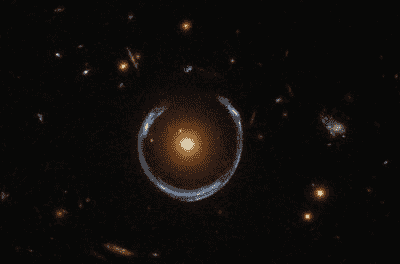
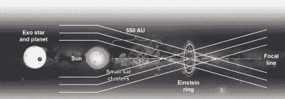
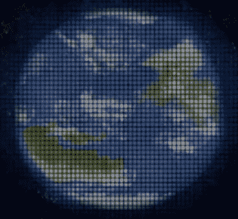

# 用太阳作为引力望远镜搜寻外星生命

> 原文：<https://hackaday.com/2020/04/21/searching-for-alien-life-with-the-sun-as-gravitational-telescope/>

天文学无疑是物理学中最激动人心的学科之一。特别是在过去的几十年里，寻找系外行星已经成为一个蓬勃发展的领域。虽然第一颗系外行星仅在 1992 年被发现[，但是现在](https://www.nature.com/articles/355145a0)[有 4144 颗确认的系外行星](https://exoplanetarchive.ipac.caltech.edu/)(截至 2020 年 4 月 2 日)。自然，我们这些科幻爱好者对 [55 颗潜在可居住的系外行星](http://phl.upr.edu/projects/habitable-exoplanets-catalog)最感兴趣。不幸的是，用传统的望远镜是不可能拍摄一张足够详细的地球 2.0 的照片来识别潜在的生命特征的。

[太阳引力透镜任务](https://www.nasa.gov/directorates/spacetech/niac/2020_Phase_I_Phase_II/Direct_Multipixel_Imaging_and_Spectroscopy_of_an_Exoplanet/)，最近已经被[美国宇航局创新先进概念(NIAC)计划](https://www.nasa.gov/content/niac-overview)选为第三期资助，旨在通过利用太阳引力透镜效应来改变这种情况。

# 这一切都始于爱因斯坦

Strong gravitational lens LRG 3-757 as observed by the Hubble Space Telescope (Credit: NASA)

毫不奇怪，是爱因斯坦在 1936 年计算出恒星的引力场可以充当透镜。如果一个物体位于恒星后面，与观察者在同一视线上，那么产生的图像将形成一个环，现在被称为*爱因斯坦环*。直到 1979 年，当[观察到两个可疑相似的物体](https://www.nature.com/articles/279381a0)原来是由引力透镜形成的双重影像时，这种效应才被发现。今天，引力透镜被用来量化暗物质的数量和分布。正如介绍中所暗示的，由于引力透镜引起的亮度放大，它也可以作为一种*引力望远镜*，允许从早期宇宙中[探测微弱的星系。](https://www.nature.com/articles/nature11446)

# AI 和公民科学家帮助大海捞针

引力透镜非常罕见，人们通常要查看上千张不同的星系图像才能找到一张。此外，识别和解开图像上引力透镜的扭曲不是一件小事。因此，[空间扭曲项目](https://www.zooniverse.org/projects/aprajita/space-warps-hsc)依靠公民科学家来识别 Hyper Suprime-Cam 拍摄的数据中的引力透镜。(天文学家选择听起来像史诗的名字！)机器学习算法也可以用来筛选天文调查的数据。特别是卷积神经网络，它也是脸书 DeepFace 面部识别的基础，[已经被用来识别引力透镜](https://academic.oup.com/mnras/article-abstract/472/1/1129/4082220?redirectedFrom=fulltext)。

# 用太阳作为透镜

Concept for a Solar Gravitational Lens mission (Credit: The Aerospace Corporation)

与光学透镜相比，引力透镜产生的不是一个焦点，而是一条焦线。如图所示，太阳引力透镜(SGL)将入射光聚焦到一条距离约 550 天文单位的直线上。如果将望远镜放在这个点上，SGL 可以将远处物体的亮度放大大约 10 倍，并提供大约 10 弧秒到 10 弧秒的角度分辨率。对于 30 秒差距(~100 光年)的系外地球，SGL 望远镜可以达到~25 公里尺度的表面分辨率，足以看到表面特征和可居住性的迹象。

# 一串装有太阳帆的珍珠

Artist’s depiction of a picture from an Earth-like planet taken with the SGL telescope (Credit: Slava Turyshev)

下面的视频很好地解释了 SGL 任务的概念。首先，最大的问题之一是到达太阳的焦点。1977 年发射的最远的太空探测器旅行者 1 号目前位于 148 天文单位，即以同样的速度，需要超过 150 年才能到达最近的 SGL 焦点。由于所需的速度和长工作寿命，目前的化学和核推进技术是不够的。相反，SGL 任务将使用由太阳辐射压力驱动的太阳帆。通过紧密围绕太阳飞行，SGL 航天器可以达到 25 天文单位/年的速度，在不到 25 年的总飞行时间内到达 SGL 焦点区域。

对于 SGL 任务来说，使用单一的航天器是不切实际的，因为在漫长的飞行中失败的风险很高。相反，任务概念遵循一种*珍珠串*的方法，其中一颗珍珠由 10 到 20 个重量为< 100 公斤的小型航天器(*小卫星*)组成编队飞行。整个系列将由大约 1 年间隔发射的多颗珍珠组成。拥有多个小卫星允许一些冗余，从而限制了单点故障的风险。这也有助于在时间和参与者之间分摊成本。否则，如此规模的任务可能永远无法获得足够的资金。

每个小卫星应该主要自主运行，这在它离地球越远时变得越重要。最终的 SGL 通信延迟大约为四天。为了实现自主导航、数据处理和故障管理，SGL 任务依赖于几种新兴的人工智能技术，并抛出了许多时髦词汇，如*可解释的人工智能*、*终身学习机器*、*用更少的标签学习*和*神经形态*芯片设计。

成像仪器也面临着挑战。一台由相位掩模制成的日冕仪被用来遮挡来自太阳的直射光，相位掩模通过相消干涉来工作。这仍然留下了来自太阳日冕的光作为背景光源，它将与爱因斯坦环重叠。为了减少这种重叠，望远镜需要放在离太阳更远的地方，大约 650 天文单位。最后，望远镜将不会大到足以一次成像整个爱因斯坦环。一颗地球大小的系外行星在 30 秒差距处的图像被 SGL 压缩成一个直径约为 1.3 公里的圆柱体，紧邻焦线。对于 1 米望远镜来说，要获得 1000 x 1000 像素的图像，航天器必须以 1.3 米的小步移动，一次扫描一个像素。然后通过去卷积算法重建系外行星的原始图像。

# 我们什么时候到达那里？

那么我们什么时候能得到第一张高分辨率的系外行星图像呢？自然，这种规模的科学项目的时间表非常模糊，很容易被推迟 5-10 年。在第二阶段总结报告中指出，剩余的技术发展将允许在 2028-2030 年发射。实际上，这意味着我们可以在 21 世纪 60 年代早期获得第一批数据。

他们会看什么星球？由于在 SGL 任务到达目的地之前，可能会发现几个新的潜在宜居行星，所以目标还没有确定。目前，最有希望的候选者之一是 TRAPPIST-1e，一颗岩石，几乎地球大小的行星，位于 12.1 秒差距的距离，可能也含有液态水。计划于明年发射的詹姆斯·韦伯太空望远镜将对这颗行星进行更近距离的观察。

他们会寻找什么？检查可居住性的迹象将包括对大气的光谱调查，以检查生物标记，如氧气和甲烷。也有可能在夜间寻找人造光源以及无线电传输。

太阳不仅使地球上有了生命，而且还可以作为在其他星球上寻找生命的工具。“我们在宇宙中是孤独的吗？”这个问题非常令人兴奋在我们有生之年可能会得到否定的回答。这让你想知道有多少类似的望远镜已经对准了我们。

 [https://www.youtube.com/embed/Hjaj-Ig9jBs?version=3&rel=1&showsearch=0&showinfo=1&iv_load_policy=1&fs=1&hl=en-US&autohide=2&wmode=transparent](https://www.youtube.com/embed/Hjaj-Ig9jBs?version=3&rel=1&showsearch=0&showinfo=1&iv_load_policy=1&fs=1&hl=en-US&autohide=2&wmode=transparent)

