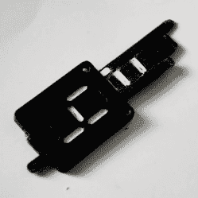

# 七个部分，但不是我们所知道的

> 原文：<https://hackaday.com/2022/10/06/seven-segments-but-not-as-we-know-them/>

我们已经看到了许多对经典 7 段显示器的巧妙重新想象，证明仍有新东西的空间是[Jack]的 [7 段“DigiTag”显示器](https://www.printables.com/model/286766-digitag-7-segment)。

 这款 3D 可打印设备有一个框架，里面插着三个滑块。这些滑块可以单独调整，混合和匹配彩色和非彩色区域的可见性，以创建数字 0-9。我们以前见过一些不寻常的 7 段式显示器，从使用[一个电机用于整个数字](https://hackaday.com/2021/11/13/a-one-servo-mechanical-seven-segment-display/)到需要[一个电机每段](https://hackaday.com/2021/08/11/a-whole-lot-of-stepper-motors-make-the-most-graceful-7-segment-displays/)，但没有什么像*这种*方法。

虽然这种特殊的设计依赖于用户手动“拨入”每个数字，但由此产生的钥匙状组件(以及每个数字的独特形状)似乎有一些有趣的应用——一个谜题盒设计浮现在脑海中。

如果你对如何使用它有自己的想法，不要藏在心里！请在下面的评论中告诉我们。