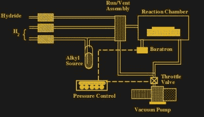
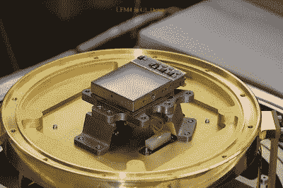
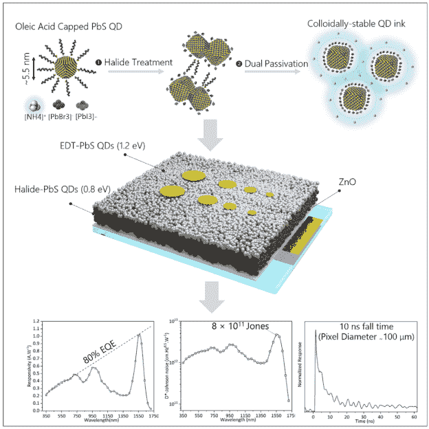
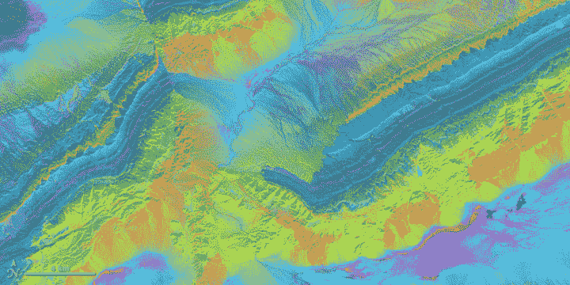

# 用短波红外辐射照亮现实

> 原文：<https://hackaday.com/2022/02/03/shining-a-different-light-on-reality-with-short-wave-infrared-radiation/>

尽管在可见光光谱下工作的相机很棒，但它们忽略了许多可以从其他波长收集到的信息。还有一个小问题是能见度经常受到影响，比如下雨或有雾的时候。当这种情况发生时，依赖于此的自动驾驶汽车等应用就会遇到一个重大问题。然而，通过使用对其他波长敏感的传感器，我们可以避免这些问题。

短波红外辐射(SWIR)大致是 1.4 微米-3 微米或 100 THz-214 THz 之间的电磁频谱部分。这使它处于可见光和微波之间，高于 20 THz-37 THz 的长波红外。LWIR 是热感相机使用的，LWIR 也是由温暖的物体发出的，如人体。

SWIR 很大程度上不受大气中水的影响，同时也能穿过对可见光不透明的物质。这使得 SWIR 可以用于分析和检查从多氯联苯和水果到艺术品的所有东西，以捕捉否则不可见或很难看到的细节。

不幸的是，很像热感相机传感器，SWIR 传感器相当昂贵。或者，直到最近，随着量子点传感器的出现，大大降低了这些传感器的成本。

## 捕捉短波

允许我们捕捉红外辐射的传感器通常由矩形像素阵列组成，称为焦平面阵列(FPA)，也称为凝视阵列。这类似于用于其他波长的 FPA，例如用于可见光的 CMOS ( [APS](https://en.wikipedia.org/wiki/Active-pixel_sensor) )和 [CCD](https://en.wikipedia.org/wiki/Charge-coupled_device) 传感器。这些 FPA 通常由硅制成，因为硅基传感器对可见光和部分近红外光谱敏感。

对于近红外以外的波长，通常需要更奇特的材料和工艺。用于 SWIR 传感器的材料不仅需要对该波长敏感，还需要具有足够的电子迁移率，以便电荷可以足够快速和有效地转移，以用于传感器。这就是目前砷化镓铟最受欢迎的地方。(在科学文献中也可互换地称为 InGaAs。)

1980 年[杜舍明等人(1981)](https://www.sciencedirect.com/science/article/pii/0022024881902724?via%3Dihub) 首次报道使用[金属有机化学气相沉积](https://en.wikipedia.org/wiki/Metalorganic_vapour-phase_epitaxy)在 InP 衬底上成功生长 GaInAs，这种方法至今仍是制造 GaInAs 传感器结构的主要方法。在气相沉积阶段之后，这些 GaInAs 芯片被小心翼翼地结合到硅基界面，这使得它成为相对缓慢、劳动密集型且因此昂贵的过程。

HgCdTe-based HAWAII sensor module with 2k x 2k pixel resolution, as installed in the James Webb Space Telescope (JWST).

这并不是说不可能进一步提高价格。当詹姆斯·韦伯太空望远镜的 NIR 传感器被开发出来时，人们发现 [GaInAs 传感器噪音太大](https://twitter.com/fox_ori/status/1483429764245434379)并且具有高暗电流。这导致了 HgCdTe(碲镉汞)的使用，每个传感器的生长和组装类似于 GaInAs 传感器，只是每个传感器的价格高达 25 万美元左右。

这指出了基于 GaInAs 的传感器的弱点:为了减少热辐射信号中的噪声，它们通常使用低温冷却器或类似的解决方案来冷却。这大大增加了操作这些传感器的成本和复杂性。

从中得出的主要结论是，它证明了人们可以选择多种材料，并将其调谐到电磁波谱的特定部分。哪一个工作因此取决于一个人的要求，以及预算。尽管 SWIR 传感器在 QA 和自动驾驶或辅助驾驶汽车的工业生产线上使用可以在不太理想的天气下绕过视觉限制，但基于 GaInAs 的传感器在这种应用中使用太昂贵了，每个传感器需要几千美元。

## 正确的权衡

显而易见，对于普通的、价格合理的 SWIR 传感器，我们不需要满足基于 GaInAs 的传感器的精确灵敏度和速度要求，只要捕获速度和灵敏度方面的权衡与预算收益相匹配。这就是为什么硫化铅(PbS)基胶体量子点(cqd)受到了极大的关注，因为由于 qd 能够相当精确地调谐到目标光谱，这些量子点在 SWIR 光谱中具有可接受的光敏性。

PbS 量子点的一个主要问题是它们的长期稳定性(钝化)，Kwon 等人(2020 年)在 *Nano Convergence* 中报道了添加硫化镉(CdS)以稳定用作 SWIR 传感器的 PbS 量子点。最终的 cqd 成功运行了超过 182 小时。与基于 GaInAs 的传感器相比，这类 cqd 的主要优势在于，它们的合成更容易、更快，同时也简化了与功能传感器的集成。

代替气相沉积步骤，以与某些显示技术中使用的 qd 类似的方式生产 qd，使用在任何装备良好的化学实验室中发现的溶液和设备合成 qd——Kwon 等人也详细描述了这一点——之后，所得溶液可以作为薄膜涂层施加在目标基板上。

Summary of HLB-stabilized SWIR-sensitive colloidal quantum dot sensor. (Vafaie et al., 2020)

同样在最近，来自多伦多大学的 [Vafaie 等人](https://www.sciencedirect.com/science/article/abs/pii/S259023852030686X) (2020， [PDF](https://light.utoronto.ca/wp-content/uploads/2021/02/publishers-version-online.pdf) )描述了使用高水平溴钝化的 PbS CQDs，创建了 SWIR qd，其不仅在 1，550 nm 处具有 80%的外部量子效率(EQE)(与 GaInAs 相当)，而且具有 10 ns 的响应时间。他们报告了在环境空气下 12 小时的稳定、连续操作。

## 小心生产差距

在一项令人惊叹的新技术走出实验室进入工厂之前，必须开发出一种适合大规模生产的生产工艺。如上所述，这是像 GaInAs 这样的技术从未通过小规模生产的地方，但 PbS CQD 总部的 SWIR 传感器似乎做得更好。

此时 [SWIR 视觉系统](https://www.swirvisionsystems.com/products/cqd-sensor-technology/)、[恩伯伦](https://www.imveurope.com/analysis-opinion/industry-puts-faith-quantum-dot-swir)、 [ST 微电子](https://www.imveurope.com/news/sts-quantum-dot-sensor-set-volume-swir-imaging)以及 [Imec](https://www.imveurope.com/feature/swir-cost-cut-imec-achieves-182-m-pixels) 已经展示了使用这些传感器的产品，或基于 PbS CQDs 的原型 SWIR 传感器。2022 年 1 月[宣布](https://www.imveurope.com/news/hitachi-use-trieye-swir-tech-driver-assistance)日立 Astemo 作为汽车供应商将评估以色列 [TriEye 的渡鸦](https://trieye.tech/raven/) SWIR 传感器。现在还为时尚早，很明显，至少在一段时间内，这些 SWIR 传感器将仍然是普通爱好者和小规模制造商无法企及的。

根据 Imec 的说法，他们期望他们的 SWIR 传感器“有一天”会被制造成低至€10 到€100。与现有的基于 GaInAs 的解决方案相比，这将是惊人的价值，一旦发布到一般市场上，即使是业余爱好者也可以实现。这可能会让人想知道廉价的 SWIR 传感器到底有什么用。

## 检查、分析、导航

SWIR 对于贡献光谱的视觉部分无法提供的细节非常有用，例如地质构造中的[矿物含量](https://earthobservatory.nasa.gov/features/FalseColor/page5.php)，这是美国宇航局利用其卫星获得的[地球观测站](https://earthobservatory.nasa.gov/)项目的重要信息。然而，同样的事情也可以由例如地质学家来完成，无论是在地面上还是通过飞机或无人机来协助勘测。

Comparing the differences between 3 shortwave infrared bands highlights the mineral geology surrounding China’s Piqiang Fault. (NASA image by Robert Simmon with ASTER data.)

在 SWIR 光照下，也很容易看到，例如水果上的瘀伤、隐藏在画布上颜料下面的草图，以及容器中剩余的液体或粉末量，否则这些都是不透明的。类似地，可以看穿大部分 PCB 和硅，使其有助于(自动)检测添加到现有的检测工作流程中。

因为 SWIR 是肉眼看不到的，但是它的反射很像可见光，所以可以用来导航。不同于可见光相机，甚至无人机上的常规红外相机，SWIR 相机甚至不受最严重的雾和雨的影响。这也是一个非常有用的安全和野生动物摄像机的属性。

几十年来，SWIR 成像基本上是普通人无法企及的，可能需要一段时间才能使其优势变得完全明显。即便如此，当我们考虑热感相机今天被业余爱好者和专业人士经常使用时，不难想象 SWIR 相机会有更多的用途，作为夜视(“IR”)相机的替代品和无价的分析工具，无论是分拣水果还是分析矿物样品。

希望在不久的将来，我们将看到 CQD 的 SWIR 传感器普遍可用。让这一代产品应用于汽车和类似市场可能会大大有助于降低制造成本。在那之前，它仍然是一个等待的游戏，即使我们应该看到这些新的传感器出现在我们周围越来越多的设备中。

[标题图片:当苹果沿着传送带行进时，它们被 InGaAs 和 CMOS 相机扫描。InGaAs 相机将显示在皮肤下开始形成的缺陷，人眼无法看到；CMOS 相机将显示可见的缺陷。(鸣谢:[滨松](https://www.hamamatsu.com/eu/en/applications/see-beyond-the-surface/index.html) )]