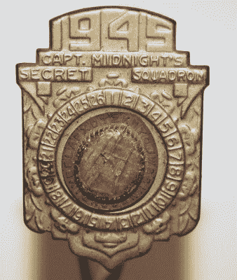
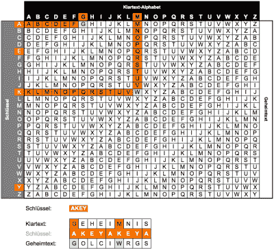
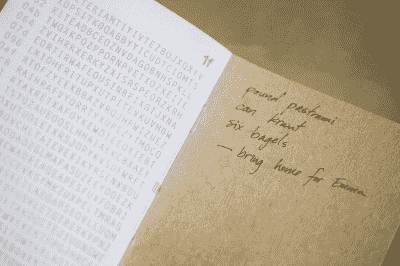

# 你可以在纸上做简单的加密

> 原文：<https://hackaday.com/2021/05/12/simple-encryption-you-can-do-on-paper/>

这是欧洲人和世界其他地方的人都关心的问题:政府中有人建议禁止、限制或秘密使用强大的端到端加密。有许多反对破坏加密的论点，但其中最强有力的论点是，加密可以足够简单地实现，高中生可以理解它的操作，几乎任何程序员都可以以某种形式编写一些东西，所以禁止它不会影响限制它在任何人中间的使用，这些人迫切需要它来努力推出自己的产品。

考虑到这一点，我们将看看最基本的密码，如果需要的话，你可以自己把它们写在纸上。

A Captain Midnight secret decoder ring. Sobebunny, [CC BY-SA 3.0](https://commons.wikimedia.org/wiki/File:Captain-midnight-decoder.jpg).

毫无疑问，只要有人类能够重复信息，就有密码学家和密码破译者在工作，我们今天使用的强大的公钥密码器是由数学家在他们的前辈的肩膀上创造的，可以追溯到几千年前。在立法者的眼中，公钥密码是最重要的，但令人惊讶的是，它们并不是唯一一个功能上不可破解的强大加密方案。一个更古老、更简单的密码也拥有这一属性，正是这一点，我们提出了强加密立法的书面答案。所谓的一次性密码本是冷战间谍故事中的一个主要内容，正是我们正在寻找的属性。

为了解释一次性密码本，有必要先追溯到古罗马，简单的字母替换密码。在最基本的形式中，从 A 到 Z 的字母表或者被移位或者被随机化，由此产生的字母列表通过直接替换被用于将消息加密到密文中。密文是加密的，但它的缺陷在于它保留了消息文本中字母的频率分布。频率分析是由伊斯兰帝国的数学家发展和完善的一种技术，在这种技术中，密码文本中单个字母的频率可以与语言整体中字母的频率相比较。通过这种技术，密码破译者可以识别信息中足够多的字母，并通过猜测剩下的字母来重建信息。

A Viginère square. Log(z)equalsY, [CC BY-SA 3.0](https://commons.wikimedia.org/wiki/File:Vigenere-Beispiel.png).

解决替换密码中的这一缺陷将我们带到 16 世纪的意大利和多字母密码，它不是使用单一的替换字母，而是使用多个替换字母，按顺序从一个字母切换到下一个字母。Vigenère 密码使用一个字母表，每个字母表相对于前一个字母移动一个字母，并随着每个连续的字母从一个字母切换到下一个字母。通过使用关键字来确定表中哪些移位的字母将用于替换，它创建了一个被认为无法破解的密码，直到 19 世纪，包括查尔斯·巴贝奇在内的数学家通过发现其关键字的重复模式成功地破解了它。

因此，Vigenère 密码受到了损害，但它的弱点不在于它的方法，而在于使用重复的关键字来实现它。如果使用一个短的关键字，例如“hackaday ”,那么它实际上变成了一系列八个连续重复的替换密码；字母表一次又一次地按顺序移动 h、a、c、k、a、d、a 和 y，一组更复杂但仍可实现的计算将揭示其秘密。随着关键字长度的增加，这些计算变得更加复杂，当关键字的长度与密文的长度相同时，就不再存在发现重复的可能性。

## 一次性密码本

Who remembers the Hackaday one-time pad? Anyone done a frequency analysis on it?

一个密钥长度与其文本长度相同的密码通过频率分析是无法破解的，以试图找出重复的关键字。但是，如果关键字本身包含一个可识别的模式，如一本书的一段话，甚至是一个伪随机序列，它仍然有可能被破坏[，特别是如果它被重复使用](https://hackaday.com/2016/08/23/colossus-face-to-face-with-the-first-electronic-computer/)，因此我们想到了一次性密码本的概念。

如果每条信息都使用一个由随机字符组成的新密钥，其长度与其文本长度相同，那么它就不包含帮助破译者的线索，因为密码文本的熵与随机密钥的熵相同。这些冷战时期的间谍用一种低技术的方式实现了这一点，他们使用一个便笺簿，其页面包含随机的密钥文本，一旦使用过，每一页都可以被撕掉并丢弃，因此有了“一次性便笺簿”这个术语。

一次一密加密。它很难操作，因为双方都必须有一个相同的密码本的副本，尽管用纸和笔(甚至一组异或门)就足够简单，但它可能不是更现代的加密形式的明智选择。但它是真正强大的端到端加密，这将使它受到任何削弱加密的企图。因此，这篇文章的重点并不是要说服大家改用一个维金格和一个写满随机数字的笔记本，而是写下安全的端到端加密可以有多简单。如果一个孩子可以用纸和笔做到这一点，那么最新手的程序员也可以只用一个文本编辑器在一个脚本中实现它，所以任何指责它的建议看起来都像是马失前蹄。