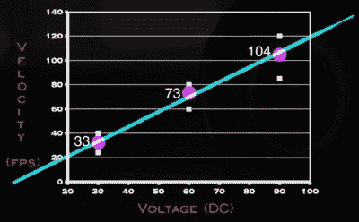

# 六射手用火药换爆电容器

> 原文：<https://hackaday.com/2022/08/29/six-shooter-swaps-powder-for-popped-capacitors/>

现代火器似乎与旧西方的左轮手枪相去甚远，但从概念上来说，它们的工作原理是一样的:爆炸火药。但是任何在电解电容器上施加过高电压的人都知道，火药不是唯一会爆炸的东西。(是的，从技术上讲，这不算爆炸。)

[Jay Bowles]想知道是否有可能建造一种使用标准电容器代替传统弹药筒的底火和火药的[电点火武器。虽然它自然只有最小口径火器的初速或能量的几分之一，但它将是一种有趣的替代方法，可以解决自 19 世纪中期以来一直被认为是基本解决的问题。](https://www.youtube.com/watch?v=4Fy9bZEufx0)

 在他最新的*等离子频道*的视频中，【杰伊】带领观众们经历了他的非常规手枪的创造，从科学测定你能从爆裂的电容器中获得多少能量开始。他的测试装置包括将一个电容器和一个小抛射体放入一个丙烯酸管中，并记录抛射体的速度和通过帽的电压之间的关系。在 30 伏直流电下，炮弹将可靠地从他的临时加农炮的炮管中发射，但通过将电压增加两倍至 90 伏直流电，他注意到初速也有 3 倍的提高。

对基本前提充满信心后，[Jay]接着组装了一些“子弹”,它们由一个顶部粘有铝弹丸的电容器组成。蹲式圆柱体并不特别符合空气动力学，但重要的是它们与电容器本身的直径相同。这使得丙烯酸室和桶周围密封良好，从而限制了气体的浪费。在真正的火器中，铅射弹的直径实际上比枪管稍大，所以当它穿过时会被挤压。但在这种情况下，没有每平方英寸数万磅的力推动抛射体前进，所以间隙需要更大一些。

这把看起来很像赛博朋克的手枪的其余部分也是由丙烯酸树脂组装而成的，就像我们对任何[杰伦]制造的东西所期望的那样。我们特别喜欢使用标准的无绳工具电池作为电源，当它们旋转到位时，两个极板与每个电容器的引线接触，这是一个辉煌的触摸。如果这种设计有缺点的话，那可能是你必须在两次射击之间手动推进圆筒，但使用磁铁来确保圆筒与枪管正确对齐是一个聪明的低技术解决方案。

在视频的最后，[Jay]展示了手枪确实能很好地撞击易拉罐…至少在一段时间内。不幸的是，在失败之前，丙烯酸结构只存活了大约十几次。听起来这个项目的第二个版本将实现一个金属圆柱体，以及其他改进，这是我们期待看到的。

值得注意的是，与[Jay]以前的许多项目不同，这并不是一个操作指南。他并不提倡任何人尝试在家里建造一个，也没有提供这样做的说明。如果你想跟随一些稍微不那么危险的东西，看看他的[超大型范德格拉夫发电机](https://hackaday.com/2021/04/27/supersized-van-de-graaff-generator-packs-a-punch/)或[手持杀戮激励棒](https://hackaday.com/2021/01/13/handheld-slayer-exciter-wand-makes-for-easy-high-voltage-magic/)。

 [https://www.youtube.com/embed/4Fy9bZEufx0?version=3&rel=1&showsearch=0&showinfo=1&iv_load_policy=1&fs=1&hl=en-US&autohide=2&wmode=transparent](https://www.youtube.com/embed/4Fy9bZEufx0?version=3&rel=1&showsearch=0&showinfo=1&iv_load_policy=1&fs=1&hl=en-US&autohide=2&wmode=transparent)

