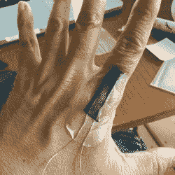

# 安装在皮肤上的可佩戴弯曲传感器变得更加贴近和个性化

> 原文：<https://hackaday.com/2021/07/10/skin-mounted-wearable-bend-sensor-gets-close-and-personal/>

[Mikst]长期以来一直致力于可穿戴电子产品和传感器的研究，并分享了[一种直接贴在皮肤上的不同类型的弯曲传感器](https://www.kobakant.at/DIY/?p=9086)的成果。诚然，这种传感器设计是不可重复使用的，但它也非常简单和便宜。目前这只是一个概念验证，但我们可以看到它或其他一些想法[Mikst]尝试，用于空间至关重要的利基可穿戴应用，如 [cosplay](https://hackaday.com/tag/cosplay/) 。

 传感器的核心是由两股导电线和一小片可穿戴电子纺织品中常见的有弹性的导电织物制成的。它使用透明的无纺医用粘合敷料直接粘在皮肤上，这种敷料特别适合身体的轮廓区域。在这种情况下，它被用来将一块有弹性的导电织物直接粘在[Mikst]的指关节上，即使是很小的运动，它也会做出反应。您可以在下面嵌入的视频中观看万用表测量电阻变化。

我们以前看到过[Mikst]在寻找电子纺织品问题的不同寻常的解决方案方面的工作，例如[一种用于安装可穿戴霍尔效应传感器的三导体枢轴连接](https://hackaday.com/2019/02/13/three-conductor-pivot-for-e-textiles-is-better-than-wires/)。

[https://embedr.flickr.com/photos/51272295939](https://embedr.flickr.com/photos/51272295939)