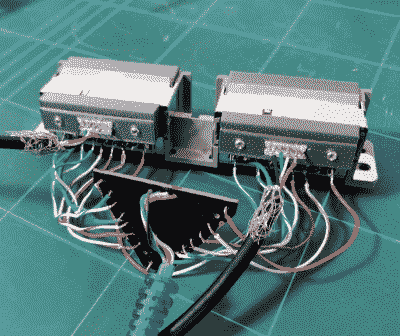

# Sleeper PlayStation 隐藏了一个树莓 Pi 4

> 原文：<https://hackaday.com/2019/12/12/sleeper-playstation-hides-a-raspberry-pi-4/>

安德烈亚斯·威尔科克斯(Andreas Wilcox)想要给他的哥哥一份生日礼物，反映他们对早期 3D 游戏的共同热爱，但只给他一台二手原版 PlayStation 缺乏某种风格。因此，他决定彻底改变这个经典系统，用崭新的 Raspberry Pi 4 取代过时的内部组件。但是他没有走捷径，而是投入时间和精力将新硬件整合得天衣无缝，以至于这台使用了近 25 年的游戏机从外面看起来还是老样子。

 前端端口可以正常工作，并且可以与原来的控制器配合使用，这一事实确实有助于销售股票。[Andreas]找到了一个 USB 到 PlayStation 控制器的适配器，释放了 PCB，并将其焊接到系统端口的背面。由于母 USB 连接器安装在原来连接器的位置，甚至存储卡插槽也加入了进来。这是一个紧密的配合，但最终的结果是非常值得的。

我们还喜欢 GPIO 控制的冷却风扇，它配有一个管道，旨在吹过臭名昭著的烤面包机，并检查精心设计的电源和重置按钮支架。这整个项目真的是一个奇妙的例子，3D 打印部件可以给你的项目一个比黑客的旧备用热熔胶更干净、更专业的外观；尽管这当然需要相当多的时间投入。

[这不是我们第一次看到](https://hackaday.com/2019/04/03/raspberry-pi-breathes-life-into-a-scale-model-sega/)一个树莓派[被塞进经典的视频游戏控制台](https://hackaday.com/2017/04/19/discontinued-nintendo-consoles-and-raspberry-pis/)，但这绝对是我们见过的最干净的例子之一。虽然如果我们把树莓派*便携式*也算在内，竞争还是相当激烈的。